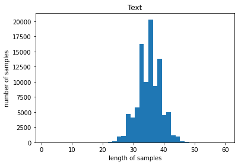
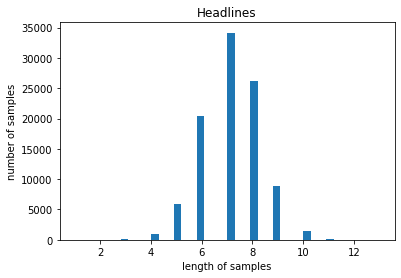
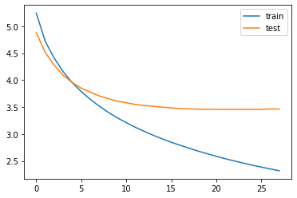

```python
from importlib.metadata import version
import nltk
import tensorflow
import summa
import pandas as pd

print(nltk.__version__)
print(tensorflow.__version__)
print(pd.__version__)
print(version('summa'))
```

    3.6.5
    2.6.0
    1.3.3
    1.2.0


```python
import urllib.request
urllib.request.urlretrieve("https://raw.githubusercontent.com/sunnysai12345/News_Summary/master/news_summary_more.csv", filename="news_summary_more.csv")
data = pd.read_csv('news_summary_more.csv', encoding='iso-8859-1')
```


```python
data.sample(10)
```


<div>
<style scoped>
    .dataframe tbody tr th:only-of-type {
        vertical-align: middle;
    }

    .dataframe tbody tr th {
        vertical-align: top;
    }

    .dataframe thead th {
        text-align: right;
    }
</style>
<table border="1" class="dataframe">
  <thead>
    <tr style="text-align: right;">
      <th></th>
      <th>headlines</th>
      <th>text</th>
    </tr>
  </thead>
  <tbody>
    <tr>
      <th>33271</th>
      <td>Hitler led the world's 1st anti-smoking campaign</td>
      <td>The first public anti-smoking campaign was sta...</td>
    </tr>
    <tr>
      <th>57114</th>
      <td>PM Modi is 'desh ka baap': BJP spokesperson Sa...</td>
      <td>BJP spokesperson Sambit Patra termed Prime Min...</td>
    </tr>
    <tr>
      <th>48182</th>
      <td>World's first driverless transport pods unveil...</td>
      <td>Dubai has started testing the world's first se...</td>
    </tr>
    <tr>
      <th>75724</th>
      <td>New-found TRAPPIST-1 is older than our Solar S...</td>
      <td>US-based researchers have calculated that the ...</td>
    </tr>
    <tr>
      <th>2963</th>
      <td>HC dismisses plea to remove Kejriwal from post...</td>
      <td>The Delhi High Court on Tuesday dismissed a pl...</td>
    </tr>
    <tr>
      <th>69036</th>
      <td>Protesters march against Philippine Prez's 'di...</td>
      <td>Around 8,000 people marched in the Philippines...</td>
    </tr>
    <tr>
      <th>4627</th>
      <td>No blackout of subscribed TV channels after re...</td>
      <td>Telecom Regulatory Authority of India (TRAI) h...</td>
    </tr>
    <tr>
      <th>16996</th>
      <td>INSV Tarini's all-women crew given Tenzing Nor...</td>
      <td>All the six members of the Indian Navy's first...</td>
    </tr>
    <tr>
      <th>86833</th>
      <td>FIR against Rajasthan shopkeeper for Tricolour...</td>
      <td>An FIR has been filed against a Rajasthan shop...</td>
    </tr>
    <tr>
      <th>57477</th>
      <td>No change in deadlines for linking Aadhaar as ...</td>
      <td>The UIDAI on Thursday said the deadlines for v...</td>
    </tr>
  </tbody>
</table>
</div>


### Step 2. 데이터 전처리하기 (추상적 요약)
실습에서 사용된 전처리를 참고하여 각자 필요하다고 생각하는 전처리를 추가 사용하여 텍스트를 정규화 또는 정제해 보세요. 만약, 불용어 제거를 선택한다면 상대적으로 길이가 짧은 요약 데이터에 대해서도 불용어를 제거하는 것이 좋을지 고민해 보세요.

### Step 3. 어텐션 메커니즘 사용하기 (추상적 요약)
일반적인 seq2seq보다는 어텐션 메커니즘을 사용한 seq2seq를 사용하는 것이 더 나은 성능을 얻을 수 있어요. 실습 내용을 참고하여 어텐션 메커니즘을 사용한 seq2seq를 설계해 보세요.

### Step 4. 실제 결과와 요약문 비교하기 (추상적 요약)
원래의 요약문(headlines 열)과 학습을 통해 얻은 추상적 요약의 결과를 비교해 보세요.

### Step 5. Summa을 이용해서 추출적 요약해보기
추상적 요약은 추출적 요약과는 달리 문장의 표현력을 다양하게 가져갈 수 있지만, 추출적 요약에 비해서 난이도가 높아요. 반대로 말하면 추출적 요약은 추상적 요약에 비해 난이도가 낮고 기존 문장에서 문장을 꺼내오는 것이므로 잘못된 요약이 나올 가능성이 낮아요.

### Summa의 summarize를 사용하여 추출적 요약을 해보세요.

### 추상적 요약
#### 1. 데이터 전처리


1. 중복데이터 data['text']를 통해서 제거(headlines(요약) : 98280 < text(본문) : 98360)
2. isna를 통해서 null값 확인: headlines(요약) : 0 text(본문) : 0
3. 데이터 전처리 
4. 최대길이 제한


```python
data
```


<div>
<style scoped>
    .dataframe tbody tr th:only-of-type {
        vertical-align: middle;
    }

    .dataframe tbody tr th {
        vertical-align: top;
    }

    .dataframe thead th {
        text-align: right;
    }
</style>
<table border="1" class="dataframe">
  <thead>
    <tr style="text-align: right;">
      <th></th>
      <th>headlines</th>
      <th>text</th>
    </tr>
  </thead>
  <tbody>
    <tr>
      <th>0</th>
      <td>upGrad learner switches to career in ML &amp; Al w...</td>
      <td>Saurav Kant, an alumnus of upGrad and IIIT-B's...</td>
    </tr>
    <tr>
      <th>1</th>
      <td>Delhi techie wins free food from Swiggy for on...</td>
      <td>Kunal Shah's credit card bill payment platform...</td>
    </tr>
    <tr>
      <th>2</th>
      <td>New Zealand end Rohit Sharma-led India's 12-ma...</td>
      <td>New Zealand defeated India by 8 wickets in the...</td>
    </tr>
    <tr>
      <th>3</th>
      <td>Aegon life iTerm insurance plan helps customer...</td>
      <td>With Aegon Life iTerm Insurance plan, customer...</td>
    </tr>
    <tr>
      <th>4</th>
      <td>Have known Hirani for yrs, what if MeToo claim...</td>
      <td>Speaking about the sexual harassment allegatio...</td>
    </tr>
    <tr>
      <th>...</th>
      <td>...</td>
      <td>...</td>
    </tr>
    <tr>
      <th>98396</th>
      <td>CRPF jawan axed to death by Maoists in Chhatti...</td>
      <td>A CRPF jawan was on Tuesday axed to death with...</td>
    </tr>
    <tr>
      <th>98397</th>
      <td>First song from Sonakshi Sinha's 'Noor' titled...</td>
      <td>'Uff Yeh', the first song from the Sonakshi Si...</td>
    </tr>
    <tr>
      <th>98398</th>
      <td>'The Matrix' film to get a reboot: Reports</td>
      <td>According to reports, a new version of the 199...</td>
    </tr>
    <tr>
      <th>98399</th>
      <td>Snoop Dogg aims gun at clown dressed as Trump ...</td>
      <td>A new music video shows rapper Snoop Dogg aimi...</td>
    </tr>
    <tr>
      <th>98400</th>
      <td>Madhesi Morcha withdraws support to Nepalese g...</td>
      <td>Madhesi Morcha, an alliance of seven political...</td>
    </tr>
  </tbody>
</table>
<p>98401 rows × 2 columns</p>
</div>


```python
print('headlines 열에서 중복을 배제한 유일한 샘플의 수 :', data['headlines'].nunique())
print('text 열에서 중복을 배제한 유일한 샘플의 수 :', data['text'].nunique())
```

    headlines 열에서 중복을 배제한 유일한 샘플의 수 : 98280
    text 열에서 중복을 배제한 유일한 샘플의 수 : 98360


```python
#data['text']에 따라 중복제거
data.drop_duplicates(subset=['text'], inplace=True)
print(data.isnull().sum())
```

    headlines    0
    text         0
    dtype: int64


```python
import numpy as np
import pandas as pd
import os
import matplotlib.pyplot as plt
from tensorflow.keras.preprocessing.text import Tokenizer 
from tensorflow.keras.preprocessing.sequence import pad_sequences
import urllib.request
import warnings
warnings.filterwarnings("ignore", category=UserWarning, module='bs4')

print('=3')
```

    =3


```python
!pip install contractions
```

    Requirement already satisfied: contractions in /opt/conda/lib/python3.9/site-packages (0.1.73)
    Requirement already satisfied: textsearch>=0.0.21 in /opt/conda/lib/python3.9/site-packages (from contractions) (0.0.24)
    Requirement already satisfied: anyascii in /opt/conda/lib/python3.9/site-packages (from textsearch>=0.0.21->contractions) (0.3.2)
    Requirement already satisfied: pyahocorasick in /opt/conda/lib/python3.9/site-packages (from textsearch>=0.0.21->contractions) (2.1.0)
    WARNING: Running pip as the 'root' user can result in broken permissions and conflicting behaviour with the system package manager. It is recommended to use a virtual environment instead: https://pip.pypa.io/warnings/venv


```python
import re  # 정규 표현식 처리
import contractions  # 영어 약어 확장
from bs4 import BeautifulSoup  # HTML 태그 제거
from nltk.corpus import stopwords  # 불용어 제거

# nltk의 stopwords를 사용하려면 먼저 다운로드해야 합니다.
import nltk
nltk.download('stopwords')

# 데이터 전처리 함수
def preprocess_sentence(sentence, remove_stopwords=True):
    sentence = sentence.lower()  # 텍스트 소문자화
    sentence = BeautifulSoup(sentence, "lxml").text  # HTML 태그 제거
    sentence = re.sub(r'\([^)]*\)', '', sentence)  # 괄호 내부 문자열 제거
    sentence = re.sub('"', '', sentence)  # 쌍따옴표 제거
    sentence = ' '.join([contractions.fix(t) for t in sentence.split(" ")])  # 약어 정규화
    sentence = re.sub(r"'s\b", "", sentence)  # 소유격 제거
    sentence = re.sub("[^a-zA-Z]", " ", sentence)  # 영어 외 문자 공백 변환
    sentence = re.sub(r'[m]{2,}', 'mm', sentence)  # m이 3개 이상이면 2개로 변경

    # 불용어 제거 (Text)
    if remove_stopwords:
        stop_words = set(stopwords.words('english'))
        tokens = ' '.join(word for word in sentence.split() if word not in stop_words and len(word) > 1)
    # 불용어 미제거 (Summary)
    else:
        tokens = ' '.join(word for word in sentence.split() if len(word) > 1)

    return tokens

print('데이터 전처리 함수 로드 완료')

```

    데이터 전처리 함수 로드 완료


    [nltk_data] Downloading package stopwords to /aiffel/nltk_data...
    [nltk_data]   Package stopwords is already up-to-date!


```python
# headlines는 불용어 제거x, test는 불용어 제거o
clean_headlines = []
clean_text = []

clean_headlines = data['headlines'].apply(lambda x: preprocess_sentence(x), False)
clean_text = data['text'].apply(lambda x: preprocess_sentence(x))
```


```python
#한번 더 빈 샘플 확인
data['headlines'] = clean_headlines
data['text'] = clean_text

data.isnull().sum()
```


    headlines    0
    text         0
    dtype: int64


```python
## 길이 분포 출력
import matplotlib.pyplot as plt

text_len = [len(s.split()) for s in data['text']]
summary_len = [len(s.split()) for s in data['headlines']]

print('텍스트의 최소 길이 : {}'.format(np.min(text_len)))
print('텍스트의 최대 길이 : {}'.format(np.max(text_len)))
print('텍스트의 평균 길이 : {}'.format(np.mean(text_len)))
print('요약의 최소 길이 : {}'.format(np.min(summary_len)))
print('요약의 최대 길이 : {}'.format(np.max(summary_len)))
print('요약의 평균 길이 : {}'.format(np.mean(summary_len)))

plt.subplot(1,2,1)
plt.boxplot(text_len)
plt.title('Text')
plt.subplot(1,2,2)
plt.boxplot(summary_len)
plt.title('Headlines')
plt.tight_layout()
plt.show()

plt.title('Text')
plt.hist(text_len, bins = 40)
plt.xlabel('length of samples')
plt.ylabel('number of samples')
plt.show()

plt.title('Headlines')
plt.hist(summary_len, bins = 40)
plt.xlabel('length of samples')
plt.ylabel('number of samples')
plt.show()
```

    텍스트의 최소 길이 : 1
    텍스트의 최대 길이 : 60
    텍스트의 평균 길이 : 35.09384912566084
    요약의 최소 길이 : 1
    요약의 최대 길이 : 13
    요약의 평균 길이 : 7.136346075640504


    

    


    

    


    

    


#### 최소 최대 제한
1. 4< headlines <10
2. 23< text <47


```python
headlines_min=4
headlines_max=10
text_min=25
text_max=45

filtered_data = data[data['text'].apply(lambda x: text_min< len(x.split()) < text_max) & 
                     data['headlines'].apply(lambda x: headlines_min < len(x.split()) < headlines_max)]
```


```python
# 요약 데이터에는 시작 토큰과 종료 토큰을 추가한다.
filtered_data['decoder_input'] = filtered_data['headlines'].apply(lambda x : 'sostoken '+ x)
filtered_data['decoder_target'] = filtered_data['headlines'].apply(lambda x : x + ' eostoken')
filtered_data.head()
```

    /tmp/ipykernel_98/1920055328.py:2: SettingWithCopyWarning: 
    A value is trying to be set on a copy of a slice from a DataFrame.
    Try using .loc[row_indexer,col_indexer] = value instead
    
    See the caveats in the documentation: https://pandas.pydata.org/pandas-docs/stable/user_guide/indexing.html#returning-a-view-versus-a-copy
      filtered_data['decoder_input'] = filtered_data['headlines'].apply(lambda x : 'sostoken '+ x)
    /tmp/ipykernel_98/1920055328.py:3: SettingWithCopyWarning: 
    A value is trying to be set on a copy of a slice from a DataFrame.
    Try using .loc[row_indexer,col_indexer] = value instead
    
    See the caveats in the documentation: https://pandas.pydata.org/pandas-docs/stable/user_guide/indexing.html#returning-a-view-versus-a-copy
      filtered_data['decoder_target'] = filtered_data['headlines'].apply(lambda x : x + ' eostoken')


<div>
<style scoped>
    .dataframe tbody tr th:only-of-type {
        vertical-align: middle;
    }

    .dataframe tbody tr th {
        vertical-align: top;
    }

    .dataframe thead th {
        text-align: right;
    }
</style>
<table border="1" class="dataframe">
  <thead>
    <tr style="text-align: right;">
      <th></th>
      <th>headlines</th>
      <th>text</th>
      <th>decoder_input</th>
      <th>decoder_target</th>
    </tr>
  </thead>
  <tbody>
    <tr>
      <th>0</th>
      <td>upgrad learner switches career ml al salary hike</td>
      <td>saurav kant alumnus upgrad iiit pg program mac...</td>
      <td>sostoken upgrad learner switches career ml al ...</td>
      <td>upgrad learner switches career ml al salary hi...</td>
    </tr>
    <tr>
      <th>3</th>
      <td>aegon life iterm insurance plan helps customer...</td>
      <td>aegon life iterm insurance plan customers enjo...</td>
      <td>sostoken aegon life iterm insurance plan helps...</td>
      <td>aegon life iterm insurance plan helps customer...</td>
    </tr>
    <tr>
      <th>4</th>
      <td>known hirani yrs metoo claims true sonam</td>
      <td>speaking sexual harassment allegations rajkuma...</td>
      <td>sostoken known hirani yrs metoo claims true sonam</td>
      <td>known hirani yrs metoo claims true sonam eostoken</td>
    </tr>
    <tr>
      <th>5</th>
      <td>rahat fateh ali khan denies getting notice smu...</td>
      <td>pakistani singer rahat fateh ali khan denied r...</td>
      <td>sostoken rahat fateh ali khan denies getting n...</td>
      <td>rahat fateh ali khan denies getting notice smu...</td>
    </tr>
    <tr>
      <th>6</th>
      <td>india get lowest odi total new zealand</td>
      <td>india recorded lowest odi total new zealand ge...</td>
      <td>sostoken india get lowest odi total new zealand</td>
      <td>india get lowest odi total new zealand eostoken</td>
    </tr>
  </tbody>
</table>
</div>


### incoding decoding


```python
encoder_input = np.array(filtered_data['text']) # 인코더의 입력
decoder_input = np.array(filtered_data['decoder_input']) # 디코더의 입력
decoder_target = np.array(filtered_data['decoder_target']) # 디코더의 레이블
print('=3')
```

    =3


```python
indices = np.arange(encoder_input.shape[0])
np.random.shuffle(indices)
print(indices)
```

    [90135 60077  3277 ... 19463 37146 21873]


```python
encoder_input = encoder_input[indices]
decoder_input = decoder_input[indices]
decoder_target = decoder_target[indices]
print('인코더_input: \n',encoder_input)
print('디코더_input: \n',decoder_input)
print('디코더_target: \n',decoder_target)
```

    인코더_input: 
     ['two women found murdered toilets trains plying route assam two days police suspecting serial killer role victims hailed bihar strangled death killer leaving gamosa behind leaving gamosas behind must culprit way sending message police said'
     'rjd chief lalu prasad yadav wednesday found guilty third six fodder scam cases accused special cbi court ranchi former bihar cm jagannath mishra also convicted case deals fraudulent withdrawal crore chaibasa treasury'
     'millie bobby brown stars netflix series stranger things named unicef youngest ever goodwill ambassador year old actress said use platform highlight children rights issues youngest ever goodwill ambassador unicef honour powerful privilege actress said'
     ...
     'indian shuttler saina nehwal defeated rio olympic gold medallist carolina marin straight sets knock denmark open first round wednesday world number nehwal match scoreline minutes registered fifth victory world number four spaniard nine matches'
     'death toll portugal forest fires risen another injured possibly deadliest ever forest blaze atlantic coastal country nearly firefighters vehicles dispatched tackle blaze broke saturday portugal declared days national mourning victims fire'
     'talking taking direction upcoming film manikarnika queen jhansi kangana ranaut said felt like part rotting away able express director got directing pressure goals directing first love added']
    디코더_input: 
     ['sostoken women killed train toilets serial killer role suspected'
     'sostoken lalu prasad yadav convicted third fodder scam case'
     'sostoken yr old stranger things actress named youngest unicef envoy' ...
     'sostoken saina nehwal beats olympic champion marin straight sets'
     'sostoken death toll portugal forest fires rises'
     'sostoken part rotting kangana became director']
    디코더_target: 
     ['women killed train toilets serial killer role suspected eostoken'
     'lalu prasad yadav convicted third fodder scam case eostoken'
     'yr old stranger things actress named youngest unicef envoy eostoken' ...
     'saina nehwal beats olympic champion marin straight sets eostoken'
     'death toll portugal forest fires rises eostoken'
     'part rotting kangana became director eostoken']


```python
#섞인 데이터를 8:2의 비율로 훈련 데이터와 테스트 데이터로 분리
n_of_val = int(len(encoder_input)*0.2)
print('테스트 데이터의 수 :', n_of_val)
```

    테스트 데이터의 수 : 18868


```python
encoder_input_train = encoder_input[:-n_of_val]
decoder_input_train = decoder_input[:-n_of_val]
decoder_target_train = decoder_target[:-n_of_val]

encoder_input_test = encoder_input[-n_of_val:]
decoder_input_test = decoder_input[-n_of_val:]
decoder_target_test = decoder_target[-n_of_val:]

print('훈련 데이터의 개수 :', len(encoder_input_train))
print('훈련 레이블의 개수 :', len(decoder_input_train))
print('테스트 데이터의 개수 :', len(encoder_input_test))
print('테스트 레이블의 개수 :', len(decoder_input_test))
```

    훈련 데이터의 개수 : 75472
    훈련 레이블의 개수 : 75472
    테스트 데이터의 개수 : 18868
    테스트 레이블의 개수 : 18868


### 데이터 토크나이징


```python
src_tokenizer = Tokenizer() # 토크나이저 정의
src_tokenizer.fit_on_texts(encoder_input_train) # 입력된 데이터로부터 단어 집합 생성
```


```python
threshold = 15
total_cnt = len(src_tokenizer.word_index) # 단어의 수
rare_cnt = 0 # 등장 빈도수가 threshold보다 작은 단어의 개수를 카운트
total_freq = 0 # 훈련 데이터의 전체 단어 빈도수 총 합
rare_freq = 0 # 등장 빈도수가 threshold보다 작은 단어의 등장 빈도수의 총 합

# 단어와 빈도수의 쌍(pair)을 key와 value로 받는다.
for key, value in src_tokenizer.word_counts.items():
    total_freq = total_freq + value

    # 단어의 등장 빈도수가 threshold보다 작으면
    if(value < threshold):
        rare_cnt = rare_cnt + 1
        rare_freq = rare_freq + value

print('단어 집합(vocabulary)의 크기 :', total_cnt)
print('등장 빈도가 %s번 이하인 희귀 단어의 수: %s'%(threshold - 1, rare_cnt))
print('단어 집합에서 희귀 단어를 제외시킬 경우의 단어 집합의 크기 %s'%(total_cnt - rare_cnt))
print("단어 집합에서 희귀 단어의 비율:", (rare_cnt / total_cnt)*100)
print("전체 등장 빈도에서 희귀 단어 등장 빈도 비율:", (rare_freq / total_freq)*100)
```

    단어 집합(vocabulary)의 크기 : 67912
    등장 빈도가 14번 이하인 희귀 단어의 수: 53462
    단어 집합에서 희귀 단어를 제외시킬 경우의 단어 집합의 크기 14450
    단어 집합에서 희귀 단어의 비율: 78.72246436564967
    전체 등장 빈도에서 희귀 단어 등장 빈도 비율: 6.231157411991084


```python
src_vocab = 14000
src_tokenizer = Tokenizer(num_words=src_vocab) # 단어 집합의 크기를 14000
src_tokenizer.fit_on_texts(encoder_input_train) # 단어 집합 재생성
print('=3')
```

    =3


```python
# 텍스트 시퀀스를 정수 시퀀스로 변환
encoder_input_train = src_tokenizer.texts_to_sequences(encoder_input_train) 
encoder_input_test = src_tokenizer.texts_to_sequences(encoder_input_test)

# 잘 진행되었는지 샘플 출력
print(encoder_input_train[:3])
```

    [[4783, 825, 176, 15, 2804, 233, 3054, 2414, 162, 103, 97, 10, 15, 654, 6711, 5873, 341, 220, 333, 426, 17, 1749, 3442, 6078, 1, 4783, 4, 341, 2310, 28, 597, 24], [579, 5261, 2595, 5318, 1204, 677, 101, 4508, 602, 65, 4333, 3153, 1779, 4390, 1432, 494, 612, 1596, 8446, 1, 106, 101, 485, 4333, 109, 2262, 1568, 8900, 1154, 100], [2141, 19, 586, 212, 311, 3067, 90, 11266, 1407, 39, 2561, 73, 1869, 457, 170, 1373, 36, 1675, 44, 2561, 32, 18, 99, 626, 1, 1684, 18]]


```python
tar_tokenizer = Tokenizer()
tar_tokenizer.fit_on_texts(decoder_input_train)
print('=3')
```

    =3


```python
threshold = 10
total_cnt = len(tar_tokenizer.word_index) # 단어의 수
rare_cnt = 0 # 등장 빈도수가 threshold보다 작은 단어의 개수를 카운트
total_freq = 0 # 훈련 데이터의 전체 단어 빈도수 총 합
rare_freq = 0 # 등장 빈도수가 threshold보다 작은 단어의 등장 빈도수의 총 합

# 단어와 빈도수의 쌍(pair)을 key와 value로 받는다.
for key, value in tar_tokenizer.word_counts.items():
    total_freq = total_freq + value

    # 단어의 등장 빈도수가 threshold보다 작으면
    if(value < threshold):
        rare_cnt = rare_cnt + 1
        rare_freq = rare_freq + value

print('단어 집합(vocabulary)의 크기 :', total_cnt)
print('등장 빈도가 %s번 이하인 희귀 단어의 수: %s'%(threshold - 1, rare_cnt))
print('단어 집합에서 희귀 단어를 제외시킬 경우의 단어 집합의 크기 %s'%(total_cnt - rare_cnt))
print("단어 집합에서 희귀 단어의 비율:", (rare_cnt / total_cnt)*100)
print("전체 등장 빈도에서 희귀 단어 등장 빈도 비율:", (rare_freq / total_freq)*100)
```

    단어 집합(vocabulary)의 크기 : 29307
    등장 빈도가 9번 이하인 희귀 단어의 수: 21913
    단어 집합에서 희귀 단어를 제외시킬 경우의 단어 집합의 크기 7394
    단어 집합에서 희귀 단어의 비율: 74.7705326372539
    전체 등장 빈도에서 희귀 단어 등장 빈도 비율: 9.198489162268213


```python
tar_vocab = 7000
tar_tokenizer = Tokenizer(num_words=tar_vocab) 
tar_tokenizer.fit_on_texts(decoder_input_train)
tar_tokenizer.fit_on_texts(decoder_target_train)

# 텍스트 시퀀스를 정수 시퀀스로 변환
decoder_input_train = tar_tokenizer.texts_to_sequences(decoder_input_train) 
decoder_target_train = tar_tokenizer.texts_to_sequences(decoder_target_train)
decoder_input_test = tar_tokenizer.texts_to_sequences(decoder_input_test)
decoder_target_test = tar_tokenizer.texts_to_sequences(decoder_target_test)

# 잘 변환되었는지 확인
print('input')
print('input ',decoder_input_train[:5])
print('target')
print('decoder ',decoder_target_train[:5])
```

    input
    input  [[1, 80, 2650, 784, 34, 5636, 2961], [1, 28, 785, 398, 746, 5408, 3801, 2651, 712], [1, 83, 3099, 73, 91, 504, 2392, 1110], [1, 74, 671, 2159, 1481, 4, 845, 403, 3683], [1, 46, 102, 99, 196, 4933, 5915, 1548, 4022]]
    target
    decoder  [[80, 2650, 784, 34, 5636, 2961, 2], [28, 785, 398, 746, 5408, 3801, 2651, 712, 2], [83, 3099, 73, 91, 504, 2392, 1110, 2], [74, 671, 2159, 1481, 4, 845, 403, 3683, 2], [46, 102, 99, 196, 4933, 5915, 1548, 4022, 2]]


```python
drop_train = [index for index, sentence in enumerate(decoder_input_train) if len(sentence) == 1]
drop_test = [index for index, sentence in enumerate(decoder_input_test) if len(sentence) == 1]

print('삭제할 훈련 데이터의 개수 :', len(drop_train))
print('삭제할 테스트 데이터의 개수 :', len(drop_test))

encoder_input_train = [sentence for index, sentence in enumerate(encoder_input_train) if index not in drop_train]
decoder_input_train = [sentence for index, sentence in enumerate(decoder_input_train) if index not in drop_train]
decoder_target_train = [sentence for index, sentence in enumerate(decoder_target_train) if index not in drop_train]

encoder_input_test = [sentence for index, sentence in enumerate(encoder_input_test) if index not in drop_test]
decoder_input_test = [sentence for index, sentence in enumerate(decoder_input_test) if index not in drop_test]
decoder_target_test = [sentence for index, sentence in enumerate(decoder_target_test) if index not in drop_test]

print('훈련 데이터의 개수 :', len(encoder_input_train))
print('훈련 레이블의 개수 :', len(decoder_input_train))
print('테스트 데이터의 개수 :', len(encoder_input_test))
print('테스트 레이블의 개수 :', len(decoder_input_test))
```

    삭제할 훈련 데이터의 개수 : 1
    삭제할 테스트 데이터의 개수 : 0
    훈련 데이터의 개수 : 75471
    훈련 레이블의 개수 : 75471
    테스트 데이터의 개수 : 18868
    테스트 레이블의 개수 : 18868


```python
encoder_input_train = pad_sequences(encoder_input_train, maxlen=text_max, padding='post')
encoder_input_test = pad_sequences(encoder_input_test, maxlen=text_max, padding='post')
decoder_input_train = pad_sequences(decoder_input_train, maxlen=headlines_max, padding='post')
decoder_target_train = pad_sequences(decoder_target_train, maxlen=headlines_max, padding='post')
decoder_input_test = pad_sequences(decoder_input_test, maxlen=headlines_max, padding='post')
decoder_target_test = pad_sequences(decoder_target_test, maxlen=headlines_max, padding='post')
print('=3')
```

    =3


# 모델 설계하기


```python
from tensorflow.keras.layers import Input, Embedding, LSTM, Dense
from tensorflow.keras.models import Model

# 인코더 설계 시작
embedding_dim = 128
hidden_size = 256

# 인코더
encoder_inputs = Input(shape=(text_max,))

# 인코더의 임베딩 층
enc_emb = Embedding(src_vocab, embedding_dim)(encoder_inputs)

# 인코더의 LSTM 1
encoder_lstm1 = LSTM(hidden_size, return_sequences=True, return_state=True, dropout=0.4)
encoder_output1, state_h1, state_c1 = encoder_lstm1(enc_emb)

# 인코더의 LSTM 2
encoder_lstm2 = LSTM(hidden_size, return_sequences=True, return_state=True, dropout=0.4)
encoder_output2, state_h2, state_c2 = encoder_lstm2(encoder_output1)

# 인코더의 LSTM 3
encoder_lstm3 = LSTM(hidden_size, return_sequences=True, return_state=True, dropout=0.4)
encoder_outputs, state_h, state_c = encoder_lstm3(encoder_output2)

```


```python
# 디코더 설계
decoder_inputs = Input(shape=(None,))

# 디코더의 임베딩 층
dec_emb_layer = Embedding(tar_vocab, embedding_dim)
dec_emb = dec_emb_layer(decoder_inputs)

# 디코더의 LSTM
# decoder_lstm = LSTM(hidden_size, return_sequences=True, return_state=True, dropout=0.4, recurrent_dropout=0.2)
decoder_lstm = LSTM(hidden_size, return_sequences=True, return_state=True, dropout=0.4)
decoder_outputs, _, _ = decoder_lstm(dec_emb, initial_state=[state_h, state_c])
```


```python
# 디코더의 출력층
decoder_softmax_layer = Dense(tar_vocab, activation='softmax')
decoder_softmax_outputs = decoder_softmax_layer(decoder_outputs) 

# 모델 정의
model = Model([encoder_inputs, decoder_inputs], decoder_softmax_outputs)
model.summary()
```

    Model: "model_8"
    __________________________________________________________________________________________________
    Layer (type)                    Output Shape         Param #     Connected to                     
    ==================================================================================================
    input_11 (InputLayer)           [(None, 45)]         0                                            
    __________________________________________________________________________________________________
    embedding_4 (Embedding)         (None, 45, 128)      1792000     input_11[0][0]                   
    __________________________________________________________________________________________________
    lstm_8 (LSTM)                   [(None, 45, 256), (N 394240      embedding_4[0][0]                
    __________________________________________________________________________________________________
    input_12 (InputLayer)           [(None, None)]       0                                            
    __________________________________________________________________________________________________
    lstm_9 (LSTM)                   [(None, 45, 256), (N 525312      lstm_8[0][0]                     
    __________________________________________________________________________________________________
    embedding_5 (Embedding)         (None, None, 128)    896000      input_12[0][0]                   
    __________________________________________________________________________________________________
    lstm_10 (LSTM)                  [(None, 45, 256), (N 525312      lstm_9[0][0]                     
    __________________________________________________________________________________________________
    lstm_11 (LSTM)                  [(None, None, 256),  394240      embedding_5[0][0]                
                                                                     lstm_10[0][1]                    
                                                                     lstm_10[0][2]                    
    __________________________________________________________________________________________________
    dense_4 (Dense)                 (None, None, 7000)   1799000     lstm_11[0][0]                    
    ==================================================================================================
    Total params: 6,326,104
    Trainable params: 6,326,104
    Non-trainable params: 0
    __________________________________________________________________________________________________


```python
from tensorflow.keras.layers import AdditiveAttention, Concatenate

# 어텐션 층(어텐션 함수)
attn_layer = AdditiveAttention(name='attention_layer')

# 인코더와 디코더의 모든 time step의 hidden state를 어텐션 층에 전달하고 결과를 리턴
attn_out = attn_layer([decoder_outputs, encoder_outputs])


# 어텐션의 결과와 디코더의 hidden state들을 연결
decoder_concat_input = Concatenate(axis=-1, name='concat_layer')([decoder_outputs, attn_out])

# 디코더의 출력층
decoder_softmax_layer = Dense(tar_vocab, activation='softmax')
decoder_softmax_outputs = decoder_softmax_layer(decoder_concat_input)

# 모델 정의
model = Model([encoder_inputs, decoder_inputs], decoder_softmax_outputs)
model.summary()
```

    Model: "model_9"
    __________________________________________________________________________________________________
    Layer (type)                    Output Shape         Param #     Connected to                     
    ==================================================================================================
    input_11 (InputLayer)           [(None, 45)]         0                                            
    __________________________________________________________________________________________________
    embedding_4 (Embedding)         (None, 45, 128)      1792000     input_11[0][0]                   
    __________________________________________________________________________________________________
    lstm_8 (LSTM)                   [(None, 45, 256), (N 394240      embedding_4[0][0]                
    __________________________________________________________________________________________________
    input_12 (InputLayer)           [(None, None)]       0                                            
    __________________________________________________________________________________________________
    lstm_9 (LSTM)                   [(None, 45, 256), (N 525312      lstm_8[0][0]                     
    __________________________________________________________________________________________________
    embedding_5 (Embedding)         (None, None, 128)    896000      input_12[0][0]                   
    __________________________________________________________________________________________________
    lstm_10 (LSTM)                  [(None, 45, 256), (N 525312      lstm_9[0][0]                     
    __________________________________________________________________________________________________
    lstm_11 (LSTM)                  [(None, None, 256),  394240      embedding_5[0][0]                
                                                                     lstm_10[0][1]                    
                                                                     lstm_10[0][2]                    
    __________________________________________________________________________________________________
    attention_layer (AdditiveAttent (None, None, 256)    256         lstm_11[0][0]                    
                                                                     lstm_10[0][0]                    
    __________________________________________________________________________________________________
    concat_layer (Concatenate)      (None, None, 512)    0           lstm_11[0][0]                    
                                                                     attention_layer[0][0]            
    __________________________________________________________________________________________________
    dense_5 (Dense)                 (None, None, 7000)   3591000     concat_layer[0][0]               
    ==================================================================================================
    Total params: 8,118,360
    Trainable params: 8,118,360
    Non-trainable params: 0
    __________________________________________________________________________________________________


```python
import tensorflow as tf
from tensorflow.keras.callbacks import EarlyStopping, ModelCheckpoint

# 모델 저장 경로 설정
model_save_path = 'best_model.h5'

# EarlyStopping 설정
es = EarlyStopping(monitor='val_loss', patience=4, verbose=1, restore_best_weights=True)

# ModelCheckpoint 설정 (최적의 모델 저장)
mc = ModelCheckpoint(model_save_path, monitor='val_loss', save_best_only=True, verbose=1)

# 모델 컴파일
model.compile(optimizer='rmsprop', loss='sparse_categorical_crossentropy')

# model.fit()을 tf.function 바깥에서 호출
history = model.fit(
    x=[encoder_input_train, decoder_input_train], 
    y=decoder_target_train,
    validation_data=([encoder_input_test, decoder_input_test], decoder_target_test),
    batch_size=256, 
    callbacks=[es, mc],  # ModelCheckpoint 추가
    epochs=50
)

```

    Epoch 1/50
    295/295 [==============================] - 29s 84ms/step - loss: 5.2451 - val_loss: 4.8783
    
    Epoch 00001: val_loss improved from inf to 4.87825, saving model to best_model.h5
    Epoch 2/50
    295/295 [==============================] - 24s 82ms/step - loss: 4.7161 - val_loss: 4.5109
    
    Epoch 00002: val_loss improved from 4.87825 to 4.51093, saving model to best_model.h5
    Epoch 3/50
    295/295 [==============================] - 24s 81ms/step - loss: 4.4066 - val_loss: 4.2772
    
    Epoch 00003: val_loss improved from 4.51093 to 4.27718, saving model to best_model.h5
    Epoch 4/50
    295/295 [==============================] - 24s 81ms/step - loss: 4.1545 - val_loss: 4.0881
    
    Epoch 00004: val_loss improved from 4.27718 to 4.08813, saving model to best_model.h5
    Epoch 5/50
    295/295 [==============================] - 24s 81ms/step - loss: 3.9518 - val_loss: 3.9551
    
    Epoch 00005: val_loss improved from 4.08813 to 3.95513, saving model to best_model.h5
    Epoch 6/50
    295/295 [==============================] - 24s 81ms/step - loss: 3.7857 - val_loss: 3.8499
    
    Epoch 00006: val_loss improved from 3.95513 to 3.84991, saving model to best_model.h5
    Epoch 7/50
    295/295 [==============================] - 24s 81ms/step - loss: 3.6433 - val_loss: 3.7769
    
    Epoch 00007: val_loss improved from 3.84991 to 3.77690, saving model to best_model.h5
    Epoch 8/50
    295/295 [==============================] - 24s 81ms/step - loss: 3.5168 - val_loss: 3.7068
    
    Epoch 00008: val_loss improved from 3.77690 to 3.70684, saving model to best_model.h5
    Epoch 9/50
    295/295 [==============================] - 24s 81ms/step - loss: 3.4026 - val_loss: 3.6563
    
    Epoch 00009: val_loss improved from 3.70684 to 3.65630, saving model to best_model.h5
    Epoch 10/50
    295/295 [==============================] - 24s 81ms/step - loss: 3.3008 - val_loss: 3.6080
    
    Epoch 00010: val_loss improved from 3.65630 to 3.60800, saving model to best_model.h5
    Epoch 11/50
    295/295 [==============================] - 24s 81ms/step - loss: 3.2102 - val_loss: 3.5811
    
    Epoch 00011: val_loss improved from 3.60800 to 3.58105, saving model to best_model.h5
    Epoch 12/50
    295/295 [==============================] - 24s 81ms/step - loss: 3.1259 - val_loss: 3.5478
    
    Epoch 00012: val_loss improved from 3.58105 to 3.54775, saving model to best_model.h5
    Epoch 13/50
    295/295 [==============================] - 24s 81ms/step - loss: 3.0486 - val_loss: 3.5278
    
    Epoch 00013: val_loss improved from 3.54775 to 3.52785, saving model to best_model.h5
    Epoch 14/50
    295/295 [==============================] - 24s 81ms/step - loss: 2.9769 - val_loss: 3.5140
    
    Epoch 00014: val_loss improved from 3.52785 to 3.51396, saving model to best_model.h5
    Epoch 15/50
    295/295 [==============================] - 24s 81ms/step - loss: 2.9094 - val_loss: 3.4971
    
    Epoch 00015: val_loss improved from 3.51396 to 3.49707, saving model to best_model.h5
    Epoch 16/50
    295/295 [==============================] - 24s 81ms/step - loss: 2.8472 - val_loss: 3.4850
    
    Epoch 00016: val_loss improved from 3.49707 to 3.48503, saving model to best_model.h5
    Epoch 17/50
    295/295 [==============================] - 24s 81ms/step - loss: 2.7904 - val_loss: 3.4716
    
    Epoch 00017: val_loss improved from 3.48503 to 3.47159, saving model to best_model.h5
    Epoch 18/50
    295/295 [==============================] - 24s 81ms/step - loss: 2.7357 - val_loss: 3.4681
    
    Epoch 00018: val_loss improved from 3.47159 to 3.46806, saving model to best_model.h5
    Epoch 19/50
    295/295 [==============================] - 24s 81ms/step - loss: 2.6828 - val_loss: 3.4605
    
    Epoch 00019: val_loss improved from 3.46806 to 3.46046, saving model to best_model.h5
    Epoch 20/50
    295/295 [==============================] - 24s 81ms/step - loss: 2.6339 - val_loss: 3.4581
    
    Epoch 00020: val_loss improved from 3.46046 to 3.45805, saving model to best_model.h5
    Epoch 21/50
    295/295 [==============================] - 24s 81ms/step - loss: 2.5871 - val_loss: 3.4590
    
    Epoch 00021: val_loss did not improve from 3.45805
    Epoch 22/50
    295/295 [==============================] - 24s 81ms/step - loss: 2.5421 - val_loss: 3.4563
    
    Epoch 00022: val_loss improved from 3.45805 to 3.45631, saving model to best_model.h5
    Epoch 23/50
    295/295 [==============================] - 24s 81ms/step - loss: 2.5005 - val_loss: 3.4578
    
    Epoch 00023: val_loss did not improve from 3.45631
    Epoch 24/50
    295/295 [==============================] - 24s 81ms/step - loss: 2.4598 - val_loss: 3.4558
    
    Epoch 00024: val_loss improved from 3.45631 to 3.45575, saving model to best_model.h5
    Epoch 25/50
    295/295 [==============================] - 24s 82ms/step - loss: 2.4216 - val_loss: 3.4579
    
    Epoch 00025: val_loss did not improve from 3.45575
    Epoch 26/50
    295/295 [==============================] - 24s 82ms/step - loss: 2.3864 - val_loss: 3.4579
    
    Epoch 00026: val_loss did not improve from 3.45575
    Epoch 27/50
    295/295 [==============================] - 24s 81ms/step - loss: 2.3526 - val_loss: 3.4662
    
    Epoch 00027: val_loss did not improve from 3.45575
    Epoch 28/50
    295/295 [==============================] - 24s 82ms/step - loss: 2.3179 - val_loss: 3.4628
    Restoring model weights from the end of the best epoch.
    
    Epoch 00028: val_loss did not improve from 3.45575
    Epoch 00028: early stopping


```python
plt.plot(history.history['loss'], label='train')
plt.plot(history.history['val_loss'], label='test')
plt.legend()
plt.show()
```


    

    


```python
src_index_to_word = src_tokenizer.index_word # 원문 단어 집합에서 정수 -> 단어를 얻음
tar_word_to_index = tar_tokenizer.word_index # 요약 단어 집합에서 단어 -> 정수를 얻음
tar_index_to_word = tar_tokenizer.index_word # 요약 단어 집합에서 정수 -> 단어를 얻음

print('=3')
```

    =3


```python
# 인코더 설계
encoder_model = Model(inputs=encoder_inputs, outputs=[encoder_outputs, state_h, state_c])

# 이전 시점의 상태들을 저장하는 텐서
decoder_state_input_h = Input(shape=(hidden_size,))
decoder_state_input_c = Input(shape=(hidden_size,))

dec_emb2 = dec_emb_layer(decoder_inputs)

# 문장의 다음 단어를 예측하기 위해서 초기 상태(initial_state)를 이전 시점의 상태로 사용. 이는 뒤의 함수 decode_sequence()에 구현
# 훈련 과정에서와 달리 LSTM의 리턴하는 은닉 상태와 셀 상태인 state_h와 state_c를 버리지 않음.
decoder_outputs2, state_h2, state_c2 = decoder_lstm(dec_emb2, initial_state=[decoder_state_input_h, decoder_state_input_c])

print('=3')
```

    =3


```python
# 어텐션 함수
decoder_hidden_state_input = Input(shape=(text_max, hidden_size))
attn_out_inf = attn_layer([decoder_outputs2, decoder_hidden_state_input])
decoder_inf_concat = Concatenate(axis=-1, name='concat')([decoder_outputs2, attn_out_inf])

# 디코더의 출력층
decoder_outputs2 = decoder_softmax_layer(decoder_inf_concat) 

# 최종 디코더 모델
decoder_model = Model(
    [decoder_inputs] + [decoder_hidden_state_input,decoder_state_input_h, decoder_state_input_c],
    [decoder_outputs2] + [state_h2, state_c2])

print('=3')
```

    =3


```python
def decode_sequence(input_seq):
    # 입력으로부터 인코더의 상태를 얻음
    e_out, e_h, e_c = encoder_model.predict(input_seq)

     # <SOS>에 해당하는 토큰 생성
    target_seq = np.zeros((1,1))
    target_seq[0, 0] = tar_word_to_index['sostoken']

    stop_condition = False
    decoded_sentence = ''
    while not stop_condition: # stop_condition이 True가 될 때까지 루프 반복

        output_tokens, h, c = decoder_model.predict([target_seq] + [e_out, e_h, e_c])
        sampled_token_index = np.argmax(output_tokens[0, -1, :])
        sampled_token = tar_index_to_word[sampled_token_index]

        if (sampled_token!='eostoken'):
            decoded_sentence += ' '+sampled_token

        #  <eos>에 도달하거나 최대 길이를 넘으면 중단.
        if (sampled_token == 'eostoken'  or len(decoded_sentence.split()) >= (headlines_max-1)):
            stop_condition = True

        # 길이가 1인 타겟 시퀀스를 업데이트
        target_seq = np.zeros((1,1))
        target_seq[0, 0] = sampled_token_index

        # 상태를 업데이트 합니다.
        e_h, e_c = h, c

    return decoded_sentence
print('=3')
```

    =3


```python
# 원문의 정수 시퀀스를 텍스트 시퀀스로 변환
def seq2text(input_seq):
    temp=''
    for i in input_seq:
        if (i!=0):
            temp = temp + src_index_to_word[i]+' '
    return temp

# 요약문의 정수 시퀀스를 텍스트 시퀀스로 변환
def seq2summary(input_seq):
    temp=''
    for i in input_seq:
        if (i!=0):
            temp = temp + src_index_to_word[i]+' '
    return temp

print('=3')
```

    =3


```python
encoder_input_test[i].shape
```


    (45,)


```python
for i in range(50, 100):
    print("원문 :", seq2text(encoder_input_test[i]))
    print("실제 요약 :", seq2summary(decoder_input_test[i]))
    print("예측 요약 :", decode_sequence(encoder_input_test[i].reshape(1, text_max)))
    print("\n")
```

    원문 : nirmal jain chairman financial services group india holdings become billionaire according bloomberg mumbai banker billion private wealth management unit became india biggest assets helped become billionaire firm share price doubled past months taking fortune billion first time week 
    실제 요약 : said cannes helmet board red mla matches 
    예측 요약 :  mukesh ambani wealth fund becomes asia richest
    
    
    원문 : maharashtra navnirman sena transport wing called strike ola drivers third day holding talks officials cab hailing startup however uber drivers asked continue strike talks uber officials thursday besides mumbai drivers major cities india participate large numbers reports said 
    실제 요약 : said whether aviation best west registered years report aviation page 
    예측 요약 :  mns mp booked violating ola bungalow
    
    
    원문 : several videos showing people blown away trees knocked strong winds netherlands surfaced online country issued highest weather alert several parts country storm winds reached speeds kmph places severe storm claimed three lives disrupted country transport system 
    실제 요약 : said singh malayalam bachao moscow like director circuit 
    예측 요약 :  video shows rain rain hit anniversary
    
    
    원문 : year old mother sweden changed son name tattoo artist misspelled arm artist instead kevin realised one else name became unique believe better kevin said 
    실제 요약 : said pieces instead quit match hit game hit 
    예측 요약 :  father daughter
    
    
    원문 : singer ex boyfriend accused domestic abuse alleged stabbed remember night cut almost died police take tweeted lie tell trying kill would take jail added 
    실제 요약 : said delhi present gone 
    예측 요약 :  singer accused sexual assault
    
    
    원문 : government planning sim cards linked aadhaar number february according reports supreme court passed order february year asking government link sim cards aadhaar within year practice would remove subscribers crackdown fraudulent activities court said 
    실제 요약 : said midnight softbank shahid order reports 
    예측 요약 :  govt linked aadhaar aadhaar
    
    
    원문 : global smartphone brand oneplus broken billion dollar sales barrier first time company founder ceo pete revealed added revenues last year doubled come healthy profits oneplus plans challenge bigger players tying leading mobile networks us europe 
    실제 요약 : said closed worked month fall padukone reach 
    예측 요약 :  oneplus sales launch first ever smartphone sales
    
    
    원문 : goods services tax launched tonight launch event start pm apart government officials industrialist ratan tata amitabh bachchan lata mangeshkar invited event metro man father green revolution ms swaminathan also present 
    실제 요약 : said stronger launched elections student 
    예측 요약 :  new zealand pm announces new madhuri
    
    
    원문 : germany year old alexander zverev became first player born earn atp masters title defeating serbia novak djokovic straight sets italian open rome sunday title zverev enter top atp men rankings first time career 
    실제 요약 : said world two ongoing ukraine woman sure adding 
    예측 요약 :  year old becomes wins th grand slam title
    
    
    원문 : historic roy villa darjeeling swami vivekananda sister last vandalised looted unidentified miscreants incident took place amid ongoing unrest gorkhaland issue darjeeling police superintendent akhilesh chaturvedi ruled connection loot gorkhaland agitation 
    실제 요약 : said pratap stating corruption temporary 
    예측 요약 :  dalit sisters set ablaze ablaze mafia
    
    
    원문 : woman united states teddy bears holds guinness world record largest collection teddy bears year old record jackie miley keeps teddy bears house called teddy bear town one bear collecting teddy bears since 
    실제 요약 : said court note indian around 
    예측 요약 :  woman breaks record world record
    
    
    원문 : married woman mumbai arrested allegedly trying kidnap year old girl house indore claiming life partner previous birth met girl visited mumbai mother treatment exchanged numbers year old told girl live together refused 
    실제 요약 : said court national suspended pact step sponsored gandhi 
    예측 요약 :  mumbai man arrested years mother year old daughter
    
    
    원문 : least two militants house superintendent police jammu kashmir kulgam district militants tried scare family members firing air reports injury notably comes three civilians killed incident stone pelters clashed police budgam 
    실제 요약 : said elon earlier set 
    예측 요약 :  militants killed police officer militants
    
    
    원문 : ongoing match pakistan abu dhabi new zealand first international match gap days new zealand previous international match test england took place march april april october pakistan played international matches second period 
    실제 요약 : said connection six payments since reportedly new leader 
    예측 요약 :  pakistan pakistan tour pakistan
    
    
    원문 : blood testing startup reportedly deal investment group lifted bankruptcy earlier year elizabeth stepped ceo emerged president ramesh aware faulty blood tests investors including owners walmart st century fox lost nearly billion total 
    실제 요약 : said moved part due nation overs still twitter 
    예측 요약 :  zomato acquires us based startup
    
    
    원문 : twitter users creating memes picture virat kohli shows indian captain dressing room window photo read shami aur karthik tak hai team field set max pe aa hai 
    실제 요약 : said notably users billion shooter monday deliveries criticised forced 
    예측 요약 :  kohli shares video kohli twitter katrina
    
    
    원문 : whatsapp started testing block revoke request feature beta prevent misuse delete everyone requests comes users able delete messages dating back three years everyone unauthorised app versions feature checks message deleted sent last hours otherwise request denied 
    실제 요약 : said known recent agency range admission strict staying 
    예측 요약 :  whatsapp let us users share whatsapp messages
    
    
    원문 : first batch dairy cows flown qatar five weeks saudi arabia led boycott country began many cows flown qatar flights within one month considered biggest cattle ever attempted milk expected supply qatar needs 
    실제 요약 : said address marks novel warned goyal 
    예측 요약 :  saudi arabia starts un amid standoff
    
    
    원문 : observing six years passed since nirbhaya rape murder case shook country delhi commission women issued notice tihar jail questioning delay convicts execution asked updates whether execution order issued six convicts one allegedly committed suicide juvenile released 
    실제 요약 : said party flight northern wrote deals pub bjp high 
    예측 요약 :  justice rape case filed women
    
    
    원문 : us president donald trump saturday promised million aid feed people left drought conflict somalia south sudan nigeria yemen trump pledge came session summit germany notably crore people need urgent food assistance four countries 
    실제 요약 : said police expenses old smith details cities 
    예측 요약 :  trump threatens aid syria aid us aid
    
    
    원문 : indonesia monday called international help deal aftermath earthquake tsunami island region killed people president authorised us accept international help urgent disaster response indonesian authorities said meanwhile indonesia disaster agency said needs heavy equipment personnel recover bodies 
    실제 요약 : said bowler alleged character become traced disclosed cloud 
    예측 요약 :  indonesia quake hit indonesia
    
    
    원문 : talking startup scenario india spiritual guru said indian economy ready startup also said india stage economic development need solid businesses last many years said tremendous amount money lost startups apps 
    실제 요약 : said people believed staff pakistan 
    예측 요약 :  india indian firms good startups
    
    
    원문 : world renowned indian sand artist pattnaik used around five tonnes sand create sand art celebrating india st independence day sand sculpture carried words jai jawan jai kishan jai pattnaik holds guinness world record making tallest sand castle awarded padma shri 
    실제 요약 : said white snapdeal uses chosen ocean nirav years 
    예측 요약 :  world largest sand museum india
    
    
    원문 : germany largest lender deutsche bank offices including headquarters raided prosecutors connection panama papers probe thursday investigators probing activities two employees allegedly helped clients set offshore firms money prosecutors said police officers prosecutors tax inspectors involved raids 
    실제 요약 : said puts khan forcing durga boat regarding others 
    예측 요약 :  nissan largest bank bank shares bank accounts
    
    
    원문 : newborn girl died bengaluru rescued municipal garbage bin saturday incident came light heard infant informed police rushed hospital doctors declared brought dead police suspect baby abandoned girl 
    실제 요약 : said constituency actress days simply outside 
    예측 요약 :  baby dies trying fire rescued
    
    
    원문 : nasa paid tribute late president apj abdul kalam naming newly discovered named nasa scientist found iss orbiting earth km kalam trained nasa setting india first rocket launching facility kerala 
    실제 요약 : said attack kumble goldman targets naval crore alibaba 
    예측 요약 :  nasa probe president mission
    
    
    원문 : woman district uttar pradesh deliver baby floor community health centre due non availability doctors two women held cover woman delivered baby floor strict action would taken employees found guilty officials said 
    실제 요약 : said court noted founder messages helped fail 
    예측 요약 :  woman delivers baby denied ambulance
    
    
    원문 : health ministry ordered thorough inquiry bodies donated dera sacha sauda lucknow based medical college research allegedly without death certificates college said receive requisite death certificates adding acquired signed regarding donations kin deceased 
    실제 요약 : said others awards joining fleet salary clashes 
    예측 요약 :  govt official death harassment
    
    
    원문 : priyanka chopra hollywood film opposite chris pratt indefinitely postponed per reports universal studios producing film reportedly removed release schedule film earlier scheduled release july announced film permanently 
    실제 요약 : said wife parliament three beaten trump privacy film 
    예측 요약 :  priyanka chopra starrer tubelight report
    
    
    원문 : several government websites us state ohio hacked sunday message supportive islamic state held accountable trump people every drop blood flowing muslim countries read message affected servers taken offline authorities investigating incident 
    실제 요약 : said added got digital aamir russia shiv 
    예측 요약 :  us state agency hacked hackers account
    
    
    원문 : tesla ceo elon musk video thursday said people way happier really instagram talking negative effects social media said particularly instagram people look like better life really might think good looking must added 
    실제 요약 : said like coach injured diwali pictures worth 
    예측 요약 :  elon musk says says elon musk
    
    
    원문 : body doctor went missing heavy rains mumbai found thursday near worli sea shore dr deepak disappeared tuesday abandoned car started walking waist high water reports suggest may fallen opened water flow away 
    실제 요약 : said time helped earned star ventures worldwide according revealed 
    예측 요약 :  mumbai hospital rescued days days
    
    
    원문 : delhi police charged abetment suicide wife sunanda pushkar death congress leader shashi tharoor said contest chargesheet stating wife could committed suicide added police informed delhi high court found evidence case till october 
    실제 요약 : said asking alleged exposed test qualified tuesday 
    예측 요약 :  tharoor wife sunanda suicide police sunanda
    
    
    원문 : former jammu kashmir cm farooq abdullah said pakistan tehreek insaf chief imran khan statement developing good relations india kind hearted congratulating imran declaring party victory pakistan general elections abdullah added want implement saying imran said two nations resolve kashmir issue talks 
    실제 요약 : said opening established year former venture qualify delhi president 
    예측 요약 :  kashmir imran khan kashmir chief
    
    
    원문 : tiger zinda hai entered crore club earning crore within three days release per bollywood trade analyst taran adarsh salman khan th film cross crore mark maximum bollywood actor film also year second highest hindi opening grosser baahubali hindi version 
    실제 요약 : said muslim angeles tweets comment would reach ended leader right 
    예측 요약 :  tiger zinda hai enters cr club within days
    
    
    원문 : speaking comparison indian captain virat kohli australia steve smith sourav ganguly said time virat kohli score steve smith score runs think one times one person gets runs person get runs ganguly added 
    실제 요약 : said new justice monday operations photo administration 
    예측 요약 :  kohli smith kohli ganguly captain smith kohli
    
    
    원문 : year old man hailing telangana died hit light train us california week officials said resident ohio krishna come san jose official work last month efforts made bring body native place last rites family said 
    실제 요약 : said discovered us days added part makes seen 
    예측 요약 :  man dies km days
    
    
    원문 : attempt fight fake news facebook said reduce size posts feature fake news news feed reduce visual feed stories fact checked false facebook spokesperson said company also display fact checked links related articles box original link 
    실제 요약 : said group devices finals top singing international gujarat 
    예측 요약 :  facebook removes fake news accounts fake news
    
    
    원문 : former us president barack obama wife michelle obama purchased nine bedroom washington mansion million earlier square foot mansion dates back allow complete high school neighbours us president donald trump daughter ivanka husband jared kushner 
    실제 요약 : said ceiling mccullum withdrawing old 
    예측 요약 :  obama son gifts crore auctioned
    
    
    원문 : congress leader kapil sibal said never sunni waqf board lawyer representing individual ayodhya case talking pm narendra modi slamming seeking case till general elections sibal said pm address country concerns adding issuing statements help india way 
    실제 요약 : said tax kashmir policy ago steal 
    예측 요약 :  pm modi kapil sibal
    
    
    원문 : body nine year old girl found police surat injury marks postmortem revealed child raped tortured least eight days strangled death girl identified yet none family come forward claim body 
    실제 요약 : said world two wrote class high according animal currency 
    예측 요약 :  year old girl found hanging tree
    
    
    원문 : slamming centre merging union budget railway budget former railway minister pawan bansal said move finished importance railways added separate railway budget allowed parliament government announcements india union railway merged years 
    실제 요약 : said medical territorial delhi day terrorist 
    예측 요약 :  govt asks govt plan hike
    
    
    원문 : five member gang men aged years arrested looting temples karnataka mysuru accused men took help google maps identify temples located isolated places steal valuables worth lakh since september last year accused full time robbers come different professional backgrounds police said 
    실제 요약 : said challenged death pradesh sharif panels bottle based reported 
    예측 요약 :  andhra man arrested stealing men
    
    
    원문 : television actor karan mehra wife rawal welcomed baby boy first child together karan known role serial yeh kya hai also shared picture baby feet announce news couple got married dating six years 
    실제 요약 : said data flipkart test bowling founder received 
    예측 요약 :  karan johar shares pic baby girl
    
    
    원문 : hearing assam national register citizens left lakh people draft supreme court told assam government centre behave like state individual comes government insisted keeping five required documents court recommended including people nrc 
    실제 요약 : said neil made social critics congress filed plans structure 
    예측 요약 :  assam govt seeks lakh sc funds
    
    
    원문 : uk biggest buy let landlord wilson called police online abuse banned coloured people properties curry smell end also reported video called racist earlier said lost costs left property curry 
    실제 요약 : said cold communal like 
    예측 요약 :  uk firm offers pay
    
    
    원문 : tesla ceo elon musk said wants add feature enables tesla cars automatically call truck soon detect issues like flat users able cancel call display however musk provided timeline feature might get launched 
    실제 요약 : said many decision issue special weeks scored pizza worth 
    예측 요약 :  musk shares video tesla cars
    
    
    원문 : people started calling emergency service number report youtube working america philadelphia police tweeted yes youtube please call cannot fix google owned video sharing platform worldwide hour wednesday youtube acknowledged outage users 
    실제 요약 : said special get bond bring added earlier banned like 
    예측 요약 :  youtube twitter users people face videos
    
    
    원문 : backdrop north korea threatening target us island territory guam two radio stations accidentally broadcast emergency danger warning warning lasted minutes following guam homeland security advisor assured civilians change threat level civil danger warn civilians threats like terrorist attacks military strikes 
    실제 요약 : said usa god spacex took needed cup including refused 
    예측 요약 :  north korea fires threat us
    
    
    원문 : telecom commission tuesday approved proposal allowing phone calls internet service flights within indian airspace telecom regulator trai recommended making calls allowed aircraft reaches altitude metres government intervene pricing mechanism would left airlines flight connectivity providers 
    실제 요약 : said training country born accident bill first america nuclear 
    예측 요약 :  govt proposes free help flights
    
    


## 모델 적용해보기


```python
from tensorflow.keras.models import load_model

# 모델 로드
model = load_model('best_model.h5')

```


```python
# 새로운 토큰 인덱스 지정
new_index = len(tar_tokenizer.word_index) + 1

# word_index와 index_word에 추가
tar_tokenizer.word_index['<start>'] = new_index
tar_tokenizer.index_word[new_index] = '<start>'

print("추가된 '<start>' 토큰 인덱스:", tar_tokenizer.word_index['<start>'])

```

    추가된 '<start>' 토큰 인덱스: 29310


```python
from tensorflow.keras.preprocessing.sequence import pad_sequences

# 긴 영어 텍스트 입력
new_text = """
Beijing began imposing tariffs on Monday on many farm products from the United States, for which China is the largest overseas market. It is the latest escalation of a trade fight between the world’s two largest economies.

The Chinese government announced the tariffs last week, shortly after President Trump raised tariffs on Chinese products for the second time since he took office in January. The Chinese tariffs will include a levy of 15 percent on U.S. products like chicken, wheat and corn, as well as 10 percent on products like soybeans, pork, beef and fruit.

Beijing said that goods that had already been shipped by Monday and imported by April 12 would not be subject to the new tariffs.

A spokesman for the National People’s Congress, China’s annual legislative session, said last week that Mr. Trump’s latest tariffs had “disrupted the security and stability of the global industrial and supply chains.”
"""

# 소스 텍스트 토큰화
new_text_seq = src_tokenizer.texts_to_sequences([new_text])

# 패딩 처리 (모델 훈련 시 사용한 text_max 값과 동일해야 함)
new_text_seq_padded = pad_sequences(new_text_seq, maxlen=text_max, padding='post')

# 디코더의 입력 시퀀스를 준비 (디코더 입력의 첫 번째 토큰을 '<start>'로 설정)
decoder_input = [tar_tokenizer.word_index['<start>']] + [0] * (text_max - 1)
decoder_input_seq = pad_sequences([decoder_input], maxlen=text_max, padding='post')

print("디코더 입력 시퀀스:", decoder_input_seq)

```

    디코더 입력 시퀀스: [[29310     0     0     0     0     0     0     0     0     0     0     0
          0     0     0     0     0     0     0     0     0     0     0     0
          0     0     0     0     0     0     0     0     0     0     0     0
          0     0     0     0     0     0     0     0     0]]


```python
import numpy as np

# 예측 수행
predicted_output = model.predict([new_text_seq_padded, decoder_input_seq])

# 예측 결과에서 가장 높은 확률을 가진 단어 추출
predicted_indices = np.argmax(predicted_output, axis=-1)

# 예측된 단어 인덱스를 단어로 변환
predicted_words = [tar_tokenizer.index_word[idx] for idx in predicted_indices[0]]

# 예측된 문장 출력
predicted_sentence = ' '.join(predicted_words)
print("예측된 텍스트:", predicted_sentence)

# <start>와 <end> 토큰을 제거
predicted_sentence = ' '.join([word for word in predicted_words if word not in ['<start>', '<end>']])

print("후처리된 예측 텍스트:", predicted_sentence)

```


    ---------------------------------------------------------------------------

    KeyError                                  Traceback (most recent call last)

    /tmp/ipykernel_98/3129283332.py in <module>
          8 
          9 # 예측된 단어 인덱스를 단어로 변환
    ---> 10 predicted_words = [tar_tokenizer.index_word[idx] for idx in predicted_indices[0]]
         11 
         12 # 예측된 문장 출력


    /tmp/ipykernel_98/3129283332.py in <listcomp>(.0)
          8 
          9 # 예측된 단어 인덱스를 단어로 변환
    ---> 10 predicted_words = [tar_tokenizer.index_word[idx] for idx in predicted_indices[0]]
         11 
         12 # 예측된 문장 출력


    KeyError: 0


https://www.nytimes.com/2025/03/10/business/china-tariffs-us.html

## 회고

1. 노드를 따라서 그대로 적용했습니다. 
2. 히스토그램을 보고 max만 적용한게 아니라 min을 통해서 전처리를 해서 그런지 다른사람들보다 좋은 loss값이 나온거 같습니다
3. 마지막에 일반 text로 모델을 적용할려고 했으나 오류가 많이 떴는데 model save를 하는게 아니라 여러개를 save 해야된단것을 알았습니다. 한번더 시도해보겠습니다.


```python

```
