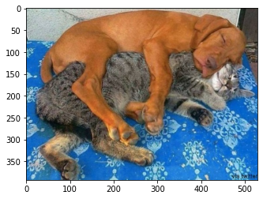
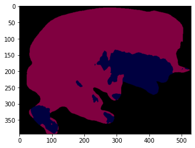
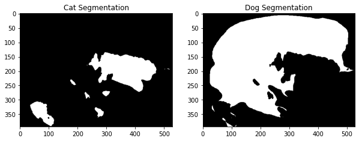
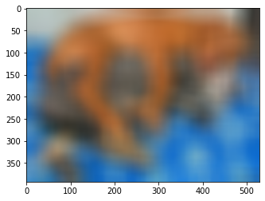
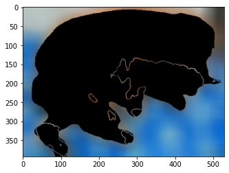
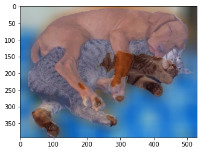
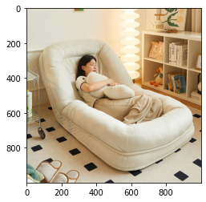
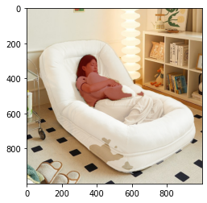
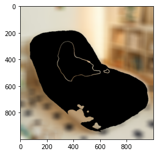

```python
# importlib: 사용자가 파이썬의 import 시스템과 상호작용하기 위한 API를 제공하는 내장 라이브러리
# 사용자는 import 함수의 구현 내용과, 실행에 필요한 하위 함수들을 이용해 필요에 맞는 임포터를 직접 구현하거나 임포트 관련 기능들을 자유롭게 사용할 수 있음
# importlib.metadata: 설치된 패키지 메타 데이터에 대한 접근을 제공하는 라이브러리.
# 해당 코드 블럭에서는 importlib.metadata 안에 있는 version() 함수를 이용하여 pixellib 라이브러리의 버전을 확인

from importlib.metadata import version
import os
import urllib
import cv2
import numpy as np
from pixellib.semantic import semantic_segmentation
from matplotlib import pyplot as plt


print(cv2.__version__)
print(version('pixellib'))
```

    4.5.3
    0.7.1


# 1. Cat and Dog Segmentation : deeplabv3사용


```python
img_path = os.getenv('HOME')+'/aiffel/human_segmentation/images/cat_dog.jpg'  
img_orig = cv2.imread(img_path) 

print(img_orig.shape)

plt.imshow(cv2.cvtColor(img_orig, cv2.COLOR_BGR2RGB))
plt.show()

```

    (393, 529, 3)


    

    


```python
# 저장할 파일 이름을 결정합니다
# 1. os.getenv(x)함수는 환경 변수x의 값을 포함하는 문자열 변수를 반환합니다. model_dir 에 "/aiffel/human_segmentation/models" 저장
# 2. #os.path.join(a, b)는 경로를 병합하여 새 경로 생성 model_file 에 "/aiffel/aiffel/human_segmentation/models/deeplabv3_xception_tf_dim_ordering_tf_kernels.h5" 저장
# 1
model_dir = os.getenv('HOME')+'/aiffel/human_segmentation/models' 
# 2
model_file = os.path.join(model_dir, 'deeplabv3_xception_tf_dim_ordering_tf_kernels.h5') 

# PixelLib가 제공하는 모델의 url입니다
model_url = 'https://github.com/ayoolaolafenwa/PixelLib/releases/download/1.1/deeplabv3_xception_tf_dim_ordering_tf_kernels.h5' 

# 다운로드를 시작합니다
urllib.request.urlretrieve(model_url, model_file) # urllib 패키지 내에 있는 request 모듈의 urlretrieve 함수를 이용해서 model_url에 있는 파일을 다운로드 해서 model_file 파일명으로 저장
```


    ('/aiffel/aiffel/human_segmentation/models/deeplabv3_xception_tf_dim_ordering_tf_kernels.h5',
     <http.client.HTTPMessage at 0x7bd24ec27130>)


```python
model = semantic_segmentation() #PixelLib 라이브러리 에서 가져온 클래스를 가져와서 semantic segmentation을 수행하는 클래스 인스턴스를 만듬
model.load_pascalvoc_model(model_file) # pascal voc에 대해 훈련된 예외 모델(model_file)을 로드하는 함수를 호출
```


```python
# segmentAsPascalvoc()함 수 를 호출 하여 입력된 이미지를 분할, 분할 출력의 배열을 가져옴, 분할 은 pacalvoc 데이터로 학습된 모델을 이용
segvalues, output = model.segmentAsPascalvoc(img_path)
```


```python
#pascalvoc 데이터의 라벨종류
LABEL_NAMES = [
    'background', 'aeroplane', 'bicycle', 'bird', 'boat', 'bottle', 'bus',
    'car', 'cat', 'chair', 'cow', 'diningtable', 'dog', 'horse', 'motorbike',
    'person', 'pottedplant', 'sheep', 'sofa', 'train', 'tv'
]
len(LABEL_NAMES)
```


    21


```python
#segmentAsPascalvoc() 함수 를 호출하여 입력된 이미지를 분할한 뒤 나온 결과값 중 output을 matplotlib을 이용해 출력
plt.imshow(output)
plt.show()
```


    

    


```python
output.shape
```


    (393, 529, 3)


```python
segvalues
```


    {'class_ids': array([ 0,  8, 12]),
     'masks': array([[False, False, False, ..., False, False, False],
            [False, False, False, ..., False, False, False],
            [False, False, False, ..., False, False, False],
            ...,
            [False, False, False, ..., False, False, False],
            [False, False, False, ..., False, False, False],
            [False, False, False, ..., False, False, False]])}


```python
#segvalues에 있는 class_ids를 담겨있는 값을 통해 pacalvoc에 담겨있는 라벨을 출력
for class_id in segvalues['class_ids']:
    print(LABEL_NAMES[class_id])
```

    background
    cat
    dog


```python
# 아래 코드를 이해하지 않아도 좋습니다
# PixelLib에서 그대로 가져온 코드입니다
# 주목해야 할 것은 생상 코드 결과물이예요!

#컬러맵 만들기 
colormap = np.zeros((256, 3), dtype = int)
ind = np.arange(256, dtype=int)

for shift in reversed(range(8)):
    for channel in range(3):
        colormap[:, channel] |= ((ind >> channel) & 1) << shift
    ind >>= 3

colormap[:20] #생성한 20개의 컬러맵 출력
```


    array([[  0,   0,   0],
           [128,   0,   0],
           [  0, 128,   0],
           [128, 128,   0],
           [  0,   0, 128],
           [128,   0, 128],
           [  0, 128, 128],
           [128, 128, 128],
           [ 64,   0,   0],
           [192,   0,   0],
           [ 64, 128,   0],
           [192, 128,   0],
           [ 64,   0, 128],
           [192,   0, 128],
           [ 64, 128, 128],
           [192, 128, 128],
           [  0,  64,   0],
           [128,  64,   0],
           [  0, 192,   0],
           [128, 192,   0]])


```python
# Cat과 Dog 색상 확인
cat_index = 8
dog_index = 12

print(f"Cat Color (Index {cat_index}): {colormap[cat_index]}")
print(f"Dog Color (Index {dog_index}): {colormap[dog_index]}")
```

    Cat Color (Index 8): [64  0  0]
    Dog Color (Index 12): [ 64   0 128]


```python
# 색상순서 변경 - colormap의 배열은 RGB 순이며 output의 배열은 BGR 순서로 채널 배치가 되어 있어서
seg_color_cat = (0, 0, 64)
seg_color_dog = (128, 0, 64)
```


```python
import numpy as np
import matplotlib.pyplot as plt

# 예제 seg_color 값 (PASCAL VOC 컬러맵 기반)
seg_color_cat = (0, 0, 64)
seg_color_dog = (128, 0, 64) 


# 고양이 & 개의 위치를 True/False로 변환
seg_map_cat = np.all(output == seg_color_cat, axis=-1)
seg_map_dog = np.all(output == seg_color_dog, axis=-1)

print(seg_map_cat.shape)
print(seg_map_dog.shape)

# 📌 두 개의 이미지를 나란히 출력
plt.figure(figsize=(10, 5))  # 그래프 크기 설정

# 첫 번째 그래프: 고양이
plt.subplot(1, 2, 1)
plt.imshow(seg_map_cat, cmap='gray')
plt.title("Cat Segmentation")

# 두 번째 그래프: 개
plt.subplot(1, 2, 2)
plt.imshow(seg_map_dog, cmap='gray')
plt.title("Dog Segmentation")

plt.show()

```

    (393, 529)
    (393, 529)


    

    


```python
# 원본이미지를 img_show에 할당한뒤 이미지 사람이 있는 위치와 배경을 분리해서 표현한 color_mask 를 만든뒤 두 이미지를 합쳐서 출력
img_show = img_orig.copy()

# True과 False인 값을 각각 255과 0으로 바꿔줍니다
img_mask_cat = seg_map_cat.astype(np.uint8) * 255
img_mask_dog = seg_map_dog.astype(np.uint8) * 255

# 고양이: 빨간색, 강아지: 파란색
color_mask_cat = cv2.applyColorMap(seg_map_cat, cv2.COLORMAP_JET)
color_mask_dog = cv2.applyColorMap(seg_map_dog, cv2.COLORMAP_OCEAN)  # 파란색 계열

# 두 개의 컬러 마스크 합치기
color_mask = cv2.addWeighted(color_mask_cat, 0.5, color_mask_dog, 0.5, 0.0)

# 원본 이미지와 합성
img_show = cv2.addWeighted(img_show, 0.6, color_mask, 0.4, 0.0)

# 시각화
plt.imshow(cv2.cvtColor(img_show, cv2.COLOR_BGR2RGB))
plt.show()

```


    ---------------------------------------------------------------------------

    error                                     Traceback (most recent call last)

    /tmp/ipykernel_198/3516110950.py in <module>
         11 
         12 # 두 개의 컬러 마스크 합치기
    ---> 13 color_mask = cv2.addWeighted(color_mask_cat, 0.5, color_mask_dog, 0.5)
         14 
         15 # 원본 이미지와 합성


    error: OpenCV(4.5.3) :-1: error: (-5:Bad argument) in function 'addWeighted'
    > Overload resolution failed:
    >  - addWeighted() missing required argument 'gamma' (pos 5)
    >  - addWeighted() missing required argument 'gamma' (pos 5)


```python
# (13,13)은 blurring kernel size를 뜻합니다
# 다양하게 바꿔보세요
img_orig_blur = cv2.blur(img_orig, (50,50))

# plt.imshow(): 저장된 데이터를 이미지의 형식으로 표시한다.
# cv2.cvtColor(입력 이미지, 색상 변환 코드): 입력 이미지의 색상 채널을 변경
# cv2.COLOR_BGR2RGB: 원본이 BGR 순서로 픽셀을 읽다보니
# 이미지 색상 채널을 변경해야함 (BGR 형식을 RGB 형식으로 변경)   
plt.imshow(cv2.cvtColor(img_orig_blur, cv2.COLOR_BGR2RGB))
plt.show()
```


    

    


```python
#두개의 img_mask를 생성
# 이미지 색상 채널을 변경해야함 (BGR 형식을 RGB 형식으로 변경) 
img_mask_color_cat = cv2.cvtColor(img_mask_cat, cv2.COLOR_GRAY2BGR)
img_mask_color_dog = cv2.cvtColor(img_mask_dog, cv2.COLOR_GRAY2BGR)
# 두 개의 마스크를 합치기 (bitwise OR 사용)
img_mask_color = cv2.bitwise_or(img_mask_color_cat, img_mask_color_dog)

img_bg_mask_cat = cv2.bitwise_not(img_mask_color_cat)
img_bg_mask_dog = cv2.bitwise_not(img_mask_color_dog)

# 필요하면 그 후에 두 이미지를 결합하거나 다른 방식으로 처리
img_bg_combined = cv2.bitwise_and(img_bg_mask_cat, img_bg_mask_dog)  # 예시: 두 이미지 OR 연산

# cv2.bitwise_and()을 사용하면 배경만 있는 영상을 얻을 수 있습니다.
# 0과 어떤 수를 bitwise_and 연산을 해도 0이 되기 때문에 
# 사람이 0인 경우에는 사람이 있던 모든 픽셀이 0이 됩니다. 결국 사람이 사라지고 배경만 남아요!
img_bg_blur = cv2.bitwise_and(img_orig_blur, img_bg_combined)
plt.imshow(cv2.cvtColor(img_bg_blur, cv2.COLOR_BGR2RGB))
plt.show()
```


    

    


```python
# img_mask_color를 img_orig 또는 img_show 크기로 리사이즈
img_mask_color_resized = cv2.resize(img_mask_color, (img_orig.shape[1], img_orig.shape[0]), interpolation=cv2.INTER_NEAREST)

# 이제 크기가 맞으므로 np.where()로 합칠 수 있습니다
img_concat = np.where(img_mask_color_resized == 255, img_show, img_bg_blur)
plt.imshow(cv2.cvtColor(img_concat, cv2.COLOR_BGR2RGB))
plt.show()

```


    

    


# 2. Person and Sofa Segmentation : deeplabv3사용


```python
img_path = os.getenv('HOME')+'/aiffel/human_segmentation/images/person_sofa.jpg'  
img_orig = cv2.imread(img_path) 

print(img_orig.shape)

plt.imshow(cv2.cvtColor(img_orig, cv2.COLOR_BGR2RGB))
plt.show()

```

    (1000, 1000, 3)


    

    


```python
# 저장할 파일 이름을 결정합니다
# 1. os.getenv(x)함수는 환경 변수x의 값을 포함하는 문자열 변수를 반환합니다. model_dir 에 "/aiffel/human_segmentation/models" 저장
# 2. #os.path.join(a, b)는 경로를 병합하여 새 경로 생성 model_file 에 "/aiffel/aiffel/human_segmentation/models/deeplabv3_xception_tf_dim_ordering_tf_kernels.h5" 저장
# 1
model_dir = os.getenv('HOME')+'/aiffel/human_segmentation/models' 
# 2
model_file = os.path.join(model_dir, 'deeplabv3_xception_tf_dim_ordering_tf_kernels.h5') 

# PixelLib가 제공하는 모델의 url입니다
model_url = 'https://github.com/ayoolaolafenwa/PixelLib/releases/download/1.1/deeplabv3_xception_tf_dim_ordering_tf_kernels.h5' 

# 다운로드를 시작합니다
urllib.request.urlretrieve(model_url, model_file) # urllib 패키지 내에 있는 request 모듈의 urlretrieve 함수를 이용해서 model_url에 있는 파일을 다운로드 해서 model_file 파일명으로 저장
```


    ('/aiffel/aiffel/human_segmentation/models/deeplabv3_xception_tf_dim_ordering_tf_kernels.h5',
     <http.client.HTTPMessage at 0x791ffaee78e0>)


```python
model = semantic_segmentation() #PixelLib 라이브러리 에서 가져온 클래스를 가져와서 semantic segmentation을 수행하는 클래스 인스턴스를 만듬
model.load_pascalvoc_model(model_file) # pascal voc에 대해 훈련된 예외 모델(model_file)을 로드하는 함수를 호출
```


```python
# segmentAsPascalvoc()함 수 를 호출 하여 입력된 이미지를 분할, 분할 출력의 배열을 가져옴, 분할 은 pacalvoc 데이터로 학습된 모델을 이용
segvalues, output = model.segmentAsPascalvoc(img_path)
```


```python
#pascalvoc 데이터의 라벨종류
LABEL_NAMES = [
    'background', 'aeroplane', 'bicycle', 'bird', 'boat', 'bottle', 'bus',
    'car', 'cat', 'chair', 'cow', 'diningtable', 'dog', 'horse', 'motorbike',
    'person', 'pottedplant', 'sheep', 'sofa', 'train', 'tv'
]
len(LABEL_NAMES)
```


    21


```python
#segmentAsPascalvoc() 함수 를 호출하여 입력된 이미지를 분할한 뒤 나온 결과값 중 output을 matplotlib을 이용해 출력
plt.imshow(output)
plt.show()
```


    

    


```python
#segvalues에 있는 class_ids를 담겨있는 값을 통해 pacalvoc에 담겨있는 라벨을 출력
for class_id in segvalues['class_ids']:
    print(LABEL_NAMES[class_id])
```

    background
    chair
    person
    sofa


```python
# 아래 코드를 이해하지 않아도 좋습니다
# PixelLib에서 그대로 가져온 코드입니다
# 주목해야 할 것은 생상 코드 결과물이예요!

#컬러맵 만들기 
colormap = np.zeros((256, 3), dtype = int)
ind = np.arange(256, dtype=int)

for shift in reversed(range(8)):
    for channel in range(3):
        colormap[:, channel] |= ((ind >> channel) & 1) << shift
    ind >>= 3

colormap[:20] #생성한 20개의 컬러맵 출력
```


    array([[  0,   0,   0],
           [128,   0,   0],
           [  0, 128,   0],
           [128, 128,   0],
           [  0,   0, 128],
           [128,   0, 128],
           [  0, 128, 128],
           [128, 128, 128],
           [ 64,   0,   0],
           [192,   0,   0],
           [ 64, 128,   0],
           [192, 128,   0],
           [ 64,   0, 128],
           [192,   0, 128],
           [ 64, 128, 128],
           [192, 128, 128],
           [  0,  64,   0],
           [128,  64,   0],
           [  0, 192,   0],
           [128, 192,   0]])


```python
# Cat과 Dog 색상 확인
person_index = 15
sofa_index = 9

print(f"Person Color (Index {person_index}): {colormap[person_index]}")
print(f"Sofa Color (Index {sofa_index}): {colormap[sofa_index]}")
```

    Person Color (Index 15): [192 128 128]
    Sofa Color (Index 9): [192   0   0]


```python
import numpy as np
import matplotlib.pyplot as plt

# 예제 seg_color 값 (PASCAL VOC 컬러맵 기반)
seg_color_person = (128, 128, 192)
seg_color_sofa = (0, 0, 192)

# 고양이 & 개의 위치를 True/False로 변환
seg_map_person = np.all(output == seg_color_person, axis=-1)
seg_map_sofa = np.all(output == seg_color_sofa, axis=-1)

print(seg_map_person.shape)
print(seg_map_sofa.shape)

# 📌 두 개의 이미지를 나란히 출력
plt.figure(figsize=(10, 5))  # 그래프 크기 설정

# 첫 번째 그래프: 사람
plt.subplot(1, 2, 1)
plt.imshow(seg_map_person, cmap='gray')
plt.title("Person Segmentation")

# 두 번째 그래프: 소파
plt.subplot(1, 2, 2)
plt.imshow(seg_map_sofa, cmap='gray')
plt.title("Sofa Segmentation")

plt.show()

```

    (1000, 1000)
    (1000, 1000)


    

    


```python
# 원본 이미지 복사
img_show = img_orig.copy()

# True/False 값을 255/0으로 변환
img_mask_person = seg_map_person.astype(np.uint8) * 255
img_mask_sofa = seg_map_sofa.astype(np.uint8) * 255

# 컬러 마스크 적용 (색깔 차이를 확실히 주기 위해 COLORMAP 적용)
color_mask_person = cv2.applyColorMap(img_mask_person, cv2.COLORMAP_JET)    # 붉은색 계열
color_mask_sofa = cv2.applyColorMap(img_mask_sofa, cv2.COLORMAP_OCEAN)      # 푸른색 계열

# ⭕ 두 마스크를 따로 적용해서 합치기
img_show[seg_map_person] = cv2.addWeighted(img_show[seg_map_person], 0.5, color_mask_person[seg_map_person], 0.5, 0.0)
img_show[seg_map_sofa] = cv2.addWeighted(img_show[seg_map_sofa], 0.5, color_mask_sofa[seg_map_sofa], 0.5, 0.0)

# 시각화
plt.imshow(cv2.cvtColor(img_show, cv2.COLOR_BGR2RGB))
plt.show()

```


    

    


```python
# (13,13)은 blurring kernel size를 뜻합니다
# 다양하게 바꿔보세요
img_orig_blur = cv2.blur(img_orig, (50,50))

# plt.imshow(): 저장된 데이터를 이미지의 형식으로 표시한다.
# cv2.cvtColor(입력 이미지, 색상 변환 코드): 입력 이미지의 색상 채널을 변경
# cv2.COLOR_BGR2RGB: 원본이 BGR 순서로 픽셀을 읽다보니
# 이미지 색상 채널을 변경해야함 (BGR 형식을 RGB 형식으로 변경)   
plt.imshow(cv2.cvtColor(img_orig_blur, cv2.COLOR_BGR2RGB))
plt.show()
```


    

    


```python
#두개의 img_mask를 생성
# 이미지 색상 채널을 변경해야함 (BGR 형식을 RGB 형식으로 변경) 
img_mask_color_person = cv2.cvtColor(img_mask_person, cv2.COLOR_GRAY2BGR)
img_mask_color_sofa = cv2.cvtColor(img_mask_sofa, cv2.COLOR_GRAY2BGR)
# 두 개의 마스크를 합치기 (bitwise OR 사용)
img_mask_color = cv2.bitwise_or(img_mask_color_person, img_mask_color_sofa)

img_bg_mask_person = cv2.bitwise_not(img_mask_color_person)
img_bg_mask_sofa = cv2.bitwise_not(img_mask_color_sofa)

# 필요하면 그 후에 두 이미지를 결합하거나 다른 방식으로 처리
img_bg_combined = cv2.bitwise_and(img_bg_mask_person, img_bg_mask_sofa)  # 예시: 두 이미지 OR 연산

# cv2.bitwise_and()을 사용하면 배경만 있는 영상을 얻을 수 있습니다.
# 0과 어떤 수를 bitwise_and 연산을 해도 0이 되기 때문에 
# 사람이 0인 경우에는 사람이 있던 모든 픽셀이 0이 됩니다. 결국 사람이 사라지고 배경만 남아요!
img_bg_blur = cv2.bitwise_and(img_orig_blur, img_bg_combined)
plt.imshow(cv2.cvtColor(img_bg_blur, cv2.COLOR_BGR2RGB))
plt.show()
```


    

    


```python
# 두 개의 img_mask를 하나로 합치기
img_mask_color_combined = cv2.bitwise_or(
    cv2.cvtColor(img_mask_person, cv2.COLOR_GRAY2BGR), 
    cv2.cvtColor(img_mask_sofa, cv2.COLOR_GRAY2BGR)
)

# 배경 마스크도 결합
img_bg_mask_combined = cv2.bitwise_not(img_mask_color_combined)

# 배경만 추출
img_bg_combined = cv2.bitwise_and(img_orig_blur, img_bg_mask_combined)

# 시각화
plt.imshow(cv2.cvtColor(img_bg_combined, cv2.COLOR_BGR2RGB))
plt.show()

```


    

    


### 배경 영상과 합치기


```python
# 이제 크기가 맞으므로 np.where()로 합칠 수 있습니다
img_concat = np.where(img_mask_color == 255, img_orig, img_bg_combined)
plt.imshow(cv2.cvtColor(img_concat, cv2.COLOR_BGR2RGB))
plt.show()
```


    

    

