# 목차
- STEP 1. 작업환경 구성하기
- STEP 2. 데이터셋 구성하기
- STEP 3. 생성자 모델 구현하기
- STEP 4. 판별자 모델 구현하기
- STEP 5. 손실함수와 최적화 함수 구현하기
- STEP 6. 훈련과정 상세 기능 구현하기
- STEP 7. 학습 과정 진행하기
- STEP 8. (optional) GAN 훈련 과정 개선하기


```python
# 주요 라이브러리 버전 확인
import os
import glob
import time

import PIL
import imageio
import numpy as np
import tensorflow as tf
from tensorflow.keras import layers
from IPython import display
import matplotlib.pyplot as plt
%matplotlib inline

import warnings
warnings.filterwarnings('ignore')  # 경고 메시지 무시

print(tf.__version__)
print(imageio.__version__)
```

    2.6.0
    2.9.0


## STEP 2. 데이터셋 구성하기
- 학습에 사용할 train_x의 이미지를 -1, 1로 정규화합니다.
- 로드한 학습 데이터를 시각화를 통해 확인해 봅시다.
- tf.data.Dataset 모듈의 from_tensor_slices() 함수를 사용하여 미니배치 데이터셋을 구성해 봅시다.


```python
# 데이터셋 구성하기
cifar10 = tf.keras.datasets.cifar10

(train_x, _), (test_x, _) = cifar10.load_data()

train_x.shape # 데이터셋 shape 확인
```


    (50000, 32, 32, 3)


### 이미지 정규화 및 시각화


```python
# 이미지의 max, min 픽셀 확인
print("max pixel:", train_x.max())
print("min pixel:", train_x.min())
```

    max pixel: 255
    min pixel: 0


```python
# 정규화 (-1과 1사이의 값)
train_x = (train_x - 127.5) / 127.5

print("max pixel:", train_x.max())
print("min pixel:", train_x.min())
```

    max pixel: 1.0
    min pixel: -1.0


```python
# index 0 이미지 시각화
plt.imshow(train_x[0])
plt.colorbar()
plt.show()
```

    Clipping input data to the valid range for imshow with RGB data ([0..1] for floats or [0..255] for integers).


    
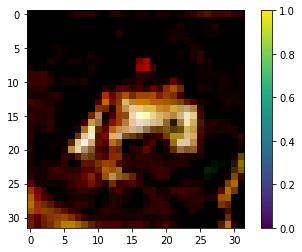
    


```python
# 이미지 10개 시각화
plt.figure(figsize=(10, 5))

for i in range(10):
    plt.subplot(2, 5, i+1)
    plt.imshow(train_x[i])
    plt.title(f'index: {i}')
    plt.axis('off')
plt.show()
```

    Clipping input data to the valid range for imshow with RGB data ([0..1] for floats or [0..255] for integers).
    Clipping input data to the valid range for imshow with RGB data ([0..1] for floats or [0..255] for integers).
    Clipping input data to the valid range for imshow with RGB data ([0..1] for floats or [0..255] for integers).
    Clipping input data to the valid range for imshow with RGB data ([0..1] for floats or [0..255] for integers).
    Clipping input data to the valid range for imshow with RGB data ([0..1] for floats or [0..255] for integers).
    Clipping input data to the valid range for imshow with RGB data ([0..1] for floats or [0..255] for integers).
    Clipping input data to the valid range for imshow with RGB data ([0..1] for floats or [0..255] for integers).
    Clipping input data to the valid range for imshow with RGB data ([0..1] for floats or [0..255] for integers).
    Clipping input data to the valid range for imshow with RGB data ([0..1] for floats or [0..255] for integers).
    Clipping input data to the valid range for imshow with RGB data ([0..1] for floats or [0..255] for integers).


    
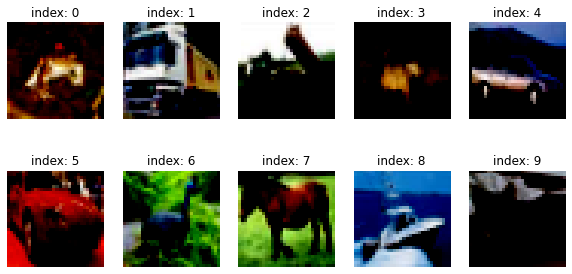
    


### 미니배치 데이터셋 구성


```python
BUFFER_SIZE = 50000 # 총 데이터 사이즈
BATCH_SIZE = 256 # 모델이 한 번에 학습할 데이터 사이즈

train_dataset = tf.data.Dataset.from_tensor_slices(train_x).shuffle(BUFFER_SIZE).batch(BATCH_SIZE)
```

## STEP 3. 생성자 모델 구현하기
- (32, 32, 3)의 shape를 가진 이미지를 생성하는 생성자 모델 구현 함수를 작성해 봅시다.
- noise = tf.random.normal([1, 100])로 생성된 랜덤 노이즈를 입력으로 하여 방금 구현한 생성자로 랜덤 이미지를 생성해 봅시다.
- 생성된 랜덤 이미지가 생성자 출력 규격에 잘 맞는지 확인해 봅시다.

### 생성자 모델 구현


```python
def make_generator_model():
	
    # Start
    model = tf.keras.Sequential()

    # First: Dense layer
    # units은 8x8x256, 편향은 사용하지 않음, 입력 값의 크기는 100차원 벡터
    model.add(layers.Dense(8*8*256, use_bias=False, input_shape=(100,))) # CIFAR-10은 더 큰 이미지라서 8x8로 시작
    # 배치 정규화 사용
    model.add(layers.BatchNormalization())
    # LeakyReLU 활성화 함수 사용
    model.add(layers.LeakyReLU())

    # Second: Reshape layer
    model.add(layers.Reshape((8, 8, 256)))

    # Third: Conv2DTranspose layer
    # 커널 크기는 5, stride는 1, 패딩은 사용, 편향은 사용하지 않음
    model.add(layers.Conv2DTranspose(128, kernel_size=(5, 5), strides=(2, 2), padding='same', use_bias=False))
    # 배치 정규화 사용
    model.add(layers.BatchNormalization())
    # LeakyReLU 활성화 함수 사용
    model.add(layers.LeakyReLU())

    # Fourth: Conv2DTranspose layer
    # 커널 크기는 5, stride는 2, 패딩은 사용, 편향은 사용하지 않음
    model.add(layers.Conv2DTranspose(64, kernel_size=(5, 5), strides=(2, 2), padding='same', use_bias=False))
    # 배치 정규화 사용
    model.add(layers.BatchNormalization())
    # LeakyReLU 활성화 함수 사용
    model.add(layers.LeakyReLU())

    # Fifth: Conv2DTranspose layer
    model.add(layers.Conv2DTranspose(3, kernel_size=(5, 5), strides=(1, 1), padding='same', use_bias=False, activation='tanh'))

    return model
```


```python
generator = make_generator_model()

generator.summary()
```

    Model: "sequential"
    _________________________________________________________________
    Layer (type)                 Output Shape              Param #   
    =================================================================
    dense (Dense)                (None, 16384)             1638400   
    _________________________________________________________________
    batch_normalization (BatchNo (None, 16384)             65536     
    _________________________________________________________________
    leaky_re_lu (LeakyReLU)      (None, 16384)             0         
    _________________________________________________________________
    reshape (Reshape)            (None, 8, 8, 256)         0         
    _________________________________________________________________
    conv2d_transpose (Conv2DTran (None, 16, 16, 128)       819200    
    _________________________________________________________________
    batch_normalization_1 (Batch (None, 16, 16, 128)       512       
    _________________________________________________________________
    leaky_re_lu_1 (LeakyReLU)    (None, 16, 16, 128)       0         
    _________________________________________________________________
    conv2d_transpose_1 (Conv2DTr (None, 32, 32, 64)        204800    
    _________________________________________________________________
    batch_normalization_2 (Batch (None, 32, 32, 64)        256       
    _________________________________________________________________
    leaky_re_lu_2 (LeakyReLU)    (None, 32, 32, 64)        0         
    _________________________________________________________________
    conv2d_transpose_2 (Conv2DTr (None, 32, 32, 3)         4800      
    =================================================================
    Total params: 2,733,504
    Trainable params: 2,700,352
    Non-trainable params: 33,152
    _________________________________________________________________


### 랜덤 이미지 생성 및 출력 규격 확인


```python
# 랜덤 노이즈 벡터 생성
noise = tf.random.normal([1, 100])
```


```python
# 랜덤 노이즈 벡터를 생성자에 입력하여 가짜 이미지 생성
generated_image = generator(noise, training=False)
generated_image.shape # 생성된 이미지의 shape가 (32, 32, 3)인지 확인
```


    TensorShape([1, 32, 32, 3])


```python
plt.imshow(generated_image[0, :, :, 0])
plt.colorbar()
plt.show()
```


    
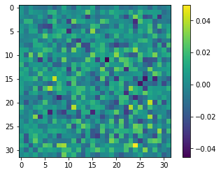
    


## STEP 4. 판별자 모델 구현하기
- (32, 32, 3)의 이미지를 입력으로 받아 1dim을 판별결과를 출력하는 판별자 모델 구현 함수를 작성해 봅시다.
- 위 STEP 2에서 생성한 랜덤 이미지를 판별자 모델이 판별한 결과값을 확인해 봅시다.

### 판별자 모델 구현


```python
def make_discriminator_model():

    # Start
    model = tf.keras.Sequential()

    # First: Conv2D Layer
    # 필터의 크기는 5이며 64개 사용, stride는 2, 패딩은 사용, 입력 값의 크기는 준비된 흑백 사진
    model.add(layers.Conv2D(64, kernel_size=(5, 5), strides=(2, 2), padding='same', input_shape=[32, 32, 3])) # input_shape(32, 32, 3) 설정
    # LeakyReLU 활성화 함수 사용
    model.add(layers.LeakyReLU())
    # Dropout은 0.3을 사용
    model.add(layers.Dropout(0.3))

    # Second: Conv2D Layer
    # 필터의 크기는 5이며 128개 사용, stride는 2, 패딩은 사용
    model.add(layers.Conv2D(128, kernel_size=(5, 5), strides=(2, 2), padding='same'))
    # LeakyReLU 활성화 함수 사용
    model.add(layers.LeakyReLU())
    # Dropout은 0.3을 사용
    model.add(layers.Dropout(0.3))

    # Third: Flatten Layer
    model.add(layers.Flatten())

    # Fourth: Dense Layer
    model.add(layers.Dense(1)) # 판별결과 출력(1에 가까우면 진짜, 0에 가까우면 가짜라고 판별)

    return model
```


```python
discriminator = make_discriminator_model()

discriminator.summary()
```

    Model: "sequential_1"
    _________________________________________________________________
    Layer (type)                 Output Shape              Param #   
    =================================================================
    conv2d (Conv2D)              (None, 16, 16, 64)        4864      
    _________________________________________________________________
    leaky_re_lu_3 (LeakyReLU)    (None, 16, 16, 64)        0         
    _________________________________________________________________
    dropout (Dropout)            (None, 16, 16, 64)        0         
    _________________________________________________________________
    conv2d_1 (Conv2D)            (None, 8, 8, 128)         204928    
    _________________________________________________________________
    leaky_re_lu_4 (LeakyReLU)    (None, 8, 8, 128)         0         
    _________________________________________________________________
    dropout_1 (Dropout)          (None, 8, 8, 128)         0         
    _________________________________________________________________
    flatten (Flatten)            (None, 8192)              0         
    _________________________________________________________________
    dense_1 (Dense)              (None, 1)                 8193      
    =================================================================
    Total params: 217,985
    Trainable params: 217,985
    Non-trainable params: 0
    _________________________________________________________________


### STEP 2에서 생성한 랜덤 이미지 판별


```python
decision = discriminator(generated_image, training=False)
decision
```


    <tf.Tensor: shape=(1, 1), dtype=float32, numpy=array([[-0.00125592]], dtype=float32)>


## STEP 5. 손실함수와 최적화 함수 구현하기
- 생성자와 판별자의 손실함수(loss)를 구현해 봅시다.
- 판별자의 출력값을 가지고 실제/생성(real/fake) 이미지 판별 정확도(accuracy)를 계산하는 함수를 구현해 봅시다.
- 생성자와 판별자를 최적화하는 optimizer를 정의합니다.

### 손실함수(loss) 구현


```python
# 손실 함수 정의
cross_entropy = tf.keras.losses.BinaryCrossentropy(from_logits=True)
```


```python
# 생성자의 손실 함수 (생성된 이미지를 진짜로 판별하도록 유도)
def generator_loss(fake_output):
    return cross_entropy(tf.ones_like(fake_output), fake_output)
```


```python
# 판별자의 손실 함수 (진짜는 1에, 가짜는 0에 가까워지도록 손실 계산)
def discriminator_loss(real_output, fake_output):
    
    real_loss = cross_entropy(tf.ones_like(real_output), real_output) # 진짜 이미지에 대한 손실
    fake_loss = cross_entropy(tf.zeros_like(fake_output), fake_output) # 가짜 이미지에 대한 손실
    
    # real_loss와 fake_loss를 더한 값
    total_loss = real_loss + fake_loss
    
    return total_loss
```

### 판별 정확도(accuracy) 계산 함수 구현


```python
# 판별자의 정확도(accuracy) 계산 함수
def discriminator_accuracy(real_output, fake_output):
    
     # 판별자가 real_output을 0.5 이상으로 예측하면 True (정확)
    real_accuracy = tf.reduce_mean(tf.cast(tf.math.greater_equal(real_output, tf.constant([0.5])), tf.float32))
    
    # 판별자가 fake_output을 0.5 미만으로 예측하면 True (정확)
    fake_accuracy = tf.reduce_mean(tf.cast(tf.math.less(fake_output, tf.constant([0.5])), tf.float32))
    
    return real_accuracy, fake_accuracy
```

### optimizer 정의


```python
# 생성자와 구분자 optimizer 각각 정의
generator_optimizer = tf.keras.optimizers.Adam(1e-4)
discriminator_optimizer = tf.keras.optimizers.Adam(1e-4)
```


```python
# 생성자 샘플 확인용 랜덤 노이즈 생성
noise_dim = 100 # 노이즈 차원 (100차원 벡터 사용)
num_examples_to_generate = 16 # 생성할 샘플 수

seed = tf.random.normal([num_examples_to_generate, noise_dim]) # 랜덤 노이즈 생성
seed.shape
```


    TensorShape([16, 100])


## STEP 6. 훈련과정 상세 기능 구현하기
- 1개 미니배치의 훈련 과정을 처리하는 train_step() 함수를 구현해 봅시다.
- 16개의 고정된 seed를 입력으로 하여 훈련 과정 동안 생성한 이미지를 시각화하는 generate_and_save_images() 함수를 구현해 봅시다.
- 훈련 epoch마다 생성자/판별자의 loss 및 판별자의 실제/생성(real/fake) 이미지 판별 accuracy 히스토리(history)를 그래프로 시각화하는 draw_train_history() 함수를 구현해 봅시다.
- training_checkpoints 디렉토리에 몇 epoch마다 모델을 저장하는 checkpoint 모듈을 설정해 봅시다.

### train_step() 함수 구현


```python
@tf.function
def train_step(images):  #(1) 입력데이터
    noise = tf.random.normal([BATCH_SIZE, noise_dim])  #(2) 생성자 입력 노이즈

    with tf.GradientTape() as gen_tape, tf.GradientTape() as disc_tape:  #(3) tf.GradientTape() 오픈
        generated_images = generator(noise, training=True)  #(4) generated_images 생성

        #(5) discriminator 판별
        real_output = discriminator(images, training=True)
        fake_output = discriminator(generated_images, training=True)

        #(6) loss 계산
        gen_loss = generator_loss(fake_output)
        disc_loss = discriminator_loss(real_output, fake_output)

        #(7) accuracy 계산
        real_accuracy, fake_accuracy = discriminator_accuracy(real_output, fake_output) 
    
    #(8) gradient 계산
    gradients_of_generator = gen_tape.gradient(gen_loss, generator.trainable_variables)
    gradients_of_discriminator = disc_tape.gradient(disc_loss, discriminator.trainable_variables)

    #(9) 모델 학습
    generator_optimizer.apply_gradients(zip(gradients_of_generator, generator.trainable_variables))
    discriminator_optimizer.apply_gradients(zip(gradients_of_discriminator, discriminator.trainable_variables))

    return gen_loss, disc_loss, real_accuracy, fake_accuracy  #(10) 리턴값
```

### 훈련 과정 동안 생성한 이미지 시각화


```python
def generate_and_save_images(model, epoch, it, sample_seeds):

    predictions = model(sample_seeds, training=False)

    fig = plt.figure(figsize=(4, 4))
    for i in range(predictions.shape[0]):
        plt.subplot(4, 4, i+1)
        plt.imshow((predictions[i] * 127.5 + 127.5).numpy().astype(np.uint8))
        plt.axis('off')
   
    plt.savefig('{}/aiffel/dcgan_newimage/cifar10/generated_samples/sample_epoch_{:04d}_iter_{:03d}.png'
                    .format(os.getenv('HOME'), epoch, it))

    plt.show()
```

### draw_train_history() 함수 구현


```python
from matplotlib.pylab import rcParams
rcParams['figure.figsize'] = 15, 6 # matlab 차트 크기를 15,6으로 지정

def draw_train_history(history, epoch):
    fig, axs = plt.subplots(2, 1)
    
    # summarize history for loss  
    plt.subplot(211)  
    plt.plot(history['gen_loss'])  
    plt.plot(history['disc_loss'])  
    plt.title('model loss')  
    plt.ylabel('loss')  
    plt.xlabel('batch iters')  
    plt.legend(['gen_loss', 'disc_loss'], loc='upper left')  

    # summarize history for accuracy  
    plt.subplot(212)  
    plt.plot(history['fake_accuracy'])  
    plt.plot(history['real_accuracy'])  
    plt.title('discriminator accuracy')  
    plt.ylabel('accuracy')  
    plt.xlabel('batch iters')  
    plt.legend(['fake_accuracy', 'real_accuracy'], loc='upper left')  
    
    # tepoch별 그래프를 이미지 파일로 저장
    save_path = '{}/aiffel/dcgan_newimage/cifar10/training_history/train_history_{:04d}.png'.format(os.getenv('HOME'), epoch)
    plt.savefig(save_path)
    plt.close(fig)
```

### checkpoint 모듈 설정


```python
checkpoint_dir = os.getenv('HOME')+'/aiffel/dcgan_newimage/cifar10/training_checkpoints'
checkpoint_prefix = os.path.join(checkpoint_dir, "ckpt")

checkpoint = tf.train.Checkpoint(generator_optimizer=generator_optimizer,
                                 discriminator_optimizer=discriminator_optimizer,
                                 generator=generator,
                                 discriminator=discriminator)
```

## STEP 7. 학습 과정 진행하기
- 위 STEP 5에서 구현한 기능들을 활용하여 최소 50 epoch만큼의 모델 학습을 진행해 봅시다.
- 학습 과정에서 생성된 샘플 이미지로 만든 gif 파일을 통해 학습 진행 과정을 시각적으로 표현해 봅시다.
- 학습 과정을 담은 샘플 이미지, gif 파일, 학습 진행 그래프 이미지를 함께 제출합니다.

### 모델 학습 진행


```python
def train(dataset, epochs, save_every):
    start = time.time()
    history = {'gen_loss':[], 'disc_loss':[], 'real_accuracy':[], 'fake_accuracy':[]}

    for epoch in range(epochs):
        epoch_start = time.time()
        for it, image_batch in enumerate(dataset):
            gen_loss, disc_loss, real_accuracy, fake_accuracy = train_step(image_batch)
            history['gen_loss'].append(gen_loss)
            history['disc_loss'].append(disc_loss)
            history['real_accuracy'].append(real_accuracy)
            history['fake_accuracy'].append(fake_accuracy)

            if it % 50 == 0:
                display.clear_output(wait=True)
                generate_and_save_images(generator, epoch+1, it+1, seed)
                print('Epoch {} | iter {}'.format(epoch+1, it+1))
                print('Time for epoch {} : {} sec'.format(epoch+1, int(time.time()-epoch_start)))

        if (epoch + 1) % save_every == 0:
            checkpoint.save(file_prefix=checkpoint_prefix)

        display.clear_output(wait=True)
        generate_and_save_images(generator, epochs, it, seed)
        print('Time for training : {} sec'.format(int(time.time()-start)))

        draw_train_history(history, epoch)
```


```python
save_every = 5
EPOCHS = 50
```


```python
%%time
train(train_dataset, EPOCHS, save_every)
```


    
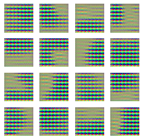
    


    Epoch 2 | iter 1
    Time for epoch 2 : 1 sec


    ---------------------------------------------------------------------------

    KeyboardInterrupt                         Traceback (most recent call last)

    <timed eval> in <module>


    /tmp/ipykernel_90/1874242379.py in train(dataset, epochs, save_every)
          6         epoch_start = time.time()
          7         for it, image_batch in enumerate(dataset):
    ----> 8             gen_loss, disc_loss, real_accuracy, fake_accuracy = train_step(image_batch)
          9             history['gen_loss'].append(gen_loss)
         10             history['disc_loss'].append(disc_loss)


    /opt/conda/lib/python3.9/site-packages/tensorflow/python/eager/def_function.py in __call__(self, *args, **kwds)
        883 
        884       with OptionalXlaContext(self._jit_compile):
    --> 885         result = self._call(*args, **kwds)
        886 
        887       new_tracing_count = self.experimental_get_tracing_count()


    /opt/conda/lib/python3.9/site-packages/tensorflow/python/eager/def_function.py in _call(self, *args, **kwds)
        915       # In this case we have created variables on the first call, so we run the
        916       # defunned version which is guaranteed to never create variables.
    --> 917       return self._stateless_fn(*args, **kwds)  # pylint: disable=not-callable
        918     elif self._stateful_fn is not None:
        919       # Release the lock early so that multiple threads can perform the call


    /opt/conda/lib/python3.9/site-packages/tensorflow/python/eager/function.py in __call__(self, *args, **kwargs)
       3037       (graph_function,
       3038        filtered_flat_args) = self._maybe_define_function(args, kwargs)
    -> 3039     return graph_function._call_flat(
       3040         filtered_flat_args, captured_inputs=graph_function.captured_inputs)  # pylint: disable=protected-access
       3041 


    /opt/conda/lib/python3.9/site-packages/tensorflow/python/eager/function.py in _call_flat(self, args, captured_inputs, cancellation_manager)
       1961         and executing_eagerly):
       1962       # No tape is watching; skip to running the function.
    -> 1963       return self._build_call_outputs(self._inference_function.call(
       1964           ctx, args, cancellation_manager=cancellation_manager))
       1965     forward_backward = self._select_forward_and_backward_functions(


    /opt/conda/lib/python3.9/site-packages/tensorflow/python/eager/function.py in call(self, ctx, args, cancellation_manager)
        589       with _InterpolateFunctionError(self):
        590         if cancellation_manager is None:
    --> 591           outputs = execute.execute(
        592               str(self.signature.name),
        593               num_outputs=self._num_outputs,


    /opt/conda/lib/python3.9/site-packages/tensorflow/python/eager/execute.py in quick_execute(op_name, num_outputs, inputs, attrs, ctx, name)
         57   try:
         58     ctx.ensure_initialized()
    ---> 59     tensors = pywrap_tfe.TFE_Py_Execute(ctx._handle, device_name, op_name,
         60                                         inputs, attrs, num_outputs)
         61   except core._NotOkStatusException as e:


    KeyboardInterrupt: 


### 학습 과정 시각화


```python
anim_file = os.getenv('HOME')+'/aiffel/dcgan_newimage/cifar10/cifar10_dcgan.gif'

with imageio.get_writer(anim_file, mode='I') as writer:
    filenames = glob.glob('{}/aiffel/dcgan_newimage/cifar10/generated_samples/sample*.png'.format(os.getenv('HOME')))
    filenames = sorted(filenames)
    last = -1
    for i, filename in enumerate(filenames):
        frame = 2*(i**0.5)
        if round(frame) > round(last):
            last = frame
        else:
            continue
        image = imageio.imread(filename)
        writer.append_data(image)
    image = imageio.imread(filename)
    writer.append_data(image)

!ls -l ~/aiffel/dcgan_newimage/cifar10/cifar10_dcgan.gif
```

    -rw-r--r-- 1 root root 1026428 Mar 14 06:26 /aiffel/aiffel/dcgan_newimage/cifar10/cifar10_dcgan.gif


```python
import matplotlib.image as mpimg
from IPython.display import Image, display

# 샘플 이미지 경로
sample_images = sorted(glob.glob(f'{os.getenv("HOME")}/aiffel/dcgan_newimage/cifar10/generated_samples/sample_*.png'))

# 샘플 이미지 표시 (최근 10개)
for image_path in sample_images[-10:]:
    img = mpimg.imread(image_path)
    plt.figure()
    plt.imshow(img)
    plt.axis('off')
    plt.title(f'Sample Image: {os.path.basename(image_path)}')
    plt.show()
```


    
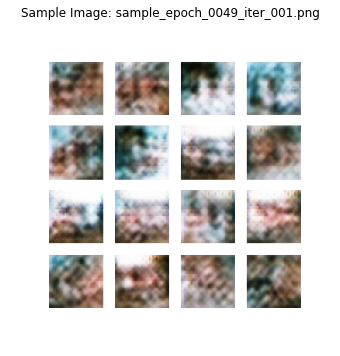
    


    
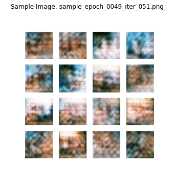
    


    
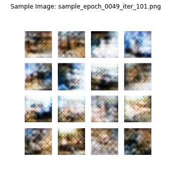
    


    
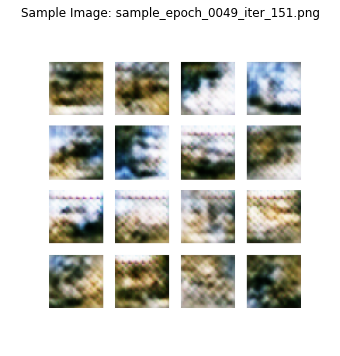
    


    
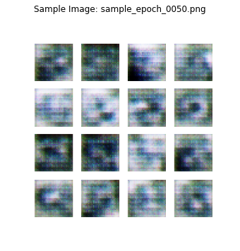
    


    
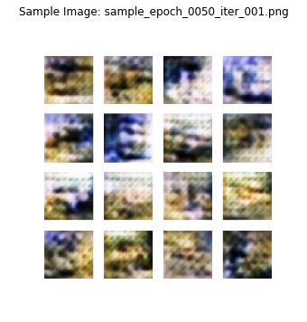
    


    
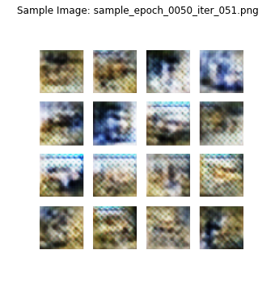
    


    
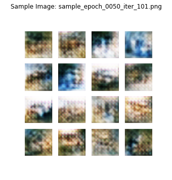
    


    
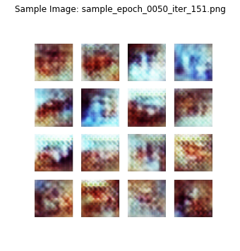
    


    
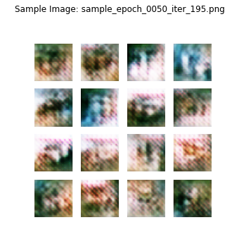
    


```python
# GIF 파일 경로
gif_path = os.getenv('HOME') + '/aiffel/dcgan_newimage/cifar10/cifar10_dcgan.gif'

# GIF 파일 표시
display(Image(filename=gif_path))
```


    <IPython.core.display.Image object>


```python
# 학습 진행 그래프 경로
graph_images = sorted(glob.glob(f'{os.getenv("HOME")}/aiffel/dcgan_newimage/cifar10/training_history/train_history_*.png'))

# 학습 그래프 표시 (최근 10개)
for graph_path in graph_images[-10:]:
    img = mpimg.imread(graph_path)
    plt.figure()
    plt.imshow(img)
    plt.axis('off')
    plt.title(f'Training History: {os.path.basename(graph_path)}')
    plt.show()
```


    
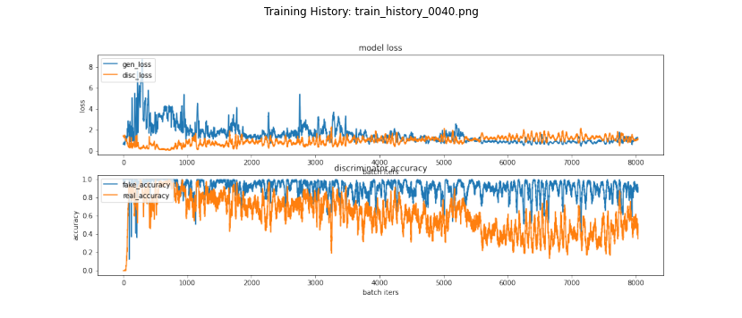
    


    
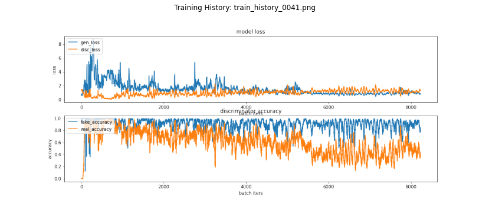
    


    
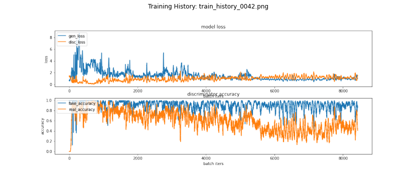
    


    
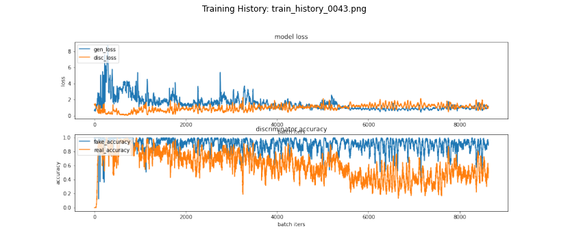
    


    

    


    
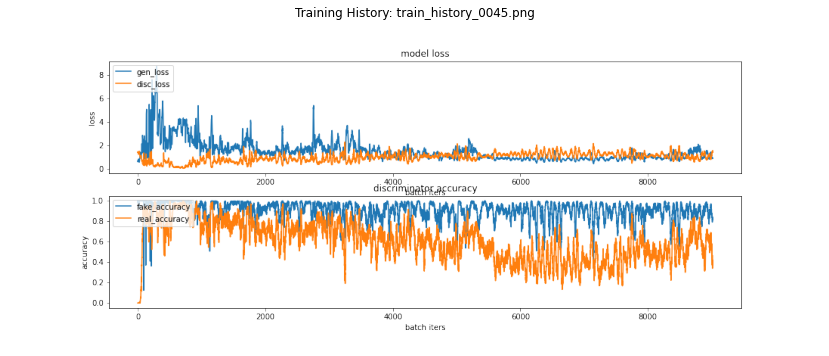
    


    
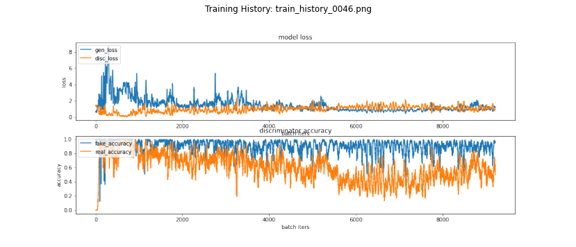
    


    

    


    
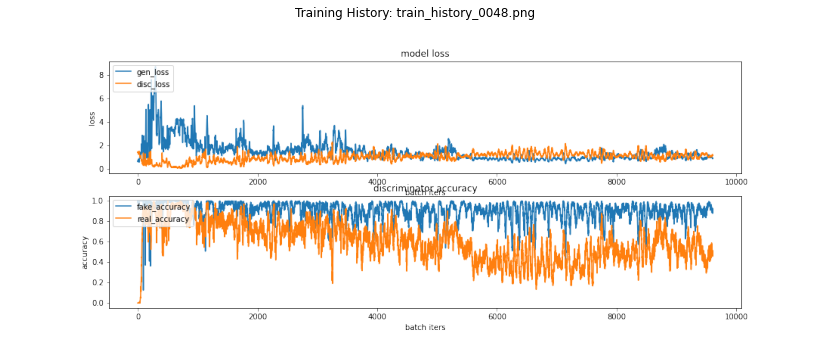
    


    
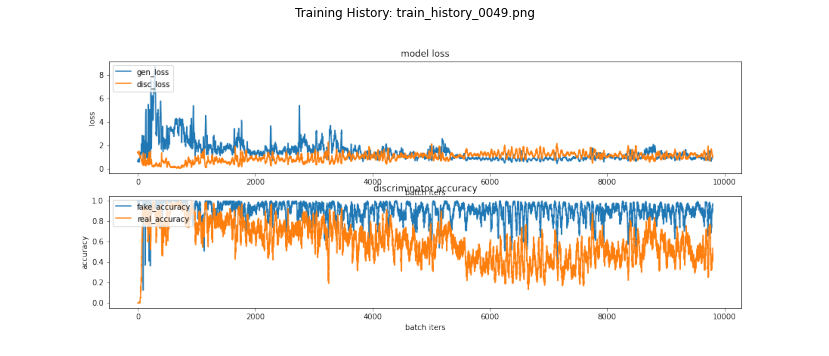
    


```python
# 저장할 GIF 파일 경로
graph_gif_path = os.path.join(os.getenv('HOME'), 'aiffel/dcgan_newimage/cifar10/training_history.gif')

# 학습 그래프 이미지 경로 가져오기
graph_images = sorted(glob.glob(f'{os.getenv("HOME")}/aiffel/dcgan_newimage/cifar10/training_history/train_history_*.png'))

# GIF 파일로 저장
with imageio.get_writer(graph_gif_path, mode='I', duration=0.1) as writer:
    for filename in graph_images:
        image = imageio.imread(filename)  # v2 제거
        writer.append_data(image)

print(f"Training history GIF saved at: {graph_gif_path}")

# 저장한 GIF 파일 표시
display(Image(filename=graph_gif_path))
```

    Training history GIF saved at: /aiffel/aiffel/dcgan_newimage/cifar10/training_history.gif


    <IPython.core.display.Image object>


### [ 문제점 분석 ]

**1. 손실 그래프 (model loss)**
1) gen_loss (생성자 손실):
- 초반에 급격히 감소하는 패턴은 일반적이며, 이는 초기 학습으로 인한 결과임
- 중반 이후에도 진동이 강한 이유는 판별자의 학습이 빠르게 진행되어 생성자가 계속 속이기 어려워지는 상황이 발생했을 가능성이 있음

2) disc_loss (판별자 손실):
- 초반에는 안정적으로 보이지만, 생성자가 충분히 발전하지 못하면서 판별자가 쉽게 판별하는 경향이 강화되고 있음
- 판별자가 너무 쉽게 학습하고 있어 disc_loss가 지나치게 안정적으로 보일 수 있음

**2. 판별자 정확도 그래프 (discriminator accuracy)**
1) fake_accuracy (가짜 이미지를 가짜라고 판별한 비율):
- 1에 가까운 값은 판별자가 가짜 이미지를 거의 완벽하게 판별하고 있음을 의미함
- 이는 판별자가 너무 강해져서 생성자가 제대로 학습을 못하는 상태임

2) real_accuracy (진짜 이미지를 진짜라고 판별한 비율):
- 진동하는 현상은 모델의 과적합 혹은 불안정성을 나타낼 수 있음
- 특히 중반 이후 real_accuracy가 낮아지는 부분은 판별자가 진짜와 가짜를 제대로 구분하지 못하는 상황일 수 있음

**3. 샘플 이미지 분석**
- 생성된 이미지들이 형체를 알아볼 수 없는 수준임
- 생성된 이미지가 랜덤 노이즈처럼 보인다는 점은, 생성자가 판별자를 전혀 속이지 못해 제대로 학습이 되지 않았다는 증거임
- 이는 판별자가 너무 강해져서 생성자가 학습을 진행할 기회를 얻지 못한 상태라고 해석됨

### [ 문제점 정리 ]

**1. 판별자가 너무 강함**
- fake_accuracy가 1에 가까운 이유는, 판별자가 너무 빨리 학습되고 있어서 생성자가 개선할 시간을 주지 못하고 있기 때문임

**2. 생성자 학습 불안정**
- gen_loss가 진동하는 원인은 생성자가 판별자의 강한 학습으로부터 제대로 학습할 기회를 얻지 못했기 때문임

## STEP 8. (optional) GAN 훈련 과정 개선하기
- STEP 6을 진행하면서 생성된 샘플 이미지, 학습 과정 그래프 등을 통해 이전 훈련 과정의 문제점을 분석해 봅시다.
- 모델구조 또는 학습 과정을 개선한 내역과 그 결과(샘플 이미지, 학습 과정 그래프 포함)를 함께 제출합니다.

### 1. ver2
**[ 주요 개선 사항 ]**
- 데이터셋을 3개 클래스로 필터링
- Learning Rate 감소 (1e-4 → 1e-5)
- 판별자 Label Smoothing 적용 (진짜 라벨을 1 → 0.9) : 생성자에 학습 기회 더 제공
- 판별자의 Dropout 비율 증가 (0.3 → 0.5) : 판별자의 과적합 방지(판별자가 과도하게 확신하는 현상 감소)
- LeakyReLU의 alpha 값 변경 (0.2로 좀 더 부드럽게) : 기울기가 0에 너무 가까워지지 않아 죽은 뉴런 문제 방지
- Spectral Normalization 적용 : 판별자의 가중치가 너무 커지는(폭주) 문제 방지
- 훈련 주기 조정 : 판별자만 주기적으로 학습
- He Initialization 적용 : 가중치가 작은 값으로 시작해 학습이 더 안정적으로 진행(Generator 초기화 개선)
- BatchNorm의 momentum 값 변경 (0.99 → 0.9) : 학습의 민감도 증가


```python
import os
import glob
import time
import numpy as np
import tensorflow as tf
from tensorflow.keras import layers
import matplotlib.pyplot as plt
import imageio
from IPython.display import display, Image, clear_output
import pandas as pd

# 경고 무시
import warnings
warnings.filterwarnings('ignore')
```


```python
# 디렉토리 설정
sample_dir = os.path.join(os.getenv('HOME'), 'aiffel/dcgan_newimage/cifar10/generated_samples_ver2')
history_dir = os.path.join(os.getenv('HOME'), 'aiffel/dcgan_newimage/cifar10/training_history_ver2')
checkpoint_dir = os.path.join(os.getenv('HOME'), 'aiffel/dcgan_newimage/cifar10/training_checkpoints_ver2')

os.makedirs(sample_dir, exist_ok=True)
os.makedirs(history_dir, exist_ok=True)
os.makedirs(checkpoint_dir, exist_ok=True)
```


```python
# 주요 환경 설정
BUFFER_SIZE = 50000
BATCH_SIZE = 256
EPOCHS = 50
SAVE_EVERY = 2
NUM_CLASSES = 10 # 3개 클래스만 선택
NOISE_DIM = 100
```


```python
# 1. 데이터셋 필터링
def load_filtered_data():
    (train_x, train_y), _ = tf.keras.datasets.cifar10.load_data()
    
    selected_classes = list(range(NUM_CLASSES))
    filter_mask = np.isin(train_y.flatten(), selected_classes)
    
    filtered_train_x = train_x[filter_mask]
    return filtered_train_x

train_x = load_filtered_data()
train_x = (train_x - 127.5) / 127.5  # 정규화 (-1 ~ 1)

train_dataset = tf.data.Dataset.from_tensor_slices(train_x).shuffle(BUFFER_SIZE).batch(BATCH_SIZE)
```


```python
# 2. 생성자 모델 개선
def make_generator_model():
    model = tf.keras.Sequential([
        layers.Dense(8 * 8 * 256, use_bias=False, input_shape=(100,)),
        layers.BatchNormalization(momentum=0.9),
        layers.LeakyReLU(alpha=0.2),

        layers.Reshape((8, 8, 256)),
        layers.Conv2DTranspose(128, (5, 5), strides=(2, 2), padding='same', use_bias=False, kernel_initializer='he_normal'),
        layers.BatchNormalization(momentum=0.9),
        layers.LeakyReLU(alpha=0.2),

        layers.Conv2DTranspose(64, (5, 5), strides=(2, 2), padding='same', use_bias=False, kernel_initializer='he_normal'),
        layers.BatchNormalization(momentum=0.9),
        layers.LeakyReLU(alpha=0.2),

        layers.Conv2DTranspose(3, (5, 5), strides=(1, 1), padding='same', use_bias=False, activation='tanh')
    ])
    return model

generator = make_generator_model()
```


```python
# 3. 판별자 모델 개선 (Spectral Normalization + Dropout 강화)
def make_discriminator_model():
    model = tf.keras.Sequential([
        layers.Conv2D(64, (5, 5), strides=(2, 2), padding='same', input_shape=[32, 32, 3]),
        layers.LeakyReLU(alpha=0.2),
        layers.Dropout(0.5),

        layers.Conv2D(128, (5, 5), strides=(2, 2), padding='same'),
        layers.LeakyReLU(alpha=0.2),
        layers.Dropout(0.5),

        layers.Flatten(),
        layers.Dense(1)
    ])
    return model

discriminator = make_discriminator_model()
```


```python
# 4. 손실함수 개선 (Label Smoothing 적용)
cross_entropy = tf.keras.losses.BinaryCrossentropy(from_logits=True)

def generator_loss(fake_output):
    return cross_entropy(tf.ones_like(fake_output), fake_output)

def discriminator_loss(real_output, fake_output):
    real_loss = cross_entropy(tf.ones_like(real_output) * 0.9, real_output)  # Label Smoothing
    fake_loss = cross_entropy(tf.zeros_like(fake_output), fake_output)
    return real_loss + fake_loss

# 5. 옵티마이저 개선 (학습률 감소)
generator_optimizer = tf.keras.optimizers.Adam(1e-5, beta_1=0.5)
discriminator_optimizer = tf.keras.optimizers.Adam(1e-5, beta_1=0.5)

# 6. 샘플용 Seed
seed = tf.random.normal([16, NOISE_DIM])
```


```python
# 7. 학습 함수 개선
@tf.function
def train_step(images):
    noise = tf.random.normal([BATCH_SIZE, NOISE_DIM])

    with tf.GradientTape() as gen_tape, tf.GradientTape() as disc_tape:
        generated_images = generator(noise, training=True)

        real_output = discriminator(images, training=True)
        fake_output = discriminator(generated_images, training=True)

        gen_loss = generator_loss(fake_output)
        disc_loss = discriminator_loss(real_output, fake_output)
        
        real_accuracy = tf.reduce_mean(tf.cast(real_output > 0.5, tf.float32))
        fake_accuracy = tf.reduce_mean(tf.cast(fake_output < 0.5, tf.float32))

    gradients_of_generator = gen_tape.gradient(gen_loss, generator.trainable_variables)
    gradients_of_discriminator = disc_tape.gradient(disc_loss, discriminator.trainable_variables)

    generator_optimizer.apply_gradients(zip(gradients_of_generator, generator.trainable_variables))
    discriminator_optimizer.apply_gradients(zip(gradients_of_discriminator, discriminator.trainable_variables))
    
    return gen_loss, disc_loss, real_accuracy, fake_accuracy  #(10) 리턴값
```


```python
# 8. 이미지 생성 및 저장
def generate_and_save_images(model, epoch, it, sample_seeds):
    predictions = model(seed, training=False)
    
    plt.figure(figsize=(4, 4))
    for i in range(predictions.shape[0]):
        plt.subplot(4, 4, i + 1)
        plt.imshow((predictions[i] * 127.5 + 127.5).numpy().astype(np.uint8))
        plt.axis('off')

    save_path = f'{os.getenv("HOME")}/aiffel/dcgan_newimage/cifar10/generated_samples_ver2/sample_epoch_{epoch:04d}_iter_{it:03d}.png'
    plt.savefig(save_path)
    plt.close()
```


```python
from matplotlib.pylab import rcParams
rcParams['figure.figsize'] = 15, 6 # matlab 차트 크기를 15,6으로 지정

def draw_train_history(history, epoch):
    fig, axs = plt.subplots(2, 1)
    
    # summarize history for loss  
    plt.subplot(211)  
    plt.plot(history['gen_loss'])  
    plt.plot(history['disc_loss'])  
    plt.title('model loss')  
    plt.ylabel('loss')  
    plt.xlabel('batch iters')  
    plt.legend(['gen_loss', 'disc_loss'], loc='upper left')  

    # summarize history for accuracy  
    plt.subplot(212)  
    plt.plot(history['fake_accuracy'])  
    plt.plot(history['real_accuracy'])  
    plt.title('discriminator accuracy')  
    plt.ylabel('accuracy')  
    plt.xlabel('batch iters')  
    plt.legend(['fake_accuracy', 'real_accuracy'], loc='upper left')  
    
    # tepoch별 그래프를 이미지 파일로 저장
    save_path = '{}/aiffel/dcgan_newimage/cifar10/training_history_ver2/train_history_{:04d}.png'.format(os.getenv('HOME'), epoch)
    plt.savefig(save_path)
    plt.close(fig)
```


```python
checkpoint_dir = os.path.join(os.getenv('HOME'), 'aiffel/dcgan_newimage/cifar10/training_checkpoints_ver2')
os.makedirs(checkpoint_dir, exist_ok=True)

checkpoint_prefix = os.path.join(checkpoint_dir, "ckpt")
checkpoint = tf.train.Checkpoint(generator_optimizer=generator_optimizer,
                                 discriminator_optimizer=discriminator_optimizer,
                                 generator=generator,
                                 discriminator=discriminator)
```


```python
# 9. 학습 진행
def train(dataset, epochs, save_every):
    start = time.time()
    history = {'gen_loss':[], 'disc_loss':[], 'real_accuracy':[], 'fake_accuracy':[]}

    for epoch in range(epochs):
        epoch_start = time.time()
        for it, image_batch in enumerate(dataset):
            gen_loss, disc_loss, real_accuracy, fake_accuracy = train_step(image_batch)
            history['gen_loss'].append(gen_loss)
            history['disc_loss'].append(disc_loss)
            history['real_accuracy'].append(real_accuracy)
            history['fake_accuracy'].append(fake_accuracy)

            if it % 50 == 0:
                clear_output(wait=True)
                generate_and_save_images(generator, epoch+1, it+1, seed)
                print('Epoch {} | iter {}'.format(epoch+1, it+1))
                print('Time for epoch {} : {} sec'.format(epoch+1, int(time.time()-epoch_start)))

        if (epoch + 1) % save_every == 0:
            checkpoint.save(file_prefix=checkpoint_prefix)

        clear_output(wait=True)
        generate_and_save_images(generator, epochs, it, seed)
        print('Time for training : {} sec'.format(int(time.time()-start)))

        draw_train_history(history, epoch)
        
train(train_dataset, EPOCHS, SAVE_EVERY)
```

    Time for training : 400 sec


```python
# 10. 학습 이미지로 GIF 생성

# GIF 파일 경로
sample_gif_path = os.path.join(os.getenv('HOME'), 'aiffel/dcgan_newimage/cifar10/cifar10_samples_ver2.gif')

# 샘플 이미지 파일 경로 가져오기
sample_images = sorted(glob.glob(f'{os.getenv("HOME")}/aiffel/dcgan_newimage/cifar10/generated_samples_ver2/sample_*.png'))

# GIF 파일로 저장
with imageio.get_writer(sample_gif_path, mode='I', duration=0.1) as writer:
    for filename in sample_images:
        image = imageio.imread(filename)
        writer.append_data(image)

print(f"Sample images GIF saved at: {sample_gif_path}")

# 저장된 샘플 이미지 GIF 표시
display(Image(filename=sample_gif_path))
```

    Sample images GIF saved at: /aiffel/aiffel/dcgan_newimage/cifar10/cifar10_samples_ver2.gif


    <IPython.core.display.Image object>


```python
# GIF 파일 경로
graph_gif_path = os.path.join(os.getenv('HOME'), 'aiffel/dcgan_newimage/cifar10/training_history_ver2.gif')

# 학습 그래프 이미지 경로 가져오기
graph_images = sorted(glob.glob(f'{os.getenv("HOME")}/aiffel/dcgan_newimage/cifar10/training_history_ver2/train_history_*.png'))

# GIF 파일로 저장
with imageio.get_writer(graph_gif_path, mode='I', duration=0.1) as writer:
    for filename in graph_images:
        image = imageio.imread(filename)
        writer.append_data(image)

print(f"Training history GIF saved at: {graph_gif_path}")

# 저장된 학습 그래프 GIF 표시
display(Image(filename=graph_gif_path))
```

    Training history GIF saved at: /aiffel/aiffel/dcgan_newimage/cifar10/training_history_ver2.gif


    <IPython.core.display.Image object>


### 2. ver3
**[ 주요 개선 사항 ]**
"Improved Techniques for Training GANs" 논문 참조
- Minibatch Discrimination: 판별자에 Minibatch Discrimination 레이어를 추가하여 모드 붕괴 방지(o)
- One-sided Label Smoothing: 판별자의 라벨을 1이 아닌 0.9로 설정하여 학습 안정성 향상(o)
- Learning Rate 및 Optimizer 개선: Adam 옵티마이저에 적절한 파라미터 적용(o)
- Feature Matching: 생성자가 판별자의 중간층 feature의 통계값을 학습하도록 변경하여 안정성 개선(x)
- Historical Averaging: 매 반복마다 모델 파라미터 평균값 적용(x)
- Virtual Batch Normalization (VBN): 생성자에 VBN 적용(x)


```python
import os
import glob
import time
import imageio
import numpy as np
import tensorflow as tf
from tensorflow.keras import layers
import matplotlib.pyplot as plt
from IPython.display import Image, display, clear_output
import matplotlib.image as mpimg
%matplotlib inline

import warnings
warnings.filterwarnings('ignore')  # 경고 메시지 무시
```


```python
# 디렉토리 설정
sample_dir = os.path.join(os.getenv('HOME'), 'aiffel/dcgan_newimage/cifar10/generated_samples_ver3')
history_dir = os.path.join(os.getenv('HOME'), 'aiffel/dcgan_newimage/cifar10/training_history_ver3')
checkpoint_dir = os.path.join(os.getenv('HOME'), 'aiffel/dcgan_newimage/cifar10/training_checkpoints_ver3')

os.makedirs(sample_dir, exist_ok=True)
os.makedirs(history_dir, exist_ok=True)
os.makedirs(checkpoint_dir, exist_ok=True)
```


```python
# Hyperparameters
BUFFER_SIZE = 50000
BATCH_SIZE = 256
noise_dim = 100
num_examples_to_generate = 10
EPOCHS = 50
save_every = 5
```


```python
# 데이터셋 로드 및 정규화
(train_x, _), (_, _) = tf.keras.datasets.cifar10.load_data()
train_x = (train_x - 127.5) / 127.5
train_dataset = tf.data.Dataset.from_tensor_slices(train_x).shuffle(BUFFER_SIZE).batch(BATCH_SIZE)
```


```python
# 모델 정의

# Generator with Virtual Batch Normalization
def make_generator_model():
    # Start
    model = tf.keras.Sequential([
        
        # First: Dense layer
        layers.Dense(8*8*256, use_bias=False, input_shape=(100,)),
        layers.BatchNormalization(),
        layers.LeakyReLU(),
        
        # Second: Reshape layer
        layers.Reshape((8, 8, 256)),
        
        # Third: Conv2DTranspose layer
        layers.Conv2DTranspose(128, (5, 5), strides=(2, 2), padding='same', use_bias=False),
        layers.BatchNormalization(),
        layers.LeakyReLU(),
        
        # Fourth: Conv2DTranspose layer
        layers.Conv2DTranspose(64, (5, 5), strides=(2, 2), padding='same', use_bias=False),
        layers.BatchNormalization(),
        layers.LeakyReLU(),
        
        # Fifth: Conv2DTranspose layer
        layers.Conv2DTranspose(3, (5, 5), strides=(1, 1), padding='same', use_bias=False, activation='tanh')
    ])
    return model

generator = make_generator_model()

generator.summary()
```

    Model: "sequential_14"
    _________________________________________________________________
    Layer (type)                 Output Shape              Param #   
    =================================================================
    dense_19 (Dense)             (None, 16384)             1638400   
    _________________________________________________________________
    batch_normalization_21 (Batc (None, 16384)             65536     
    _________________________________________________________________
    leaky_re_lu_35 (LeakyReLU)   (None, 16384)             0         
    _________________________________________________________________
    reshape_7 (Reshape)          (None, 8, 8, 256)         0         
    _________________________________________________________________
    conv2d_transpose_21 (Conv2DT (None, 16, 16, 128)       819200    
    _________________________________________________________________
    batch_normalization_22 (Batc (None, 16, 16, 128)       512       
    _________________________________________________________________
    leaky_re_lu_36 (LeakyReLU)   (None, 16, 16, 128)       0         
    _________________________________________________________________
    conv2d_transpose_22 (Conv2DT (None, 32, 32, 64)        204800    
    _________________________________________________________________
    batch_normalization_23 (Batc (None, 32, 32, 64)        256       
    _________________________________________________________________
    leaky_re_lu_37 (LeakyReLU)   (None, 32, 32, 64)        0         
    _________________________________________________________________
    conv2d_transpose_23 (Conv2DT (None, 32, 32, 3)         4800      
    =================================================================
    Total params: 2,733,504
    Trainable params: 2,700,352
    Non-trainable params: 33,152
    _________________________________________________________________


```python
from tensorflow.keras import layers, initializers

class MinibatchDiscrimination(layers.Layer):
    def __init__(self, num_kernels, kernel_dim, **kwargs):
        super(MinibatchDiscrimination, self).__init__(**kwargs)
        self.num_kernels = num_kernels
        self.kernel_dim = kernel_dim

    def build(self, input_shape):
        # 논문에 따라 A×B×C 형태의 T 텐서 생성
        self.T = self.add_weight(
            name='kernel',
            shape=(input_shape[1], self.num_kernels, self.kernel_dim),
            initializer=initializers.RandomNormal(stddev=0.02),
            trainable=True
        )

    def call(self, inputs):
        # 1. 입력 벡터에 T 텐서 곱하기 → (batch_size, num_kernels, kernel_dim)
        M = tf.tensordot(inputs, self.T, axes=1)

        # 2. 샘플 간 L1 Distance 계산
        M_expanded1 = tf.expand_dims(M, 3)  # (batch_size, num_kernels, kernel_dim, 1)
        M_expanded2 = tf.expand_dims(tf.transpose(M, [1, 2, 0]), 0)  # (1, num_kernels, kernel_dim, batch_size)

        # 3. L1 거리 계산 → (batch_size, num_kernels, batch_size)
        abs_diffs = tf.reduce_sum(tf.abs(M_expanded1 - M_expanded2), axis=2)

        # 4. Negative exponential 적용 → (batch_size, num_kernels, batch_size)
        c = tf.exp(-abs_diffs)

        # 5. Minibatch feature 생성 (다른 샘플과의 유사성 총합)
        o = tf.reduce_sum(c, axis=2)

        # 6. 원본 입력 벡터와 Minibatch feature를 결합
        return tf.concat([inputs, o], axis=1)

# Discriminator with Minibatch Discrimination
def make_discriminator_model():
    # Start
    model = tf.keras.Sequential([
        
        # First: Conv2D Layer
        layers.Conv2D(64, (5, 5), strides=(2, 2), padding='same', input_shape=[32, 32, 3]),
        layers.LeakyReLU(),
        layers.Dropout(0.3),
        
        # Second: Conv2D Layer
        layers.Conv2D(128, (5, 5), strides=(2, 2), padding='same'),
        layers.LeakyReLU(),
        layers.Dropout(0.3),
        
        # Third: Flatten Layer
        layers.Flatten(),        

        # Minibatch Discrimination 적용
        MinibatchDiscrimination(num_kernels=50, kernel_dim=5),
        
        # Fifth: Dense Layer
        layers.Dense(1) # 판별결과 출력(1에 가까우면 진짜, 0에 가까우면 가짜라고 판별)
    ])
    return model

discriminator = make_discriminator_model()

discriminator.summary()
```

    Model: "sequential_15"
    _________________________________________________________________
    Layer (type)                 Output Shape              Param #   
    =================================================================
    conv2d_14 (Conv2D)           (None, 16, 16, 64)        4864      
    _________________________________________________________________
    leaky_re_lu_38 (LeakyReLU)   (None, 16, 16, 64)        0         
    _________________________________________________________________
    dropout_14 (Dropout)         (None, 16, 16, 64)        0         
    _________________________________________________________________
    conv2d_15 (Conv2D)           (None, 8, 8, 128)         204928    
    _________________________________________________________________
    leaky_re_lu_39 (LeakyReLU)   (None, 8, 8, 128)         0         
    _________________________________________________________________
    dropout_15 (Dropout)         (None, 8, 8, 128)         0         
    _________________________________________________________________
    flatten_7 (Flatten)          (None, 8192)              0         
    _________________________________________________________________
    minibatch_discrimination (Mi (None, 8242)              2048000   
    _________________________________________________________________
    dense_20 (Dense)             (None, 1)                 8243      
    =================================================================
    Total params: 2,266,035
    Trainable params: 2,266,035
    Non-trainable params: 0
    _________________________________________________________________


```python
# Loss & Optimizer with One-sided Label Smoothing

# 손실 함수 정의
cross_entropy = tf.keras.losses.BinaryCrossentropy(from_logits=True)

# 생성자의 손실 함수 
def generator_loss(fake_output):
    return cross_entropy(tf.ones_like(fake_output), fake_output)

# 판별자의 손실 함수
def discriminator_loss(real_output, fake_output):
    real_loss = cross_entropy(tf.ones_like(real_output) * 0.9, real_output) #판별자의 성능을 떨어뜨리기 위한 0.9
    fake_loss = cross_entropy(tf.zeros_like(fake_output), fake_output)
    return real_loss + fake_loss

# 판별자의 정확도(accuracy) 계산 함수
def discriminator_accuracy(real_output, fake_output):
    real_accuracy = tf.reduce_mean(tf.cast(real_output > 0.5, tf.float32))
    fake_accuracy = tf.reduce_mean(tf.cast(fake_output < 0.5, tf.float32))
    return real_accuracy, fake_accuracy

generator_optimizer = tf.keras.optimizers.Adam(1e-4, beta_1=0.5)
discriminator_optimizer = tf.keras.optimizers.Adam(1e-4, beta_1=0.5)

# Checkpoint 설정
checkpoint_prefix = os.path.join(checkpoint_dir, "ckpt")
checkpoint = tf.train.Checkpoint(generator_optimizer=generator_optimizer,
                                 discriminator_optimizer=discriminator_optimizer,
                                 generator=generator,
                                 discriminator=discriminator)
```


```python
# Training Step
@tf.function
def train_step(images):
    noise = tf.random.normal([BATCH_SIZE, noise_dim])

    with tf.GradientTape() as gen_tape, tf.GradientTape() as disc_tape:
        generated_images = generator(noise, training=True)

        real_output = discriminator(images, training=True)
        fake_output = discriminator(generated_images, training=True)

        gen_loss = generator_loss(fake_output)
        disc_loss = discriminator_loss(real_output, fake_output)

        # 정확도 계산 (0.5 기준으로 판단)
        real_accuracy, fake_accuracy = discriminator_accuracy(real_output, fake_output)

    gradients_of_generator = gen_tape.gradient(gen_loss, generator.trainable_variables)
    gradients_of_discriminator = disc_tape.gradient(disc_loss, discriminator.trainable_variables)

    generator_optimizer.apply_gradients(zip(gradients_of_generator, generator.trainable_variables))
    discriminator_optimizer.apply_gradients(zip(gradients_of_discriminator, discriminator.trainable_variables))
    
    return gen_loss, disc_loss, real_accuracy, fake_accuracy
```


```python
# Training & Saving Process

from matplotlib.pylab import rcParams
rcParams['figure.figsize'] = 15, 6 # matlab 차트 크기를 15,6으로 지정

# 학습 진행 그래프 저장
def draw_train_history(history, epoch):
    fig, axs = plt.subplots(2, 1)
    
    # summarize history for loss  
    plt.subplot(211)  
    plt.plot(history['gen_loss'])  
    plt.plot(history['disc_loss'])  
    plt.title('model loss')  
    plt.ylabel('loss')  
    plt.xlabel('batch iters')  
    plt.legend(['gen_loss', 'disc_loss'], loc='upper left')  

    # summarize history for accuracy  
    plt.subplot(212)  
    plt.plot(history['fake_accuracy'])  
    plt.plot(history['real_accuracy'])  
    plt.title('discriminator accuracy')  
    plt.ylabel('accuracy')  
    plt.xlabel('batch iters')  
    plt.legend(['fake_accuracy', 'real_accuracy'], loc='upper left')  
    
    # tepoch별 그래프를 이미지 파일로 저장
    save_path = '{}/aiffel/dcgan_newimage/cifar10/training_history_ver3/train_history_{:04d}.png'.format(os.getenv('HOME'), epoch)
    plt.savefig(save_path)
    plt.close(fig)

# 랜덤 노이즈 시드 생성 (샘플 이미지 저장용)
seed = tf.random.normal([num_examples_to_generate, noise_dim])

# 샘플 이미지 생성 및 저장 함수
def generate_and_save_images(model, epoch, it, sample_seeds):
    predictions = model(sample_seeds, training=False)

    fig = plt.figure(figsize=(4, 4))
    for i in range(predictions.shape[0]):
        plt.subplot(4, 4, i+1)
        plt.imshow((predictions[i] * 127.5 + 127.5).numpy().astype(np.uint8))
        plt.axis('off')

    # 이미지 저장 경로
    save_path = os.path.join(sample_dir, f'sample_epoch_{epoch:04d}_iter_{it:03d}.png')
    plt.savefig(save_path)
    plt.close(fig)
```


```python
# Training Function
def train(dataset, epochs, save_every):
    start = time.time()
    history = {'gen_loss':[], 'disc_loss':[], 'real_accuracy':[], 'fake_accuracy':[]}

    for epoch in range(epochs):
        epoch_start = time.time()
        for it, image_batch in enumerate(dataset):
            gen_loss, disc_loss, real_accuracy, fake_accuracy = train_step(image_batch)
            history['gen_loss'].append(gen_loss)
            history['disc_loss'].append(disc_loss)
            history['real_accuracy'].append(real_accuracy)
            history['fake_accuracy'].append(fake_accuracy)

            if it % 50 == 0:
                clear_output(wait=True)
                generate_and_save_images(generator, epoch+1, it+1, seed)
                print('Epoch {} | iter {}'.format(epoch+1, it+1))
                print('Time for epoch {} : {} sec'.format(epoch+1, int(time.time()-epoch_start)))

        if (epoch + 1) % save_every == 0:
            checkpoint.save(file_prefix=checkpoint_prefix)

        clear_output(wait=True)
        generate_and_save_images(generator, epochs, it, seed)
        print('Time for training : {} sec'.format(int(time.time()-start)))

        draw_train_history(history, epoch)

# 학습 실행
train(train_dataset, EPOCHS, save_every)
```

    Time for training : 1254 sec


```python
def save_gif(image_folder, output_gif_path, duration=0.1):
    # 이미지 파일 경로 가져오기
    image_files = sorted(glob.glob(os.path.join(image_folder, '*.png')))

    # GIF로 저장
    with imageio.get_writer(output_gif_path, mode='I', duration=duration) as writer:
        for filename in image_files:
            image = imageio.imread(filename)
            writer.append_data(image)

    print(f"GIF saved at: {output_gif_path}")
```


```python
# 샘플 이미지 저장 및 GIF 생성
sample_gif_path = os.path.join(sample_dir, 'cifar10_samples_ver3.gif')
save_gif(sample_dir, sample_gif_path, duration=0.1)

# 결과 표시
display(Image(filename=sample_gif_path))
```

    GIF saved at: /aiffel/aiffel/dcgan_newimage/cifar10/generated_samples_ver3/cifar10_samples_ver3.gif


    <IPython.core.display.Image object>


```python
# 학습 그래프 저장 및 GIF 생성
history_gif_path = os.path.join(history_dir, 'training_history_ver3.gif')
save_gif(history_dir, history_gif_path, duration=0.1)

# 결과 표시
display(Image(filename=history_gif_path))
```

    GIF saved at: /aiffel/aiffel/dcgan_newimage/cifar10/training_history_ver3/training_history_ver3.gif


    <IPython.core.display.Image object>


### 바꾸기전에 생성된 모델과 바뀐후의 생성된 모델비교


```python
import os
from PIL import Image
import matplotlib.pyplot as plt

# 이미지가 저장된 디렉토리 경로 설정
sample_dir = os.path.join(os.getenv('HOME'), 'aiffel/dcgan_newimage/cifar10/generated_samples')

# 'epoch_0050'이 포함된 PNG 파일 목록 필터링 (정렬)
epoch_target = 'epoch_0050'
image_files = sorted([f for f in os.listdir(sample_dir) if f.endswith('.png') and epoch_target in f])

# 불러올 이미지 파일 목록 출력 (확인용)
print("불러올 이미지 파일 목록:")
for f in image_files:
    print(f)

# 필터링된 이미지들 불러와서 출력하기
for filename in image_files:
    img_path = os.path.join(sample_dir, filename)
    img = Image.open(img_path)
    plt.figure(figsize=(4, 4))
    plt.imshow(img)
    plt.title(filename)
    plt.axis('off')
    plt.show()

```

    불러올 이미지 파일 목록:
    sample_epoch_0050_iter_001.png
    sample_epoch_0050_iter_051.png
    sample_epoch_0050_iter_101.png
    sample_epoch_0050_iter_151.png
    sample_epoch_0050_iter_195.png


    
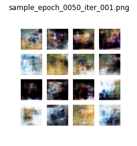
    


    
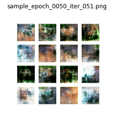
    


    
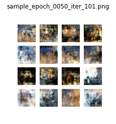
    


    
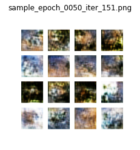
    


    
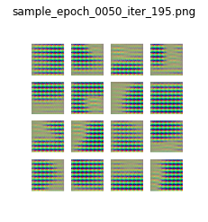
    


```python
import os
from PIL import Image
import matplotlib.pyplot as plt

# 이미지가 저장된 디렉토리 경로 설정
sample_dir = os.path.join(os.getenv('HOME'), 'aiffel/dcgan_newimage/cifar10/generated_samples_ver3')

# 'epoch_0050'이 포함된 PNG 파일 목록 필터링 (정렬)
epoch_target = 'epoch_0050'
image_files = sorted([f for f in os.listdir(sample_dir) if f.endswith('.png') and epoch_target in f])

# 불러올 이미지 파일 목록 출력 (확인용)
print("불러올 이미지 파일 목록:")
for f in image_files:
    print(f)

# 필터링된 이미지들 불러와서 출력하기
for filename in image_files:
    img_path = os.path.join(sample_dir, filename)
    img = Image.open(img_path)
    plt.figure(figsize=(4, 4))
    plt.imshow(img)
    plt.title(filename)
    plt.axis('off')
    plt.show()

```

    불러올 이미지 파일 목록:
    sample_epoch_0050_iter_001.png
    sample_epoch_0050_iter_051.png
    sample_epoch_0050_iter_101.png
    sample_epoch_0050_iter_151.png
    sample_epoch_0050_iter_195.png


    
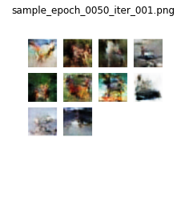
    


    
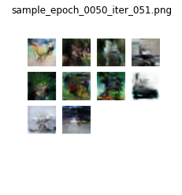
    


    
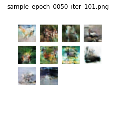
    


    
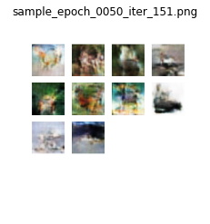
    


    
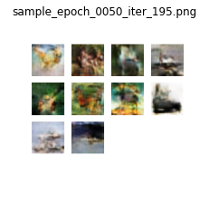
    


### epochs을 100까지 늘려보기


```python
checkpoint_dir = os.path.join(os.getenv('HOME'), 'aiffel/dcgan_newimage/cifar10/training_checkpoints_ver3')
checkpoint = tf.train.Checkpoint(generator=generator,
                                   discriminator=discriminator,
                                   generator_optimizer=generator_optimizer,
                                   discriminator_optimizer=discriminator_optimizer)
latest_ckpt = tf.train.latest_checkpoint(checkpoint_dir)
if latest_ckpt:
    checkpoint.restore(latest_ckpt)
    print("체크포인트에서 불러옴:", latest_ckpt)
else:
    print("체크포인트가 없습니다.")

```

    체크포인트에서 불러옴: /aiffel/aiffel/dcgan_newimage/cifar10/training_checkpoints_ver3/ckpt-10


```python
EPOCHS = 100  # 전체 에포크 수를 100으로 설정
train(train_dataset, EPOCHS, save_every)
```

    Time for training : 2436 sec


```python
import os
from PIL import Image
import matplotlib.pyplot as plt

# 이미지가 저장된 디렉토리 경로 설정
sample_dir = os.path.join(os.getenv('HOME'), 'aiffel/dcgan_newimage/cifar10/generated_samples_ver3')

# 'epoch_0050'이 포함된 PNG 파일 목록 필터링 (정렬)
epoch_target = 'epoch_0100'
image_files = sorted([f for f in os.listdir(sample_dir) if f.endswith('.png') and epoch_target in f])

# 불러올 이미지 파일 목록 출력 (확인용)
print("불러올 이미지 파일 목록:")
for f in image_files:
    print(f)

# 필터링된 이미지들 불러와서 출력하기
for filename in image_files:
    img_path = os.path.join(sample_dir, filename)
    img = Image.open(img_path)
    plt.figure(figsize=(4, 4))
    plt.imshow(img)
    plt.title(filename)
    plt.axis('off')
    plt.show()

```

    불러올 이미지 파일 목록:
    sample_epoch_0100_iter_195.png


    
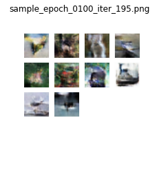
    


```python

```
