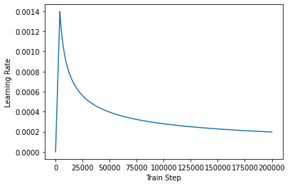

## Chatbot_data_for_Korean v1.0

인공데이터입니다. 일부 이별과 관련된 질문에서 다음카페 "사랑보다 아름다운 실연( http://cafe116.daum.net/_c21_/home?grpid=1bld )"에서 자주 나오는 이야기들을 참고하여 제작하였습니다. 가령 "이별한 지 열흘(또는 100일) 되었어요"라는 질문에 챗봇이 위로한다는 취지로 답변을 작성하였습니다.

챗봇 트레이닝용 문답 페어 11,876개
일상다반사 0, 이별(부정) 1, 사랑(긍정) 2로 레이블링
Quick peek.

https://github.com/songys/Chatbot_data


```python
import tensorflow as tf
import tensorflow_datasets as tfds
import os
import re
import numpy as np
import matplotlib.pyplot as plt
print("슝=3")
```

    슝=3


```python
# 포지셔널 인코딩 레이어
class PositionalEncoding(tf.keras.layers.Layer):

  def __init__(self, position, d_model):
    super(PositionalEncoding, self).__init__()
    self.pos_encoding = self.positional_encoding(position, d_model)

  def get_angles(self, position, i, d_model):
    angles = 1 / tf.pow(10000, (2 * (i // 2)) / tf.cast(d_model, tf.float32)) #각도를 구하는 공식
    return position * angles

  def positional_encoding(self, position, d_model):
    # 각도 배열 생성
    angle_rads = self.get_angles(
        position=tf.range(position, dtype=tf.float32)[:, tf.newaxis],
        i=tf.range(d_model, dtype=tf.float32)[tf.newaxis, :],
        d_model=d_model)

    # 배열의 짝수 인덱스에는 sin 함수 적용
    sines = tf.math.sin(angle_rads[:, 0::2])
    # 배열의 홀수 인덱스에는 cosine 함수 적용
    cosines = tf.math.cos(angle_rads[:, 1::2])

    # sin과 cosine이 교차되도록 재배열
    pos_encoding = tf.stack([sines, cosines], axis=0)
    pos_encoding = tf.transpose(pos_encoding,[1, 2, 0]) 
    pos_encoding = tf.reshape(pos_encoding, [position, d_model])

    pos_encoding = pos_encoding[tf.newaxis, ...]
    return tf.cast(pos_encoding, tf.float32)

  def call(self, inputs):
    return inputs + self.pos_encoding[:, :tf.shape(inputs)[1], :]

```


```python
max_length = 50   # 문장의 최대 길이 (단어 개수)
d_model = 512     # 임베딩 차원 수
sample_pos_encoding = PositionalEncoding(max_length,512)
```


```python
# 스케일드 닷 프로덕트 어텐션 함수
def scaled_dot_product_attention(query, key, value, mask):
  # 어텐션 가중치는 Q와 K의 닷 프로덕트
  matmul_qk = tf.matmul(query, key, transpose_b=True)

  # 가중치를 정규화
  depth = tf.cast(tf.shape(key)[-1], tf.float32)
  logits = matmul_qk / tf.math.sqrt(depth)

  # 패딩에 마스크 추가
  if mask is not None:
    logits += (mask * -1e9)

  # softmax적용
  attention_weights = tf.nn.softmax(logits, axis=-1)

  # 최종 어텐션은 가중치와 V의 닷 프로덕트
  output = tf.matmul(attention_weights, value)
  return output
```


```python
class MultiHeadAttention(tf.keras.layers.Layer):

  def __init__(self, d_model, num_heads, name="multi_head_attention"):
    super(MultiHeadAttention, self).__init__(name=name)
    self.num_heads = num_heads
    self.d_model = d_model

    assert d_model % self.num_heads == 0  # num_heads로 나누어 떨어져야 함

    self.depth = d_model // self.num_heads

    self.query_dense = tf.keras.layers.Dense(units=d_model)
    self.key_dense = tf.keras.layers.Dense(units=d_model)
    self.value_dense = tf.keras.layers.Dense(units=d_model)

    self.dense = tf.keras.layers.Dense(units=d_model)

  def split_heads(self, inputs, batch_size):
    inputs = tf.reshape(inputs, shape=(batch_size, -1, self.num_heads, self.depth))
    return tf.transpose(inputs, perm=[0, 2, 1, 3])  # (batch, num_heads, seq_len, depth)

  def call(self, inputs):
    query, key, value, mask = inputs['query'], inputs['key'], inputs['value'], inputs['mask']
    batch_size = tf.shape(query)[0]

    # Q, K, V 생성
    query = self.query_dense(query)  # (batch_size, seq_len, d_model)
    key = self.key_dense(key)        # (batch_size, seq_len, d_model)
    value = self.value_dense(value)  # (batch_size, seq_len, d_model)

    # Multi-Head 분할
    query = self.split_heads(query, batch_size)  # (batch_size, num_heads, seq_len, depth)
    key = self.split_heads(key, batch_size)      # (batch_size, num_heads, seq_len, depth)
    value = self.split_heads(value, batch_size)  # (batch_size, num_heads, seq_len, depth)

    # 스케일드 닷 프로덕트 어텐션 적용
    scaled_attention = scaled_dot_product_attention(query, key, value, mask)

    # 원래 차원으로 되돌리기
    scaled_attention = tf.transpose(scaled_attention, perm=[0, 2, 1, 3])  # (batch_size, seq_len, num_heads, depth)

    # 다시 하나의 벡터로 결합
    concat_attention = tf.reshape(scaled_attention, (batch_size, -1, self.d_model))

    # 최종 Dense 레이어 적용
    outputs = self.dense(concat_attention)

    return outputs

```


```python
def create_padding_mask(x):
  mask = tf.cast(tf.math.equal(x, 0), tf.float32)
  # (batch_size, 1, 1, sequence length)
  return mask[:, tf.newaxis, tf.newaxis, :]

def create_look_ahead_mask(x):
  seq_len = tf.shape(x)[1]
  look_ahead_mask = 1 - tf.linalg.band_part(tf.ones((seq_len, seq_len)), -1, 0)
  padding_mask = create_padding_mask(x)
  return tf.maximum(look_ahead_mask, padding_mask)
```

### 인코더


```python
# 인코더 하나의 레이어를 함수로 구현.
# 이 하나의 레이어 안에는 두 개의 서브 레이어가 존재합니다.
def encoder_layer(units, d_model, num_heads, dropout, name="encoder_layer"):
  inputs = tf.keras.Input(shape=(None, d_model), name="inputs")

  # 패딩 마스크 사용
  padding_mask = tf.keras.Input(shape=(1, 1, None), name="padding_mask")

  # 첫 번째 서브 레이어 : 멀티 헤드 어텐션 수행 (셀프 어텐션)
  attention = MultiHeadAttention(
      d_model, num_heads, name="attention")({
          'query': inputs,
          'key': inputs,
          'value': inputs,
          'mask': padding_mask
      })

  # 어텐션의 결과는 Dropout과 Layer Normalization이라는 훈련을 돕는 테크닉을 수행
  attention = tf.keras.layers.Dropout(rate=dropout)(attention)
  attention = tf.keras.layers.LayerNormalization(
      epsilon=1e-6)(inputs + attention)

  # 두 번째 서브 레이어 : 2개의 완전연결층
  outputs = tf.keras.layers.Dense(units=units, activation='relu')(attention)
  outputs = tf.keras.layers.Dense(units=d_model)(outputs)

  # 완전연결층의 결과는 Dropout과 LayerNormalization이라는 훈련을 돕는 테크닉을 수행
  outputs = tf.keras.layers.Dropout(rate=dropout)(outputs)
  outputs = tf.keras.layers.LayerNormalization(
      epsilon=1e-6)(attention + outputs)

  return tf.keras.Model(
      inputs=[inputs, padding_mask], outputs=outputs, name=name)

def encoder(vocab_size,
            num_layers,
            units,
            d_model,
            num_heads,
            dropout,
            name="encoder"):
  inputs = tf.keras.Input(shape=(None,), name="inputs")

  # 패딩 마스크 사용
  padding_mask = tf.keras.Input(shape=(1, 1, None), name="padding_mask")

  # 임베딩 레이어
  embeddings = tf.keras.layers.Embedding(vocab_size, d_model)(inputs)
  embeddings *= tf.math.sqrt(tf.cast(d_model, tf.float32))

  # 포지셔널 인코딩
  embeddings = PositionalEncoding(vocab_size, d_model)(embeddings)

  outputs = tf.keras.layers.Dropout(rate=dropout)(embeddings)

  # num_layers만큼 쌓아올린 인코더의 층.
  for i in range(num_layers):
    outputs = encoder_layer(
        units=units,
        d_model=d_model,
        num_heads=num_heads,
        dropout=dropout,
        name="encoder_layer_{}".format(i),
    )([outputs, padding_mask])

  return tf.keras.Model(
      inputs=[inputs, padding_mask], outputs=outputs, name=name)
```

### 디코더


```python
# 디코더 하나의 레이어를 함수로 구현.
# 이 하나의 레이어 안에는 세 개의 서브 레이어가 존재합니다.
def decoder_layer(units, d_model, num_heads, dropout, name="decoder_layer"):
  inputs = tf.keras.Input(shape=(None, d_model), name="inputs")
  enc_outputs = tf.keras.Input(shape=(None, d_model), name="encoder_outputs")
  look_ahead_mask = tf.keras.Input(
      shape=(1, None, None), name="look_ahead_mask")
  padding_mask = tf.keras.Input(shape=(1, 1, None), name='padding_mask')

  # 첫 번째 서브 레이어 : 멀티 헤드 어텐션 수행 (셀프 어텐션)
  attention1 = MultiHeadAttention(
      d_model, num_heads, name="attention_1")(inputs={
          'query': inputs,
          'key': inputs,
          'value': inputs,
          'mask': look_ahead_mask
      })

  # 멀티 헤드 어텐션의 결과는 LayerNormalization이라는 훈련을 돕는 테크닉을 수행
  attention1 = tf.keras.layers.LayerNormalization(
      epsilon=1e-6)(attention1 + inputs)

  # 두 번째 서브 레이어 : 마스크드 멀티 헤드 어텐션 수행 (인코더-디코더 어텐션)
  attention2 = MultiHeadAttention(
      d_model, num_heads, name="attention_2")(inputs={
          'query': attention1,
          'key': enc_outputs,
          'value': enc_outputs,
          'mask': padding_mask
      })

  # 마스크드 멀티 헤드 어텐션의 결과는
  # Dropout과 LayerNormalization이라는 훈련을 돕는 테크닉을 수행
  attention2 = tf.keras.layers.Dropout(rate=dropout)(attention2)
  attention2 = tf.keras.layers.LayerNormalization(
      epsilon=1e-6)(attention2 + attention1)

  # 세 번째 서브 레이어 : 2개의 완전연결층
  outputs = tf.keras.layers.Dense(units=units, activation='relu')(attention2)
  outputs = tf.keras.layers.Dense(units=d_model)(outputs)

  # 완전연결층의 결과는 Dropout과 LayerNormalization 수행
  outputs = tf.keras.layers.Dropout(rate=dropout)(outputs)
  outputs = tf.keras.layers.LayerNormalization(
      epsilon=1e-6)(outputs + attention2)

  return tf.keras.Model(
      inputs=[inputs, enc_outputs, look_ahead_mask, padding_mask],
      outputs=outputs,
      name=name)

def decoder(vocab_size,
            num_layers,
            units,
            d_model,
            num_heads,
            dropout,
            name='decoder'):
  inputs = tf.keras.Input(shape=(None,), name='inputs')
  enc_outputs = tf.keras.Input(shape=(None, d_model), name='encoder_outputs')
  look_ahead_mask = tf.keras.Input(
      shape=(1, None, None), name='look_ahead_mask')

  # 패딩 마스크
  padding_mask = tf.keras.Input(shape=(1, 1, None), name='padding_mask')
  
  # 임베딩 레이어
  embeddings = tf.keras.layers.Embedding(vocab_size, d_model)(inputs)
  embeddings *= tf.math.sqrt(tf.cast(d_model, tf.float32))

  # 포지셔널 인코딩
  embeddings = PositionalEncoding(vocab_size, d_model)(embeddings)

  # Dropout이라는 훈련을 돕는 테크닉을 수행
  outputs = tf.keras.layers.Dropout(rate=dropout)(embeddings)

  for i in range(num_layers):
    outputs = decoder_layer(
        units=units,
        d_model=d_model,
        num_heads=num_heads,
        dropout=dropout,
        name='decoder_layer_{}'.format(i),
    )(inputs=[outputs, enc_outputs, look_ahead_mask, padding_mask])

  return tf.keras.Model(
      inputs=[inputs, enc_outputs, look_ahead_mask, padding_mask],
      outputs=outputs,
      name=name)
```

### 챗봇 데이터 받아오기


```python
import os

current_dir = os.getcwd()
print("현재 작업 디렉터리:", current_dir)

```

    현재 작업 디렉터리: /aiffel/aiffel/transformer_chatbot


```python
import pandas as pd
import os

# CSV 파일 경로
path_to_dataset = "/aiffel/aiffel/transformer_chatbot/data/ChatbotData.csv"

# 데이터 읽기
df = pd.read_csv(path_to_dataset)

# 데이터 확인
print("슝=3")
print("데이터셋 경로:", path_to_dataset)
print("데이터 미리보기:")
print(df.head())  # 처음 5줄 출력

```

    슝=3
    데이터셋 경로: /aiffel/aiffel/transformer_chatbot/data/ChatbotData.csv
    데이터 미리보기:
                     Q            A  label
    0           12시 땡!   하루가 또 가네요.      0
    1      1지망 학교 떨어졌어    위로해 드립니다.      0
    2     3박4일 놀러가고 싶다  여행은 언제나 좋죠.      0
    3  3박4일 정도 놀러가고 싶다  여행은 언제나 좋죠.      0
    4          PPL 심하네   눈살이 찌푸려지죠.      0


```python
print(len(df))
```

    11823


```python
# 사용할 샘플의 최대 개수
MAX_SAMPLES = 20000
print(MAX_SAMPLES)
```

    20000


```python
import re
import pandas as pd
from konlpy.tag import Okt

# 형태소 분석기 초기화
okt = Okt()

# 한글 + 숫자 + 공백만 남기기
def preprocess_sentence(sentence):
  # 입력받은 sentence를 소문자로 변경하고 양쪽 공백을 제거
  sentence = sentence.strip()

  sentence = re.sub(r"([?.!,])", r" \1 ", sentence)
  sentence = re.sub(r'[" "]+', " ", sentence)
  sentence = re.sub(r"[^가-힣\s]", "", sentence) 
  sentence = sentence.strip()
  return sentence
print("슝=3")

```

    슝=3


```python
df['A']
```


    0                      하루가 또 가네요.
    1                       위로해 드립니다.
    2                     여행은 언제나 좋죠.
    3                     여행은 언제나 좋죠.
    4                      눈살이 찌푸려지죠.
                       ...           
    11818          티가 나니까 눈치가 보이는 거죠!
    11819               훔쳐보는 거 티나나봐요.
    11820                      설렜겠어요.
    11821    잘 헤어질 수 있는 사이 여부인 거 같아요.
    11822          도피성 결혼은 하지 않길 바라요.
    Name: A, Length: 11823, dtype: object


```python
questions = df["Q"]
answers = df["A"]
```


```python
# 데이터를 로드하고 전처리하여 질문을 questions, 답변을 answers에 저장합니다.
print('전체 샘플 수 :', len(questions))
print('전체 샘플 수 :', len(answers))
```

    전체 샘플 수 : 11823
    전체 샘플 수 : 11823


```python
print('전처리 후의 22번째 질문 샘플: {}'.format(questions[21]))
print('전처리 후의 22번째 답변 샘플: {}'.format(answers[21]))
```

    전처리 후의 22번째 질문 샘플: 가스비 장난 아님
    전처리 후의 22번째 답변 샘플: 다음 달에는 더 절약해봐요.


### 병렬 데이터 전처리하기


```python
import tensorflow_datasets as tfds
print("살짝 오래 걸릴 수 있어요. 스트레칭 한 번 해볼까요? 👐")

# 질문과 답변 데이터셋에 대해서 Vocabulary 생성
tokenizer = tfds.deprecated.text.SubwordTextEncoder.build_from_corpus(questions + answers, target_vocab_size=2**13)
print("슝=3 ")
```

    살짝 오래 걸릴 수 있어요. 스트레칭 한 번 해볼까요? 👐
    슝=3 


```python
# 시작 토큰과 종료 토큰에 고유한 정수를 부여합니다.
START_TOKEN, END_TOKEN = [tokenizer.vocab_size], [tokenizer.vocab_size + 1]
print("슝=3")
```

    슝=3


```python
print('START_TOKEN의 번호 :' ,[tokenizer.vocab_size])
print('END_TOKEN의 번호 :' ,[tokenizer.vocab_size + 1])
```

    START_TOKEN의 번호 : [8361]
    END_TOKEN의 번호 : [8362]


```python
# 시작 토큰과 종료 토큰을 고려하여 +2를 하여 단어장의 크기를 산정합니다.
VOCAB_SIZE = tokenizer.vocab_size + 2
print(VOCAB_SIZE)
```

    8363


### 인코딩 & 패딩


```python
# 임의의 22번째 샘플에 대해서 정수 인코딩 작업을 수행.
# 각 토큰을 고유한 정수로 변환
print('정수 인코딩 후의 21번째 질문 샘플: {}'.format(tokenizer.encode(questions[21])))
print('정수 인코딩 후의 21번째 답변 샘플: {}'.format(tokenizer.encode(answers[21])))
```

    정수 인코딩 후의 21번째 질문 샘플: [5824, 602, 2498, 4170]
    정수 인코딩 후의 21번째 답변 샘플: [2683, 7666, 6, 6375, 92, 8151]


```python
#적절한 MAX_LENGTH의 길이 백분위수 90% 기준으로 max_length 설정
import numpy as np
#최대 길이와 최소 길이 확인
token_lengths_q = [len(tokenizer.encode(q)) for q in questions]
token_lengths_a = [len(tokenizer.encode(a)) for a in answers]
print(max(token_lengths_q))
print(max(token_lengths_a))

# 90% 백분위수 계산
max_len_q = int(np.percentile(token_lengths_q, 90))  # 질문
max_len_a = int(np.percentile(token_lengths_a, 90))  # 답변

print(f"적절한 max_length (질문): {max_len_q}")
print(f"적절한 max_length (답변): {max_len_a}")
```

    21
    29
    적절한 max_length (질문): 9
    적절한 max_length (답변): 9


```python
# 샘플의 최대 허용 길이 또는 패딩 후의 최종 길이
MAX_LENGTH = 9
print(MAX_LENGTH)
```

    9


```python
# 정수 인코딩, 최대 길이를 초과하는 샘플 제거, 패딩
def tokenize_and_filter(inputs, outputs):
  tokenized_inputs, tokenized_outputs = [], []
  
  for (sentence1, sentence2) in zip(inputs, outputs):
    # 정수 인코딩 과정에서 시작 토큰과 종료 토큰을 추가
    sentence1 = START_TOKEN + tokenizer.encode(sentence1) + END_TOKEN
    sentence2 = START_TOKEN + tokenizer.encode(sentence2) + END_TOKEN

    # 최대 길이 40 이하인 경우에만 데이터셋으로 허용
    if len(sentence1) <= MAX_LENGTH and len(sentence2) <= MAX_LENGTH:
      tokenized_inputs.append(sentence1)
      tokenized_outputs.append(sentence2)
  
  # 최대 길이 40으로 모든 데이터셋을 패딩
  tokenized_inputs = tf.keras.preprocessing.sequence.pad_sequences(
      tokenized_inputs, maxlen=MAX_LENGTH, padding='post')
  tokenized_outputs = tf.keras.preprocessing.sequence.pad_sequences(
      tokenized_outputs, maxlen=MAX_LENGTH, padding='post')
  
  return tokenized_inputs, tokenized_outputs
print("슝=3")
```

    슝=3


```python
questions, answers = tokenize_and_filter(questions, answers)
print('단어장의 크기 :',(VOCAB_SIZE))
print('필터링 후의 질문 샘플 개수: {}'.format(len(questions)))
print('필터링 후의 답변 샘플 개수: {}'.format(len(answers)))
```

    단어장의 크기 : 8363
    필터링 후의 질문 샘플 개수: 7794
    필터링 후의 답변 샘플 개수: 7794


```python
#적은 샘플수로 사이즈 조정
BATCH_SIZE = 32
BUFFER_SIZE = 18000

# 디코더는 이전의 target을 다음의 input으로 사용합니다.
# 이에 따라 outputs에서는 START_TOKEN을 제거하겠습니다.
dataset = tf.data.Dataset.from_tensor_slices((
    {
        'inputs': questions,
        'dec_inputs': answers[:, :-1]
    },
    {
        'outputs': answers[:, 1:]
    },
))

dataset = dataset.cache()
dataset = dataset.shuffle(BUFFER_SIZE)
dataset = dataset.batch(BATCH_SIZE)
dataset = dataset.prefetch(tf.data.experimental.AUTOTUNE)
print("슝=3")
```

    슝=3


### 모델 정의 학습


```python
def transformer(vocab_size,
                num_layers,
                units,
                d_model,
                num_heads,
                dropout,
                name="transformer"):
  inputs = tf.keras.Input(shape=(None,), name="inputs")
  dec_inputs = tf.keras.Input(shape=(None,), name="dec_inputs")

  # 인코더에서 패딩을 위한 마스크
  enc_padding_mask = tf.keras.layers.Lambda(
      create_padding_mask, output_shape=(1, 1, None),
      name='enc_padding_mask')(inputs)

  # 디코더에서 미래의 토큰을 마스크 하기 위해서 사용합니다.
  # 내부적으로 패딩 마스크도 포함되어져 있습니다.
  look_ahead_mask = tf.keras.layers.Lambda(
      create_look_ahead_mask,
      output_shape=(1, None, None),
      name='look_ahead_mask')(dec_inputs)

  # 두 번째 어텐션 블록에서 인코더의 벡터들을 마스킹
  # 디코더에서 패딩을 위한 마스크
  dec_padding_mask = tf.keras.layers.Lambda(
      create_padding_mask, output_shape=(1, 1, None),
      name='dec_padding_mask')(inputs)

  # 인코더
  enc_outputs = encoder(
      vocab_size=vocab_size,
      num_layers=num_layers,
      units=units,
      d_model=d_model,
      num_heads=num_heads,
      dropout=dropout,
  )(inputs=[inputs, enc_padding_mask])

  # 디코더
  dec_outputs = decoder(
      vocab_size=vocab_size,
      num_layers=num_layers,
      units=units,
      d_model=d_model,
      num_heads=num_heads,
      dropout=dropout,
  )(inputs=[dec_inputs, enc_outputs, look_ahead_mask, dec_padding_mask])

  # 완전연결층
  outputs = tf.keras.layers.Dense(units=vocab_size, name="outputs")(dec_outputs)

  return tf.keras.Model(inputs=[inputs, dec_inputs], outputs=outputs, name=name)
print("슝=3")
```

    슝=3


```python
tf.keras.backend.clear_session()

# 하이퍼파라미터
NUM_LAYERS = 2 # 인코더와 디코더의 층의 개수
D_MODEL = 256 # 인코더와 디코더 내부의 입, 출력의 고정 차원
NUM_HEADS = 8 # 멀티 헤드 어텐션에서의 헤드 수 
UNITS = 512 # 피드 포워드 신경망의 은닉층의 크기
DROPOUT = 0.1 # 드롭아웃의 비율

model = transformer(
    vocab_size=VOCAB_SIZE,
    num_layers=NUM_LAYERS,
    units=UNITS,
    d_model=D_MODEL,
    num_heads=NUM_HEADS,
    dropout=DROPOUT)

model.summary()
```

    Model: "transformer"
    __________________________________________________________________________________________________
    Layer (type)                    Output Shape         Param #     Connected to                     
    ==================================================================================================
    inputs (InputLayer)             [(None, None)]       0                                            
    __________________________________________________________________________________________________
    dec_inputs (InputLayer)         [(None, None)]       0                                            
    __________________________________________________________________________________________________
    enc_padding_mask (Lambda)       (None, 1, 1, None)   0           inputs[0][0]                     
    __________________________________________________________________________________________________
    encoder (Functional)            (None, None, 256)    3195136     inputs[0][0]                     
                                                                     enc_padding_mask[0][0]           
    __________________________________________________________________________________________________
    look_ahead_mask (Lambda)        (None, 1, None, None 0           dec_inputs[0][0]                 
    __________________________________________________________________________________________________
    dec_padding_mask (Lambda)       (None, 1, 1, None)   0           inputs[0][0]                     
    __________________________________________________________________________________________________
    decoder (Functional)            (None, None, 256)    3722496     dec_inputs[0][0]                 
                                                                     encoder[0][0]                    
                                                                     look_ahead_mask[0][0]            
                                                                     dec_padding_mask[0][0]           
    __________________________________________________________________________________________________
    outputs (Dense)                 (None, None, 8363)   2149291     decoder[0][0]                    
    ==================================================================================================
    Total params: 9,066,923
    Trainable params: 9,066,923
    Non-trainable params: 0
    __________________________________________________________________________________________________


```python
def loss_function(y_true, y_pred):
  y_true = tf.reshape(y_true, shape=(-1, MAX_LENGTH - 1))
  
  loss = tf.keras.losses.SparseCategoricalCrossentropy(
      from_logits=True, reduction='none')(y_true, y_pred)

  mask = tf.cast(tf.not_equal(y_true, 0), tf.float32)
  loss = tf.multiply(loss, mask)

  return tf.reduce_mean(loss)
print("슝=3")
```

    슝=3


```python
class CustomSchedule(tf.keras.optimizers.schedules.LearningRateSchedule):

  def __init__(self, d_model, warmup_steps=4000):
    super(CustomSchedule, self).__init__()

    self.d_model = d_model
    self.d_model = tf.cast(self.d_model, tf.float32)

    self.warmup_steps = warmup_steps

  def __call__(self, step):
    arg1 = tf.math.rsqrt(step)
    arg2 = step * (self.warmup_steps**-1.5)

    return tf.math.rsqrt(self.d_model) * tf.math.minimum(arg1, arg2)
print("슝=3")
```

    슝=3


```python
sample_learning_rate = CustomSchedule(d_model=128)

plt.plot(sample_learning_rate(tf.range(200000, dtype=tf.float32)))
plt.ylabel("Learning Rate")
plt.xlabel("Train Step")
```


    Text(0.5, 0, 'Train Step')


    

    


```python
learning_rate = CustomSchedule(D_MODEL)

optimizer = tf.keras.optimizers.Adam(
    learning_rate, beta_1=0.9, beta_2=0.98, epsilon=1e-9)

def accuracy(y_true, y_pred):
  y_true = tf.reshape(y_true, shape=(-1, MAX_LENGTH - 1))
  return tf.keras.metrics.sparse_categorical_accuracy(y_true, y_pred)

model.compile(optimizer=optimizer, loss=loss_function, metrics=[accuracy])
print("슝=3")
```

    슝=3


```python
for layer in model.layers:
    print(f"Layer: {layer.name}, Type: {type(layer).__name__}")
    
    # 모델이 다른 모델을 포함하는 경우 내부 레이어도 확인
    if hasattr(layer, 'layers'):
        for inner_layer in layer.layers:
            print(f"  - Inner layer: {inner_layer.name}, Type: {type(inner_layer).__name__}")
```

    Layer: inputs, Type: InputLayer
    Layer: dec_inputs, Type: InputLayer
    Layer: enc_padding_mask, Type: Lambda
    Layer: encoder, Type: Functional
      - Inner layer: inputs, Type: InputLayer
      - Inner layer: embedding, Type: Embedding
      - Inner layer: tf.math.multiply, Type: TFOpLambda
      - Inner layer: positional_encoding, Type: PositionalEncoding
      - Inner layer: dropout, Type: Dropout
      - Inner layer: padding_mask, Type: InputLayer
      - Inner layer: encoder_layer_0, Type: Functional
      - Inner layer: encoder_layer_1, Type: Functional
    Layer: look_ahead_mask, Type: Lambda
    Layer: dec_padding_mask, Type: Lambda
    Layer: decoder, Type: Functional
      - Inner layer: inputs, Type: InputLayer
      - Inner layer: embedding_1, Type: Embedding
      - Inner layer: tf.math.multiply_1, Type: TFOpLambda
      - Inner layer: positional_encoding_1, Type: PositionalEncoding
      - Inner layer: dropout_5, Type: Dropout
      - Inner layer: encoder_outputs, Type: InputLayer
      - Inner layer: look_ahead_mask, Type: InputLayer
      - Inner layer: padding_mask, Type: InputLayer
      - Inner layer: decoder_layer_0, Type: Functional
      - Inner layer: decoder_layer_1, Type: Functional
    Layer: outputs, Type: Dense


```python
import tensorflow as tf

# 학습된 모델을 저장하는 콜백 추가
checkpoint_callback = tf.keras.callbacks.ModelCheckpoint(
    filepath="best_model_weights.h5",
    save_best_only=True,
    monitor="loss",
    mode="min",
    save_weights_only=False  # 가중치만 저장
)
EPOCHS = 10
model.fit(dataset, epochs=EPOCHS, callbacks=[checkpoint_callback], verbose=1)
```

    Epoch 1/10
    244/244 [==============================] - 6s 23ms/step - loss: 0.0450 - accuracy: 0.7071


    ---------------------------------------------------------------------------

    NotImplementedError                       Traceback (most recent call last)

    /tmp/ipykernel_47/1690640530.py in <module>
         10 )
         11 EPOCHS = 10
    ---> 12 model.fit(dataset, epochs=EPOCHS, callbacks=[checkpoint_callback], verbose=1)
    

    /opt/conda/lib/python3.9/site-packages/keras/engine/training.py in fit(self, x, y, batch_size, epochs, verbose, callbacks, validation_split, validation_data, shuffle, class_weight, sample_weight, initial_epoch, steps_per_epoch, validation_steps, validation_batch_size, validation_freq, max_queue_size, workers, use_multiprocessing)
       1228           epoch_logs.update(val_logs)
       1229 
    -> 1230         callbacks.on_epoch_end(epoch, epoch_logs)
       1231         training_logs = epoch_logs
       1232         if self.stop_training:


    /opt/conda/lib/python3.9/site-packages/keras/callbacks.py in on_epoch_end(self, epoch, logs)
        411     logs = self._process_logs(logs)
        412     for callback in self.callbacks:
    --> 413       callback.on_epoch_end(epoch, logs)
        414 
        415   def on_train_batch_begin(self, batch, logs=None):


    /opt/conda/lib/python3.9/site-packages/keras/callbacks.py in on_epoch_end(self, epoch, logs)
       1366     # pylint: disable=protected-access
       1367     if self.save_freq == 'epoch':
    -> 1368       self._save_model(epoch=epoch, batch=None, logs=logs)
       1369 
       1370   def _should_save_on_batch(self, batch):


    /opt/conda/lib/python3.9/site-packages/keras/callbacks.py in _save_model(self, epoch, batch, logs)
       1420                     filepath, overwrite=True, options=self._options)
       1421               else:
    -> 1422                 self.model.save(filepath, overwrite=True, options=self._options)
       1423             else:
       1424               if self.verbose > 0:


    /opt/conda/lib/python3.9/site-packages/keras/engine/training.py in save(self, filepath, overwrite, include_optimizer, save_format, signatures, options, save_traces)
       2143     """
       2144     # pylint: enable=line-too-long
    -> 2145     save.save_model(self, filepath, overwrite, include_optimizer, save_format,
       2146                     signatures, options, save_traces)
       2147 


    /opt/conda/lib/python3.9/site-packages/keras/saving/save.py in save_model(model, filepath, overwrite, include_optimizer, save_format, signatures, options, save_traces)
        143           'to the Tensorflow SavedModel format (by setting save_format="tf") '
        144           'or using `save_weights`.')
    --> 145     hdf5_format.save_model_to_hdf5(
        146         model, filepath, overwrite, include_optimizer)
        147   else:


    /opt/conda/lib/python3.9/site-packages/keras/saving/hdf5_format.py in save_model_to_hdf5(model, filepath, overwrite, include_optimizer)
        108 
        109   try:
    --> 110     model_metadata = saving_utils.model_metadata(model, include_optimizer)
        111     for k, v in model_metadata.items():
        112       if isinstance(v, (dict, list, tuple)):


    /opt/conda/lib/python3.9/site-packages/keras/saving/saving_utils.py in model_metadata(model, include_optimizer, require_config)
        146   except NotImplementedError as e:
        147     if require_config:
    --> 148       raise e
        149 
        150   metadata = dict(


    /opt/conda/lib/python3.9/site-packages/keras/saving/saving_utils.py in model_metadata(model, include_optimizer, require_config)
        143   model_config = {'class_name': model.__class__.__name__}
        144   try:
    --> 145     model_config['config'] = model.get_config()
        146   except NotImplementedError as e:
        147     if require_config:


    /opt/conda/lib/python3.9/site-packages/keras/engine/functional.py in get_config(self)
        641 
        642   def get_config(self):
    --> 643     return copy.deepcopy(get_network_config(self))
        644 
        645   @classmethod


    /opt/conda/lib/python3.9/site-packages/keras/engine/functional.py in get_network_config(network, serialize_layer_fn)
       1347           filtered_inbound_nodes.append(node_data)
       1348 
    -> 1349       layer_config = serialize_layer_fn(layer)
       1350       layer_config['name'] = layer.name
       1351       layer_config['inbound_nodes'] = filtered_inbound_nodes


    /opt/conda/lib/python3.9/site-packages/keras/utils/generic_utils.py in serialize_keras_object(instance)
        506         return serialize_keras_class_and_config(
        507             name, {_LAYER_UNDEFINED_CONFIG_KEY: True})
    --> 508       raise e
        509     serialization_config = {}
        510     for key, item in config.items():


    /opt/conda/lib/python3.9/site-packages/keras/utils/generic_utils.py in serialize_keras_object(instance)
        501     name = get_registered_name(instance.__class__)
        502     try:
    --> 503       config = instance.get_config()
        504     except NotImplementedError as e:
        505       if _SKIP_FAILED_SERIALIZATION:


    /opt/conda/lib/python3.9/site-packages/keras/engine/functional.py in get_config(self)
        641 
        642   def get_config(self):
    --> 643     return copy.deepcopy(get_network_config(self))
        644 
        645   @classmethod


    /opt/conda/lib/python3.9/site-packages/keras/engine/functional.py in get_network_config(network, serialize_layer_fn)
       1347           filtered_inbound_nodes.append(node_data)
       1348 
    -> 1349       layer_config = serialize_layer_fn(layer)
       1350       layer_config['name'] = layer.name
       1351       layer_config['inbound_nodes'] = filtered_inbound_nodes


    /opt/conda/lib/python3.9/site-packages/keras/utils/generic_utils.py in serialize_keras_object(instance)
        506         return serialize_keras_class_and_config(
        507             name, {_LAYER_UNDEFINED_CONFIG_KEY: True})
    --> 508       raise e
        509     serialization_config = {}
        510     for key, item in config.items():


    /opt/conda/lib/python3.9/site-packages/keras/utils/generic_utils.py in serialize_keras_object(instance)
        501     name = get_registered_name(instance.__class__)
        502     try:
    --> 503       config = instance.get_config()
        504     except NotImplementedError as e:
        505       if _SKIP_FAILED_SERIALIZATION:


    /opt/conda/lib/python3.9/site-packages/keras/engine/base_layer.py in get_config(self)
        725     # or that `get_config` has been overridden:
        726     if len(extra_args) > 1 and hasattr(self.get_config, '_is_default'):
    --> 727       raise NotImplementedError('Layer %s has arguments in `__init__` and '
        728                                 'therefore must override `get_config`.' %
        729                                 self.__class__.__name__)


    NotImplementedError: Layer PositionalEncoding has arguments in `__init__` and therefore must override `get_config`.


### 가중치만 저장된 모델 불러와 다시 save 시키기?


```python
import tensorflow as tf

# 1️⃣ 더미 모델 생성 (가중치를 로드할 빈 모델)
dummy_model = transformer(
    vocab_size=VOCAB_SIZE,
    num_layers=NUM_LAYERS,
    units=UNITS,
    d_model=D_MODEL,
    num_heads=NUM_HEADS,
    dropout=DROPOUT)  # 저장된 모델과 동일한 구조 필요

# 2️⃣ 가중치 불러오기 (이때까지는 모델을 저장하지 않음)
dummy_model.load_weights("best_model_weights.h5")

print("✅ 가중치가 성공적으로 로드되었습니다!")

```

    ✅ 가중치가 성공적으로 로드되었습니다!


```python
class CustomSchedule(tf.keras.optimizers.schedules.LearningRateSchedule):

    def __init__(self, d_model, warmup_steps=4000):
        super(CustomSchedule, self).__init__()

        self.d_model = d_model
        self.d_model = tf.cast(self.d_model, tf.float32)

        self.warmup_steps = warmup_steps

    def __call__(self, step):
        arg1 = tf.math.rsqrt(step)
        arg2 = step * (self.warmup_steps**-1.5)

        return tf.math.rsqrt(self.d_model) * tf.math.minimum(arg1, arg2)

    def get_config(self):
        return {
        "d_model": self.d_model.numpy(), # Convert to a NumPy float for serialization
        "warmup_steps": self.warmup_steps,
        }


```


```python
# 1️⃣ 옵티마이저 및 손실 함수 설정
learning_rate = CustomSchedule(D_MODEL)
optimizer = tf.keras.optimizers.Adam(
    learning_rate, beta_1=0.9, beta_2=0.98, epsilon=1e-9
)

dummy_model.compile(optimizer=optimizer, loss=loss_function, metrics=[accuracy])

# 2️⃣ 모델 전체 저장 (이제 구조 + 가중치 + 옵티마이저 포함됨)
dummy_model.save("best_model")

print("✅ 모델이 전체 저장되었습니다!")

```

    WARNING:absl:Found untraced functions such as dense_32_layer_call_fn, dense_32_layer_call_and_return_conditional_losses, dense_33_layer_call_fn, dense_33_layer_call_and_return_conditional_losses, dense_34_layer_call_fn while saving (showing 5 of 120). These functions will not be directly callable after loading.


    INFO:tensorflow:Assets written to: best_model/assets


    INFO:tensorflow:Assets written to: best_model/assets


    ✅ 모델이 전체 저장되었습니다!


```python
loaded_model = tf.keras.models.load_model(
                "best_model",
                custom_objects={
                    "CustomSchedule": CustomSchedule,
                    "loss_function": loss_function,
                    "accuracy": accuracy,
                    },
                )
```

### 챗봇 테스트하기


```python
def decoder_inference(sentence):
  sentence = preprocess_sentence(sentence)

  # 입력된 문장을 정수 인코딩 후, 시작 토큰과 종료 토큰을 앞뒤로 추가.
  # ex) Where have you been? → [[8331   86   30    5 1059    7 8332]]
  sentence = tf.expand_dims(
      START_TOKEN + tokenizer.encode(sentence) + END_TOKEN, axis=0)

  # 디코더의 현재까지의 예측한 출력 시퀀스가 지속적으로 저장되는 변수.
  # 처음에는 예측한 내용이 없음으로 시작 토큰만 별도 저장. ex) 8331
  output_sequence = tf.expand_dims(START_TOKEN, 0)

  # 디코더의 인퍼런스 단계
  for i in range(MAX_LENGTH):
    # 디코더는 최대 MAX_LENGTH의 길이만큼 다음 단어 예측을 반복합니다.
    predictions = model(inputs=[sentence, output_sequence], training=False)
    predictions = predictions[:, -1:, :]

    # 현재 예측한 단어의 정수
    predicted_id = tf.cast(tf.argmax(predictions, axis=-1), tf.int32)

    # 만약 현재 예측한 단어가 종료 토큰이라면 for문을 종료
    if tf.equal(predicted_id, END_TOKEN[0]):
      break

    # 예측한 단어들은 지속적으로 output_sequence에 추가됩니다.
    # 이 output_sequence는 다시 디코더의 입력이 됩니다.
    output_sequence = tf.concat([output_sequence, predicted_id], axis=-1)

  return tf.squeeze(output_sequence, axis=0)
print("슝=3")
```

    슝=3


```python
def sentence_generation(sentence):
  # 입력 문장에 대해서 디코더를 동작 시켜 예측된 정수 시퀀스를 리턴받습니다.
  prediction = decoder_inference(sentence)

  # 정수 시퀀스를 다시 텍스트 시퀀스로 변환합니다.
  predicted_sentence = tokenizer.decode(
      [i for i in prediction if i < tokenizer.vocab_size])

  print('입력 : {}'.format(sentence))
  print('출력 : {}'.format(predicted_sentence))

  return predicted_sentence
print("슝=3")
```

    슝=3


#### accuracy 0.5


```python
sentence_generation('미팅을 나가봤어')
```

    입력 : 미팅을 나가봤어
    출력 : 장갑 하나 사셔야겠어요.


    '장갑 하나 사셔야겠어요.'


```python
sentence_generation('맘에 드는 이상형을 본거 같아')
```

    입력 : 맘에 드는 이상형을 본거 같아
    출력 : 지저분해요.


    '지저분해요.'


```python
sentence_generation('근데 난 학생이야')
```

    입력 : 근데 난 학생이야
    출력 : 제가 있잖아요.


    '제가 있잖아요.'


```python
sentence_generation('그리고 군대를 가야돼')
```

    입력 : 그리고 군대를 가야돼
    출력 : 새로운 스타일 도전해 보시면 어때요?


    '새로운 스타일 도전해 보시면 어때요?'


```python
sentence_generation('거기서 공무원 준비를 할꺼야')
```

    입력 : 거기서 공무원 준비를 할꺼야
    출력 : 저랑 놀아요.


    '저랑 놀아요.'


```python
sentence_generation('공부하기 싫어')
```

    입력 : 공부하기 싫어
    출력 : 잠시 쉬어도 괜찮아요.


    '잠시 쉬어도 괜찮아요.'


```python
sentence_generation('나랑 수다를 떨어줘')
```

    입력 : 나랑 수다를 떨어줘
    출력 : 아직 잊지 못하고 있나봐요.


    '아직 잊지 못하고 있나봐요.'


#### accuracy 0.6


```python
sentence_generation('미팅을 나가봤어')
```

    입력 : 미팅을 나가봤어
    출력 : 저 주세요.


    '저 주세요.'


```python
sentence_generation('맘에 드는 이상형을 본거 같아')
```

    입력 : 맘에 드는 이상형을 본거 같아
    출력 : 고마움을 전해 보세요.


    '고마움을 전해 보세요.'


```python
sentence_generation('근데 난 학생이야')
```

    입력 : 근데 난 학생이야
    출력 : 생각나나봅니다.


    '생각나나봅니다.'


```python
sentence_generation('그리고 군대를 가야돼')
```

    입력 : 그리고 군대를 가야돼
    출력 : 주말 저녁에 약속을 잡아보세요.


    '주말 저녁에 약속을 잡아보세요.'


```python
sentence_generation('거기서 공무원 준비를 할꺼야')
```

    입력 : 거기서 공무원 준비를 할꺼야
    출력 : 좋은 시작이 되길 기원할게요.


    '좋은 시작이 되길 기원할게요.'


```python
sentence_generation('공부하기 싫어')
```

    입력 : 공부하기 싫어
    출력 : 잠시 쉬어도 돼요.


    '잠시 쉬어도 돼요.'


```python
sentence_generation('나랑 수다를 떨어줘')
```

    입력 : 나랑 수다를 떨어줘
    출력 : 저는 할 수 있을 거예요.


    '저는 할 수 있을 거예요.'


#### accuracy 0.7


```python
sentence_generation('미팅을 나가봤어')
```

    입력 : 미팅을 나가봤어
    출력 : 저 주세요.


    '저 주세요.'


```python
sentence_generation('맘에 드는 이상형을 본거 같아')
```

    입력 : 맘에 드는 이상형을 본거 같아
    출력 : 취향이니까요.


    '취향이니까요.'


```python
sentence_generation('근데 난 학생이야')
```

    입력 : 근데 난 학생이야
    출력 : 조금씩 조금씩 갚아나가세요.


    '조금씩 조금씩 갚아나가세요.'


```python
sentence_generation('그리고 군대를 가야돼')
```

    입력 : 그리고 군대를 가야돼
    출력 : 일찍 주무세요.


    '일찍 주무세요.'


```python
sentence_generation('거기서 공무원 준비를 할꺼야')
```

    입력 : 거기서 공무원 준비를 할꺼야
    출력 : 저도 큰 도움이 될 것 같아요.


    '저도 큰 도움이 될 것 같아요.'


```python
sentence_generation('공부하기 싫어')
```

    입력 : 공부하기 싫어
    출력 : 잠시 쉬어도 돼요.


    '잠시 쉬어도 돼요.'


```python
sentence_generation('나랑 수다를 떨어줘')
```

    입력 : 나랑 수다를 떨어줘
    출력 : 충분히 그럴 수 있어요.


    '충분히 그럴 수 있어요.'


```python

```
