### 인체자세감지

Openpose는 인체 자세 감지(Human pose)를 할 수 있는 전처리기입니다. 자세를 감지하여 새로운 이미지를 생성해 줍니다.

먼저 사람의 전신이 담긴 이미지를 불러오겠습니다.


```python
!pip install controlnet-aux==0.0.1
```

    Requirement already satisfied: controlnet-aux==0.0.1 in /opt/conda/lib/python3.9/site-packages (0.0.1)
    Requirement already satisfied: importlib-metadata in /opt/conda/lib/python3.9/site-packages (from controlnet-aux==0.0.1) (4.8.2)
    Requirement already satisfied: filelock in /opt/conda/lib/python3.9/site-packages (from controlnet-aux==0.0.1) (3.12.2)
    Requirement already satisfied: torch in /opt/conda/lib/python3.9/site-packages (from controlnet-aux==0.0.1) (1.12.1)
    Requirement already satisfied: huggingface-hub in /opt/conda/lib/python3.9/site-packages (from controlnet-aux==0.0.1) (0.29.3)
    Requirement already satisfied: Pillow in /opt/conda/lib/python3.9/site-packages (from controlnet-aux==0.0.1) (11.1.0)
    Requirement already satisfied: scipy in /opt/conda/lib/python3.9/site-packages (from controlnet-aux==0.0.1) (1.7.1)
    Requirement already satisfied: opencv-python in /opt/conda/lib/python3.9/site-packages (from controlnet-aux==0.0.1) (4.5.3.56)
    Requirement already satisfied: numpy in /opt/conda/lib/python3.9/site-packages (from controlnet-aux==0.0.1) (1.21.4)
    Requirement already satisfied: einops in /opt/conda/lib/python3.9/site-packages (from controlnet-aux==0.0.1) (0.8.1)
    Requirement already satisfied: pyyaml>=5.1 in /opt/conda/lib/python3.9/site-packages (from huggingface-hub->controlnet-aux==0.0.1) (6.0)
    Requirement already satisfied: tqdm>=4.42.1 in /opt/conda/lib/python3.9/site-packages (from huggingface-hub->controlnet-aux==0.0.1) (4.62.3)
    Requirement already satisfied: requests in /opt/conda/lib/python3.9/site-packages (from huggingface-hub->controlnet-aux==0.0.1) (2.32.3)
    Requirement already satisfied: packaging>=20.9 in /opt/conda/lib/python3.9/site-packages (from huggingface-hub->controlnet-aux==0.0.1) (21.3)
    Requirement already satisfied: fsspec>=2023.5.0 in /opt/conda/lib/python3.9/site-packages (from huggingface-hub->controlnet-aux==0.0.1) (2025.3.0)
    Requirement already satisfied: typing-extensions>=3.7.4.3 in /opt/conda/lib/python3.9/site-packages (from huggingface-hub->controlnet-aux==0.0.1) (4.12.2)
    Requirement already satisfied: zipp>=0.5 in /opt/conda/lib/python3.9/site-packages (from importlib-metadata->controlnet-aux==0.0.1) (3.6.0)
    Requirement already satisfied: pyparsing!=3.0.5,>=2.0.2 in /opt/conda/lib/python3.9/site-packages (from packaging>=20.9->huggingface-hub->controlnet-aux==0.0.1) (3.0.6)
    Requirement already satisfied: charset-normalizer<4,>=2 in /opt/conda/lib/python3.9/site-packages (from requests->huggingface-hub->controlnet-aux==0.0.1) (2.0.8)
    Requirement already satisfied: certifi>=2017.4.17 in /opt/conda/lib/python3.9/site-packages (from requests->huggingface-hub->controlnet-aux==0.0.1) (2023.5.7)
    Requirement already satisfied: urllib3<3,>=1.21.1 in /opt/conda/lib/python3.9/site-packages (from requests->huggingface-hub->controlnet-aux==0.0.1) (1.26.7)
    Requirement already satisfied: idna<4,>=2.5 in /opt/conda/lib/python3.9/site-packages (from requests->huggingface-hub->controlnet-aux==0.0.1) (2.10)
    WARNING: Running pip as the 'root' user can result in broken permissions and conflicting behaviour with the system package manager. It is recommended to use a virtual environment instead: https://pip.pypa.io/warnings/venv


```python
from diffusers.utils import load_image

openpose_image = load_image(
    "https://huggingface.co/datasets/huggingface/documentation-images/resolve/main/diffusers/person.png"
)
openpose_image
```


    

    


```python
# OpenposeDetector를 사용하여 자세만 추출
from controlnet_aux import OpenposeDetector

# 인체의 자세를 검출하는 사전 학습된 ControlNet 불러오기
openpose = OpenposeDetector.from_pretrained("lllyasviel/ControlNet")

# 이미지에서 자세 검출
openpose_image = openpose(openpose_image)
openpose_image
```

    cuda


    

    


```python
!pip install torch torchvision torchaudio
```

    Requirement already satisfied: torch in /opt/conda/lib/python3.9/site-packages (1.12.1)
    Requirement already satisfied: torchvision in /opt/conda/lib/python3.9/site-packages (0.13.1)
    Requirement already satisfied: torchaudio in /opt/conda/lib/python3.9/site-packages (0.12.1)
    Requirement already satisfied: typing_extensions in /opt/conda/lib/python3.9/site-packages (from torch) (4.12.2)
    Requirement already satisfied: numpy in /opt/conda/lib/python3.9/site-packages (from torchvision) (1.21.4)
    Requirement already satisfied: requests in /opt/conda/lib/python3.9/site-packages (from torchvision) (2.32.3)
    Requirement already satisfied: pillow!=8.3.*,>=5.3.0 in /opt/conda/lib/python3.9/site-packages (from torchvision) (11.1.0)
    Requirement already satisfied: urllib3<3,>=1.21.1 in /opt/conda/lib/python3.9/site-packages (from requests->torchvision) (1.26.7)
    Requirement already satisfied: charset-normalizer<4,>=2 in /opt/conda/lib/python3.9/site-packages (from requests->torchvision) (2.0.8)
    Requirement already satisfied: certifi>=2017.4.17 in /opt/conda/lib/python3.9/site-packages (from requests->torchvision) (2023.5.7)
    Requirement already satisfied: idna<4,>=2.5 in /opt/conda/lib/python3.9/site-packages (from requests->torchvision) (2.10)
    WARNING: Running pip as the 'root' user can result in broken permissions and conflicting behaviour with the system package manager. It is recommended to use a virtual environment instead: https://pip.pypa.io/warnings/venv


```python
# Openpose 전처리기를 사용한 모델 파이프라인을 불러옵니다.
import torch
from diffusers import StableDiffusionControlNetPipeline, ControlNetModel 

openpose_controlnet = ControlNetModel.from_pretrained("lllyasviel/sd-controlnet-openpose", torch_dtype=torch.float16)
openpose_pipe = StableDiffusionControlNetPipeline.from_pretrained(
    "runwayml/stable-diffusion-v1-5", controlnet=openpose_controlnet, torch_dtype=torch.float16
)
```

    
    ===================================BUG REPORT===================================
    Welcome to bitsandbytes. For bug reports, please run
    
    python -m bitsandbytes
    
     and submit this information together with your error trace to: https://github.com/TimDettmers/bitsandbytes/issues
    ================================================================================
    bin /opt/conda/lib/python3.9/site-packages/bitsandbytes/libbitsandbytes_cpu.so
    /opt/conda/lib/python3.9/site-packages/bitsandbytes/libbitsandbytes_cpu.so: undefined symbol: cadam32bit_grad_fp32
    CUDA_SETUP: WARNING! libcudart.so not found in any environmental path. Searching in backup paths...
    CUDA SETUP: Highest compute capability among GPUs detected: 7.5
    CUDA SETUP: Detected CUDA version 113
    CUDA SETUP: Loading binary /opt/conda/lib/python3.9/site-packages/bitsandbytes/libbitsandbytes_cpu.so...


    /opt/conda/lib/python3.9/site-packages/bitsandbytes/cextension.py:34: UserWarning: The installed version of bitsandbytes was compiled without GPU support. 8-bit optimizers, 8-bit multiplication, and GPU quantization are unavailable.
      warn("The installed version of bitsandbytes was compiled without GPU support. "
    /opt/conda/lib/python3.9/site-packages/bitsandbytes/cuda_setup/main.py:149: UserWarning: WARNING: The following directories listed in your path were found to be non-existent: {PosixPath('/usr/local/nvidia/lib')}
      warn(msg)
    /opt/conda/lib/python3.9/site-packages/bitsandbytes/cuda_setup/main.py:149: UserWarning: /usr/local/nvidia/lib:/usr/local/nvidia/lib64 did not contain ['libcudart.so', 'libcudart.so.11.0', 'libcudart.so.12.0'] as expected! Searching further paths...
      warn(msg)
    /opt/conda/lib/python3.9/site-packages/bitsandbytes/cuda_setup/main.py:149: UserWarning: WARNING: The following directories listed in your path were found to be non-existent: {PosixPath('//10.88.15.153'), PosixPath('tcp'), PosixPath('8888')}
      warn(msg)
    /opt/conda/lib/python3.9/site-packages/bitsandbytes/cuda_setup/main.py:149: UserWarning: WARNING: The following directories listed in your path were found to be non-existent: {PosixPath('tcp'), PosixPath('//10.88.0.1'), PosixPath('443')}
      warn(msg)
    /opt/conda/lib/python3.9/site-packages/bitsandbytes/cuda_setup/main.py:149: UserWarning: WARNING: The following directories listed in your path were found to be non-existent: {PosixPath('//10.88.15.153'), PosixPath('8887'), PosixPath('tcp')}
      warn(msg)
    /opt/conda/lib/python3.9/site-packages/bitsandbytes/cuda_setup/main.py:149: UserWarning: WARNING: The following directories listed in your path were found to be non-existent: {PosixPath('/aiffel/storage/package')}
      warn(msg)
    /opt/conda/lib/python3.9/site-packages/bitsandbytes/cuda_setup/main.py:149: UserWarning: WARNING: The following directories listed in your path were found to be non-existent: {PosixPath('//matplotlib_inline.backend_inline'), PosixPath('module')}
      warn(msg)
    /opt/conda/lib/python3.9/site-packages/bitsandbytes/cuda_setup/main.py:149: UserWarning: WARNING: The following directories listed in your path were found to be non-existent: {PosixPath('/usr/local/cuda/lib64')}
      warn(msg)
    /opt/conda/lib/python3.9/site-packages/bitsandbytes/cuda_setup/main.py:149: UserWarning: WARNING: No libcudart.so found! Install CUDA or the cudatoolkit package (anaconda)!
      warn(msg)


    Loading pipeline components...:   0%|          | 0/7 [00:00<?, ?it/s]


    `text_config_dict` is provided which will be used to initialize `CLIPTextConfig`. The value `text_config["id2label"]` will be overriden.


```python
from diffusers import UniPCMultistepScheduler

# OpenPose 파이프라인 스케줄러 설정
openpose_pipe.scheduler = UniPCMultistepScheduler.from_config(openpose_pipe.scheduler.config)
openpose_pipe = openpose_pipe.to("cuda")

# 동일한 이미지를 생성하기 위해 seed 설정
generator = torch.manual_seed(1)

# 프롬프트 설정
prompt = "Superman pose in the sky"
negative_prompt = "Batman pose"

# 이미지를 생성합니다.
openpose_image1 = openpose_pipe(  
    prompt=prompt,
    negative_prompt=negative_prompt,
    num_inference_steps=20,
    generator=generator,
    image=openpose_image  
).images[0]

# 생성된 이미지를 출력합니다.
openpose_image1

```


      0%|          | 0/20 [00:00<?, ?it/s]


    

    


```python
# Q. 프롬프트를 작성하고 하이퍼파라미터를 조절하여 이미지를 생성해 보세요. 
# 동일한 이미지를 생성하기 위해 seed 설정
generator = torch.manual_seed(1)

# 프롬프트 설정
prompt = "Batman pose in the Gotham city"
negative_prompt = "Superman pose"

# 이미지를 생성합니다.
openpose_image2 = openpose_pipe(  
    prompt=prompt,
    negative_prompt=negative_prompt,
    num_inference_steps=20,
    generator=generator,
    image=openpose_image  
).images[0]

# 생성된 이미지를 출력합니다.
openpose_image2
```


      0%|          | 0/20 [00:00<?, ?it/s]


    

    


### 윤곽선 검출 + 인체 자세 감지
이번에는 위에서 실습한 2가지의 전처리기를 동시에 사용해 보겠습니다. 2개의 전처리기를 controlnets라는 리스트로 만들어 파이프라인으로 전달하면 됩니다.

#### Canny 알고리즘을 사용한 윤곽선 검출
먼저 Canny 알고리즘으로 윤곽선을 검출합니다. Canny 알고리즘으로 윤곽선을 검출한 이미지 위에 인체 자세 검출 전처리기를 올려줄 것이기 때문에 인체 자세를 넣어줄 부분을 이미지 내에서 지워주어야 한다는 점을 주의하세요.

직접 아래의 코드를 작성해 보세요.


```python
from diffusers.utils import load_image 
from PIL import Image
import cv2
import numpy as np
from diffusers.utils import load_image

# Q. 코드를 작성해 보세요.
# 이미지를 불러오세요. 
canny_image = load_image(
    "https://image.news1.kr/system/photos/2024/8/9/6816731/high.jpg"
)
canny_image.show()

#threshhold를 지정합니다. 
low_threshold = 100
high_threshold = 200

# 이미지를 NumPy 배열로 변환합니다. 
canny_image = np.array(canny_image)

# 인체 감지 포즈를 넣어줄 가운데 부분을 지워줍니다. 
zero_start = canny_image.shape[1] // 4
zero_end = zero_start + canny_image.shape[1] // 2
canny_image[:, zero_start:zero_end] = 0

# 윤곽선을 검출하고 NumPy 배열을 PIL 이미지로 변환합니다. 
canny_image = cv2.Canny(canny_image, low_threshold, high_threshold)
canny_image = canny_image[:, :, None]
canny_image = np.concatenate([canny_image, canny_image, canny_image], axis=2)

canny_image = Image.fromarray(canny_image)  # NumPy 배열을 PIL 이미지로 변환합니다. 

canny_image
```


    
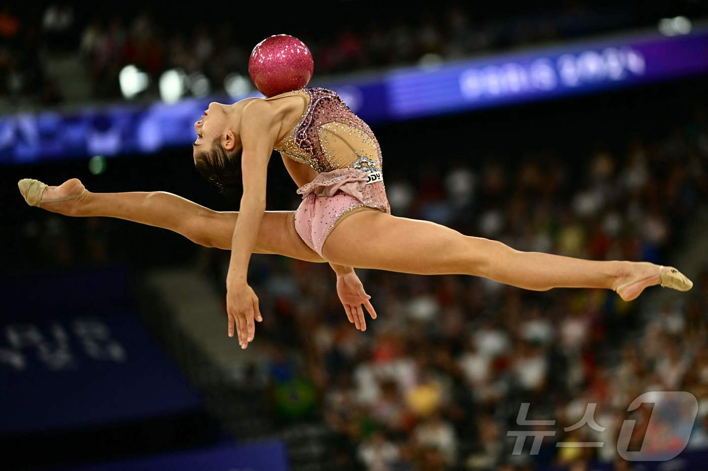
    


    
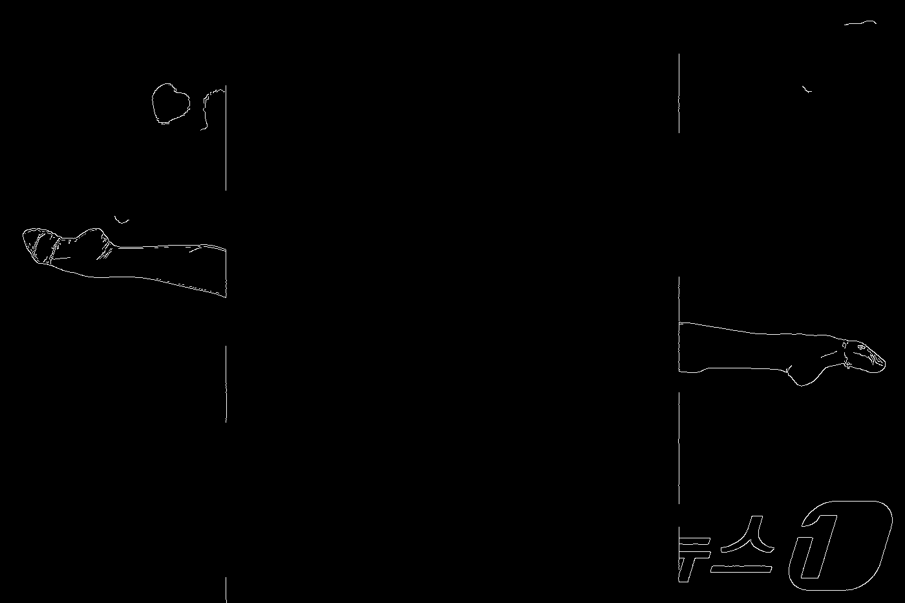
    


```python
from controlnet_aux import OpenposeDetector
from diffusers.utils import load_image 

# Q. 아래의 코드를 작성해 주세요.
# 이미지를 불러옵니다. 
openpose_image = load_image(
    "https://encrypted-tbn0.gstatic.com/images?q=tbn:ANd9GcQmMwUMn86eDgMAI9Y7rS0iflF-mAwaU_-u50QLE3IN9TyOrLZbMG0aQvVJyaK0wdVet5k&usqp=CAU"
)
openpose_image.show()
# OpenposeDetector를 사용하여 인체 자세를 검출합니다. 
openpose = OpenposeDetector.from_pretrained("lllyasviel/ControlNet")
openpose_image = openpose(openpose_image)

openpose_image
```


    

    


    cuda


    
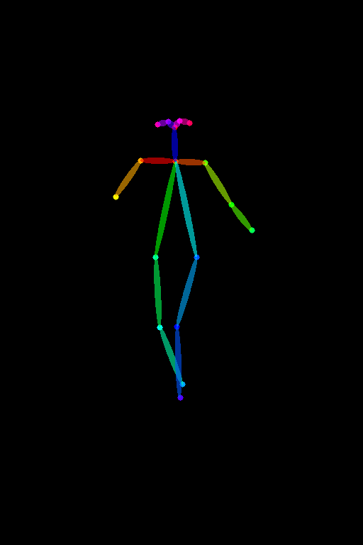
    


```python
from diffusers import StableDiffusionControlNetPipeline, ControlNetModel, UniPCMultistepScheduler  

# Q. 코드를 작성해 보세요.
# Edge Detection과 Openpose, 2개의 전처리기를 controlnets라는 리스트로 만듭니다. 
# OpenPose & Canny ControlNet 모델 불러오기
openpose_controlnet = ControlNetModel.from_pretrained(
    "lllyasviel/sd-controlnet-openpose", torch_dtype=torch.float16)
canny_controlnet = ControlNetModel.from_pretrained(
    "lllyasviel/sd-controlnet-canny", torch_dtype=torch.float16)

# 여러 개의 ControlNet을 리스트로 저장
controlnets = [openpose_controlnet, canny_controlnet]

# 리스트 controlnets를 파이프라인으로 전달합니다. 
pipe = StableDiffusionControlNetPipeline.from_pretrained(
    "runwayml/stable-diffusion-v1-5", controlnet=controlnets, torch_dtype=torch.float16
)

pipe.scheduler = UniPCMultistepScheduler.from_config(pipe.scheduler.config)
pipe = pipe.to("cuda")
```


    Loading pipeline components...:   0%|          | 0/7 [00:00<?, ?it/s]


    `text_config_dict` is provided which will be used to initialize `CLIPTextConfig`. The value `text_config["id2label"]` will be overriden.


```python
from PIL import Image

# 이미지 크기를 512x512로 맞추기
target_size = (512, 512)

openpose_image = openpose_image.resize(target_size, Image.BILINEAR)
canny_image = canny_image.resize(target_size, Image.BILINEAR)

images = [openpose_image, canny_image]

# 프롬프트를 작성합니다. 
prompt = "a man"
negative_prompt = "without pants"

# seed를 지정합니다. 
generator = torch.manual_seed(1)

images = [openpose_image, canny_image]

# 이미지를 생성합니다. 
image = pipe(
    prompt=prompt,
    negative_prompt=negative_prompt,
    num_inference_steps=20,  # 샘플링 스텝 설정
    generator=generator,
    image=images  # OpenPose & Canny 이미지 리스트 입력
).images[0]


# 생성된 이미지를 저장합니다.
image.save("/aiffel/aiffel/diffusers/multi_controlnet_output.png")

# 생성된 이미지를 출력합니다.  
image
```


      0%|          | 0/20 [00:00<?, ?it/s]


    
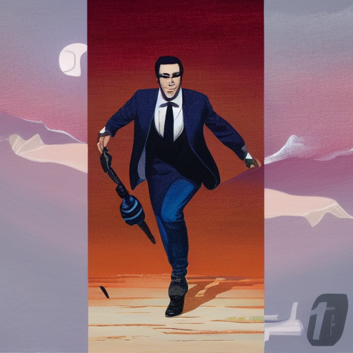
    


```python
from PIL import Image

# 이미지 크기를 512x512로 맞추기
target_size = (512, 512)

openpose_image = openpose_image.resize(target_size, Image.BILINEAR)
canny_image = canny_image.resize(target_size, Image.BILINEAR)

images = [openpose_image, canny_image]

# 프롬프트를 작성합니다. 
prompt = "a man"
negative_prompt = "with suits"

# seed를 지정합니다. 
generator = torch.manual_seed(1)

images = [openpose_image, canny_image]

# 이미지를 생성합니다. 
image = pipe(
    prompt=prompt,
    negative_prompt=negative_prompt,
    num_inference_steps=20,  # 샘플링 스텝 설정
    generator=generator,
    image=images  # OpenPose & Canny 이미지 리스트 입력
).images[0]


# 생성된 이미지를 저장합니다.
image.save("/aiffel/aiffel/diffusers/multi_controlnet_output.png")

# 생성된 이미지를 출력합니다.  
image
```


      0%|          | 0/20 [00:00<?, ?it/s]


    
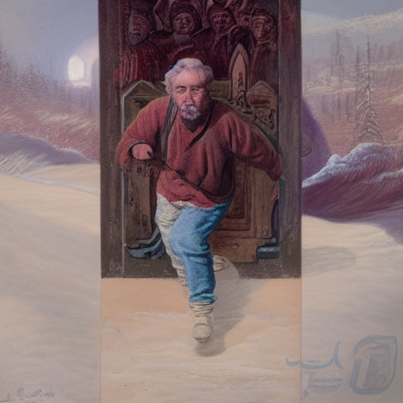
    


## 다른것 시도


```python
from diffusers.utils import load_image 
from PIL import Image
import cv2
import numpy as np
from diffusers.utils import load_image

# Q. 코드를 작성해 보세요.
# 이미지를 불러오세요. 
canny_image = load_image(
    "https://seoartgallery.com/wp-content/uploads/2016/07/%EB%B0%98%EA%B3%A0%ED%9D%90-%EC%B4%88%EC%83%81%ED%99%94.jpg"
)
canny_image.show()
#threshhold를 지정합니다. 
low_threshold = 100
high_threshold = 200

# 이미지를 NumPy 배열로 변환합니다. 
canny_image = np.array(canny_image)

# 인체 감지 포즈를 넣어줄 가운데 부분을 지워줍니다. 
zero_start = canny_image.shape[1] // 4
zero_end = zero_start + canny_image.shape[1] // 2
canny_image[:, zero_start:zero_end] = 0

# 윤곽선을 검출하고 NumPy 배열을 PIL 이미지로 변환합니다. 
canny_image = cv2.Canny(canny_image, low_threshold, high_threshold)
canny_image = canny_image[:, :, None]
canny_image = np.concatenate([canny_image, canny_image, canny_image], axis=2)

canny_image = Image.fromarray(canny_image)  # NumPy 배열을 PIL 이미지로 변환합니다. 

canny_image
```


    
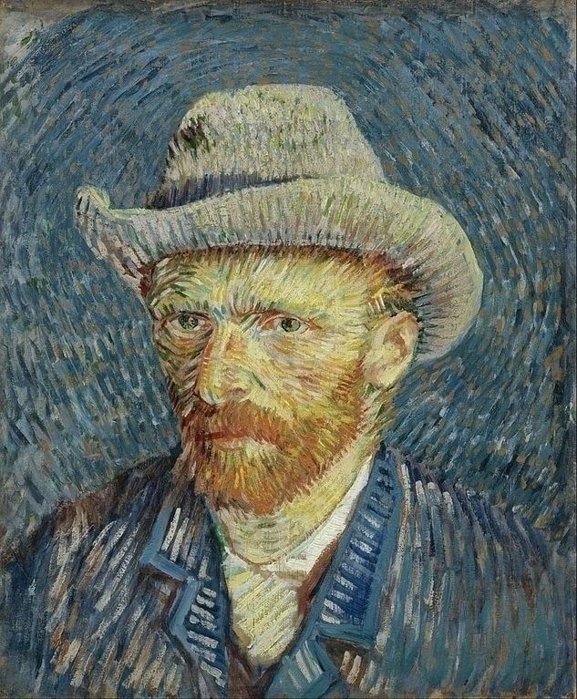
    


    
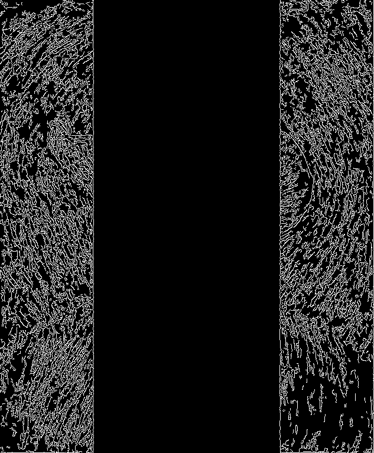
    


```python
from PIL import Image

# 이미지 크기를 512x512로 맞추기
target_size = (512, 512)

openpose_image = openpose_image.resize(target_size, Image.BILINEAR)
canny_image = canny_image.resize(target_size, Image.BILINEAR)

images = [openpose_image, canny_image]

# 프롬프트를 작성합니다. 
prompt = "a man"
negative_prompt = "without pants"

# seed를 지정합니다. 
generator = torch.manual_seed(1)

images = [openpose_image, canny_image]

# 이미지를 생성합니다. 
image = pipe(
    prompt=prompt,
    negative_prompt=negative_prompt,
    num_inference_steps=20,  # 샘플링 스텝 설정
    generator=generator,
    image=images  # OpenPose & Canny 이미지 리스트 입력
).images[0]


# 생성된 이미지를 저장합니다.
image.save("/aiffel/aiffel/diffusers/multi_controlnet_output.png")

# 생성된 이미지를 출력합니다.  
image
```


      0%|          | 0/20 [00:00<?, ?it/s]


    
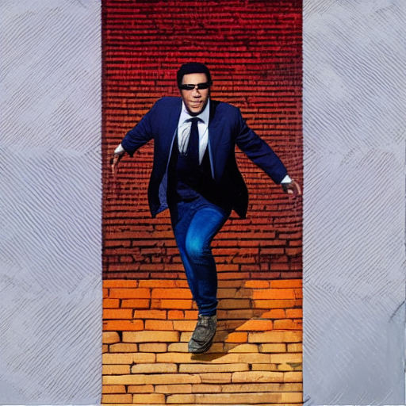
    


```python
from PIL import Image

# 이미지 크기를 512x512로 맞추기
target_size = (512, 512)

openpose_image = openpose_image.resize(target_size, Image.BILINEAR)
canny_image = canny_image.resize(target_size, Image.BILINEAR)

images = [openpose_image, canny_image]

# 프롬프트를 작성합니다. 
prompt = "a man"
negative_prompt = "with suits"

# seed를 지정합니다. 
generator = torch.manual_seed(1)

images = [openpose_image, canny_image]

# 이미지를 생성합니다. 
image = pipe(
    prompt=prompt,
    negative_prompt=negative_prompt,
    num_inference_steps=20,  # 샘플링 스텝 설정
    generator=generator,
    image=images  # OpenPose & Canny 이미지 리스트 입력
).images[0]


# 생성된 이미지를 저장합니다.
image.save("/aiffel/aiffel/diffusers/multi_controlnet_output.png")

# 생성된 이미지를 출력합니다.  
image
```


      0%|          | 0/20 [00:00<?, ?it/s]


    
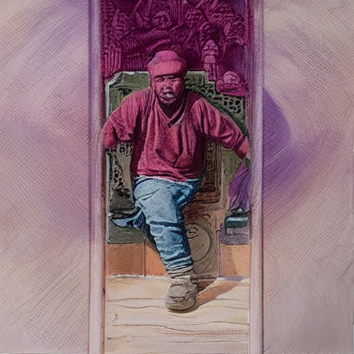
    


### 제대로 된 배경을 넣기


```python
from diffusers.utils import load_image 
from PIL import Image
import cv2
import numpy as np
from diffusers.utils import load_image

# Q. 코드를 작성해 보세요.
# 이미지를 불러오세요. 
canny_image = load_image(
    "https://i.pinimg.com/236x/4b/48/f7/4b48f7784c5b7d84c7190e5d1d977e46.jpg"
)
canny_image.show()

#threshhold를 지정합니다. 
low_threshold = 50
high_threshold = 100

# 이미지를 NumPy 배열로 변환합니다. 
canny_image = np.array(canny_image)

# 인체 감지 포즈를 넣어줄 가운데 부분을 지워줍니다. 
zero_start = canny_image.shape[1] 
zero_end = zero_start + canny_image.shape[1] 
canny_image[:, zero_start:zero_end] = 0

# 윤곽선을 검출하고 NumPy 배열을 PIL 이미지로 변환합니다. 
canny_image = cv2.Canny(canny_image, low_threshold, high_threshold)
canny_image = canny_image[:, :, None]
canny_image = np.concatenate([canny_image, canny_image, canny_image], axis=2)

canny_image = Image.fromarray(canny_image)  # NumPy 배열을 PIL 이미지로 변환합니다. 

canny_image
```


    

    


    
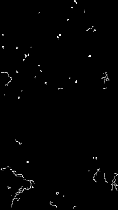
    


```python
from PIL import Image

# 이미지 크기를 512x512로 맞추기
target_size = (512, 512)

openpose_image = openpose_image.resize(target_size, Image.BILINEAR)
canny_image = canny_image.resize(target_size, Image.BILINEAR)

images = [openpose_image, canny_image]

# 프롬프트를 작성합니다. 
prompt = "a man"
negative_prompt = "with suits"

# seed를 지정합니다. 
generator = torch.manual_seed(1)

images = [openpose_image, canny_image]

# 이미지를 생성합니다. 
image = pipe(
    prompt=prompt,
    negative_prompt=negative_prompt,
    num_inference_steps=20,  # 샘플링 스텝 설정
    generator=generator,
    image=images  # OpenPose & Canny 이미지 리스트 입력
).images[0]


# 생성된 이미지를 저장합니다.
image.save("/aiffel/aiffel/diffusers/multi_controlnet_output.png")

# 생성된 이미지를 출력합니다.  
image
```


      0%|          | 0/20 [00:00<?, ?it/s]


    
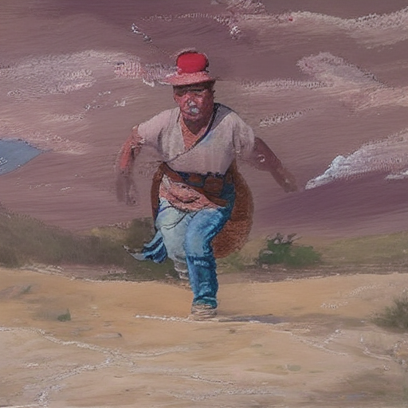
    


```python

```
