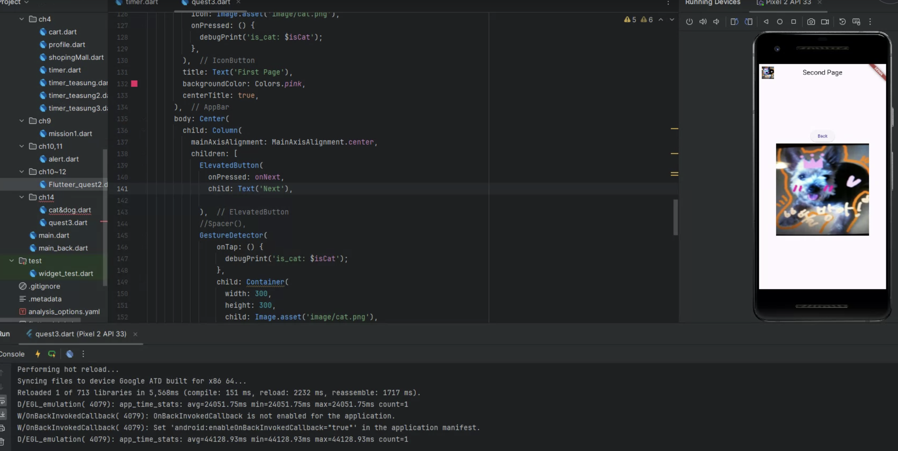
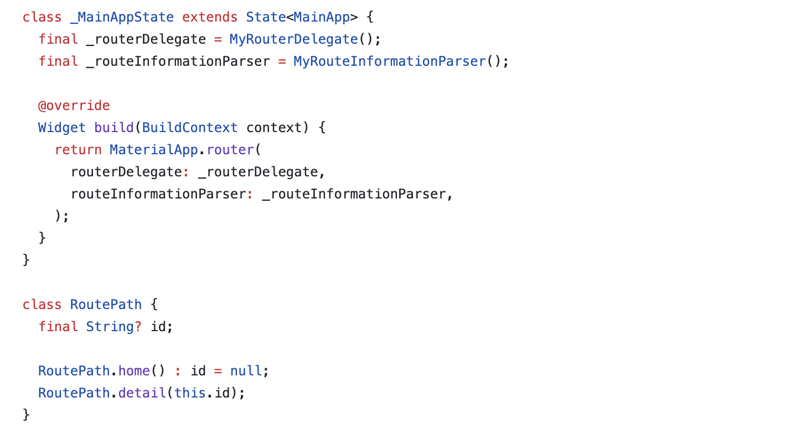
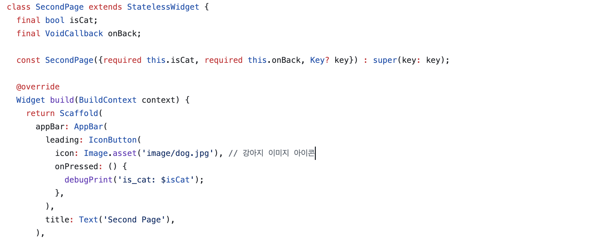
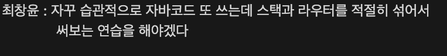
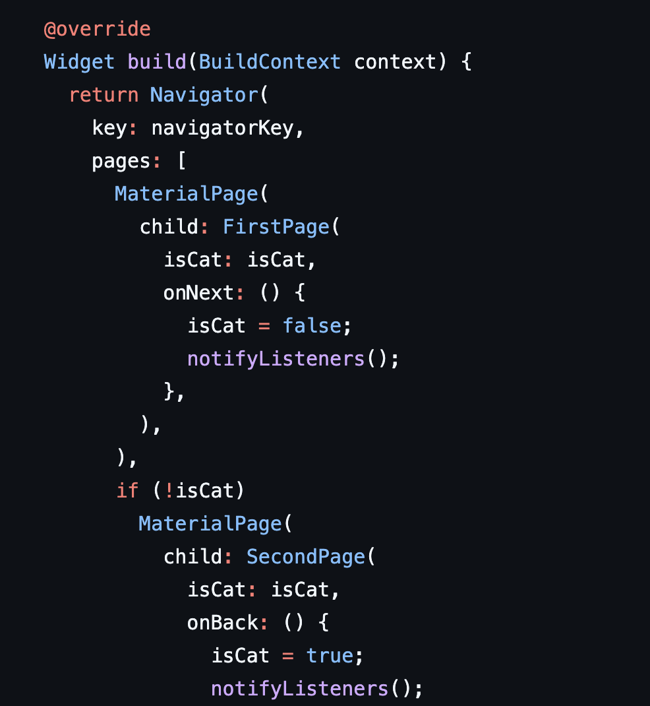

# AIFFEL Campus Online Code Peer Review Templete
- 코더 : 최창윤, 박종호
- 리뷰어 : 이은솔, 백승호


# PRT(Peer Review Template)
- [x]  **1. 주어진 문제를 해결하는 완성된 코드가 제출되었나요?**
    - 문제에서 요구하는 기능이 정상적으로 작동합니다.
    - 
    
- [ ]  **2. 전체 코드에서 가장 핵심적이거나 가장 복잡하고 이해하기 어려운 부분에 작성된 
주석 또는 doc string을 보고 해당 코드가 잘 이해되었나요?**
    - 해당 코드가 무슨 기능을 하는지, 작동 원리가 어떻게 되는지 기술 되어 있지 않습니다.
    - 
        
- [x]  **3. 에러가 난 부분을 디버깅하여 문제를 해결한 기록을 남겼거나
새로운 시도 또는 추가 실험을 수행해봤나요?**
    - 문제 원인 및 해결 과정이 별도로 기록되어 있지는 않습니다.
    - 다만 피어 리뷰 과정에서 구두로 설명해주셨습니다.
    - 
        
- [x]  **4. 회고를 잘 작성했나요?**
    - 프로젝트 결과물에 대해 배운점과 아쉬운점, 느낀점 등이 상세히 기록 되어 있나요?
    - 네
    - 
        
- [x]  **5. 코드가 간결하고 효율적인가요?**
    - 코드 중복을 최소화하고 범용적으로 사용할 수 있도록 모듈화(함수화) 했는지?
    - 잘 작성되었다고 생각되는 부분을 근거로 첨부합니다.
    - 첫번째 페이지와 두번째 페이지를 구현하는 과정이 최소화되어 있어 흥미롭습니다.
    - 


# 회고(참고 링크 및 코드 개선)
```
은솔 : 저희조가 작성한 코드와 조금 상이하여 흥미로웠습니다. 코드 작성 방법을 설명해주셔서 도움이 되었습니다.
```
