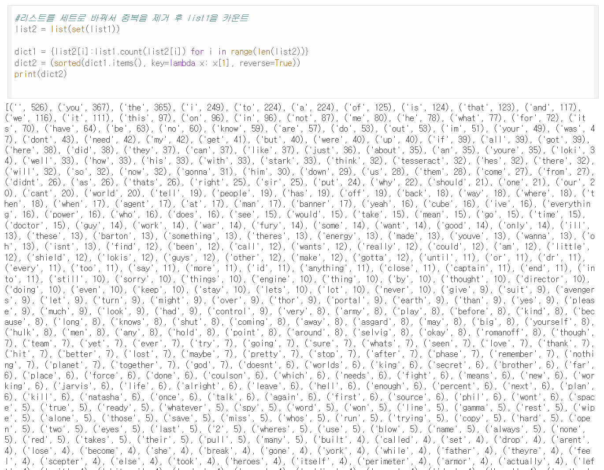
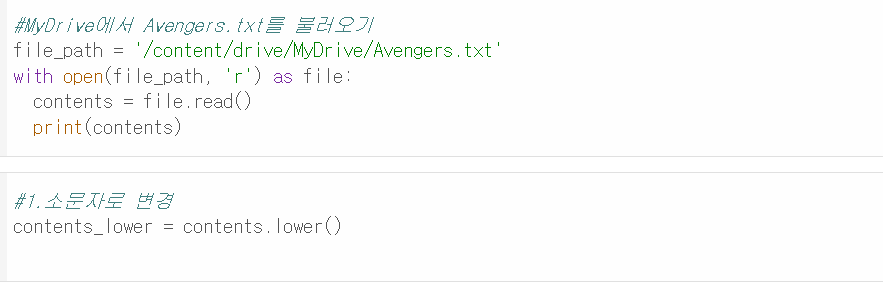
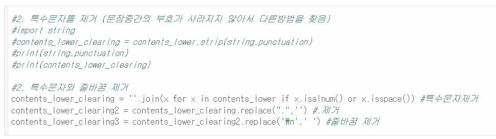

# AIFFEL Campus Online Code Peer Review Templete
- 코더 : 박종호
- 리뷰어 : 최유진


# PRT(Peer Review Template)
- [ ]  **1. 주어진 문제를 해결하는 완성된 코드가 제출되었나요?**
    - 문제에서 요구하는 최종 결과물이 첨부되었는지 확인
        - 중요! 해당 조건을 만족하는 부분을 캡쳐해 근거로 첨부
        
        딕셔너리가 아니라 튜플로 결과물이 나옴. 미완성 코드
    
- [ ]  **2. 전체 코드에서 가장 핵심적이거나 가장 복잡하고 이해하기 어려운 부분에 작성된 
주석 또는 doc string을 보고 해당 코드가 잘 이해되었나요?**
        
    -  주석을 올바르게 잘 달아 해석에 도움이 되었다.
        
- [X]  **3. 에러가 난 부분을 디버깅하여 문제를 해결한 기록을 남겼거나
새로운 시도 또는 추가 실험을 수행해봤나요?**
        
    -  문장 중간 부호가 사라지지 않아 다른 방법을 시도한 기록이 있음. 
        
- [ ]  **4. 회고를 잘 작성했나요?**
    - 아쉽게도 시간 관계상 회고를 작성하지 않았다고 들음.
        
- [X]  **5. 코드가 간결하고 효율적인가요?**
    - 파이썬 스타일 가이드 (PEP8) 를 준수하였는지 확인
    - 코드 중복을 최소화하고 범용적으로 사용할 수 있도록 함수화/모듈화했는지 확인
        - 중요! 잘 작성되었다고 생각되는 부분을 캡쳐해 근거로 첨부
        


# 회고(참고 링크 및 코드 개선)
```
# 리뷰어의 회고를 작성합니다.
# 코드 리뷰 시 참고한 링크가 있다면 링크와 간략한 설명을 첨부합니다.
# 코드 리뷰를 통해 개선한 코드가 있다면 코드와 간략한 설명을 첨부합니다.

검색을 하지 않고 해결하려고 한 흔적이 보여서, 코드가 완성되지 못했음에도 노력한 흔적이 엿보였습니다. 
```