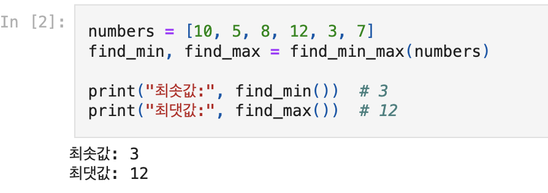
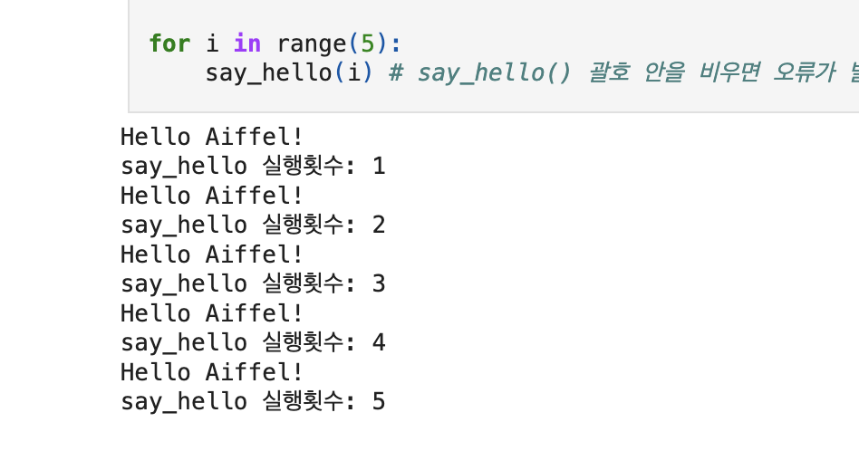
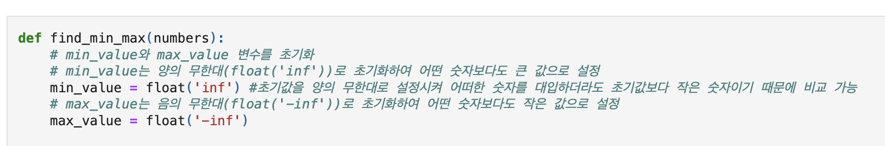

# AIFFEL Campus Online Code Peer Review Templete
- 코더 : 박종호
- 리뷰어 : 고명지


# PRT(Peer Review Template)
- [x]  **1. 주어진 문제를 해결하는 완성된 코드가 제출되었나요?**
      네 잘 제출되었습니다. 


    
- [x]  **2. 전체 코드에서 가장 핵심적이거나 가장 복잡하고 이해하기 어려운 부분에 작성된 
주석 또는 doc string을 보고 해당 코드가 잘 이해되었나요?**

        
- [x]  **3. 에러가 난 부분을 디버깅하여 문제를 해결한 기록을 남겼거나
새로운 시도 또는 추가 실험을 수행해봤나요?**
    - 구체적으로 주석을 다시지는 않았지만 회고에 내용을 작성하셨고, 문제를 푸는 과정에서 여러차례 오류를 해결하기 위해 수정한 내용을 자세하게 설명하여 주셨습니다.

        
- [x]  **4. 회고를 잘 작성했나요?**
    - 문제를 풀며 막혔던 내용과 관련하여 회고를 잘 작성하여 주셨습니다.

        
- [x]  **5. 코드가 간결하고 효율적인가요?**
    - 코드가 문제의 취지에 맞게 간결하고 효율적으로 잘 작성되었습니다. 


# 회고(참고 링크 및 코드 개선)
```
이 번 문제는 조건과 문제 해결을 위한 힌트가 주어져 전반적으로 저와 제가 리뷰하는 팀의 코드가 비슷하게 작성되었습니다.
클로저와 데코레이션에 대해 이해하는데 도움이 되었습니다. 
```
