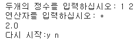
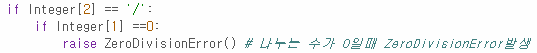
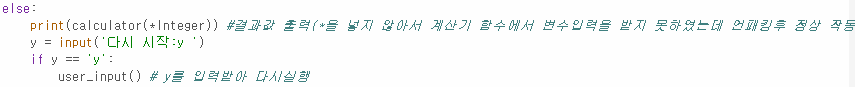
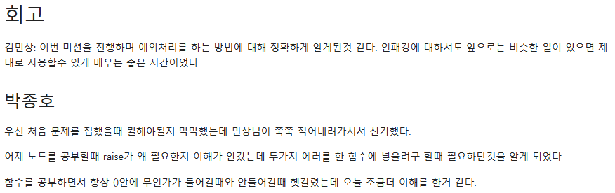

# AIFFEL Campus Online Code Peer Review Templete
- 코더 : 박종호
- 리뷰어 : 강민성


# PRT(Peer Review Template)
- [x]  **1. 주어진 문제를 해결하는 완성된 코드가 제출되었나요?**
    - 출력값을 보아 계산이 아주 잘 이루어졌음을 알 수 있습니다.
    - 

- [x]  **2. 전체 코드에서 가장 핵심적이거나 가장 복잡하고 이해하기 어려운 부분에 작성된 
주석 또는 doc string을 보고 해당 코드가 잘 이해되었나요?**
    - 주석을 통해 모든 코드들이 어떤 역할을 수행하는지 알 수 있었습니다.
    - 
        
- [x]  **3. 에러가 난 부분을 디버깅하여 문제를 해결한 기록을 남겼거나
새로운 시도 또는 추가 실험을 수행해봤나요?**
    - 오류가 났던 부분에 주석을 달아서 어떠한 오류가 발생했고, 어떻게 해결했는지 알 수 있었습니다.
    - 
        
- [x]  **4. 회고를 잘 작성했나요?**
    - 이번 퀘스트를 진행하면서 어떠한 것을 학습하였는지, 느낀 바를 알 수 있었습니다.
    - 
  
- [x]  **5. 코드가 간결하고 효율적인가요?**
    - 대체적으로 간결하지만 integer변수를 쓰지않고 계산 과정에서 ZeroDivisionError를 처리했으면 더 이해하기 편하지 않았을까 생각했습니다.

# 회고(참고 링크 및 코드 개선)
```
저와는 다른 방법으로 접근하셔서 흥미롭게 설명을 들었습니다. 예외 처리는 신경쓸 것이 참 많은 것 같아요.
```
